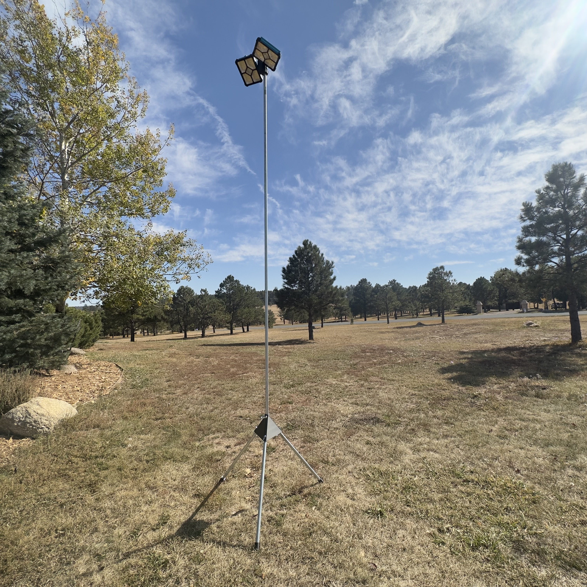
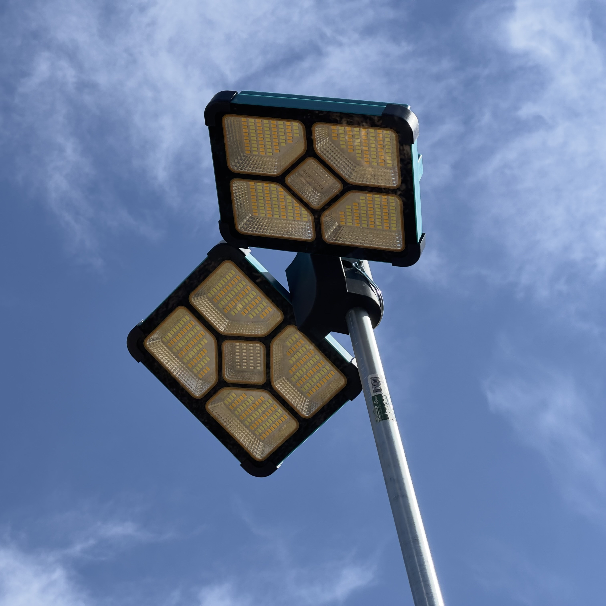

This light stand, or "portable street lamp" was developed for use by the Pine Creek Marching Band during pit warmups in dark parking lots.  It takes a pair of off the shelf solar flood lights, and mounts them on 12' in the air on a stand made from printed parts and conduit.

To assemble, you'll need the printed parts in the files in this repo, plus:

* 2x ¾" x 10' EMT Conduit (source locally, this is a standard US size)
* 5x ¼" x 2-3/4" Coupler Pins [Amazon](https://www.amazon.com/gp/product/B0C3BTMFC3)
* 2x Lights. [Amazon](https://www.amazon.com/gp/product/B0C23TR157)
* 2x ¼-20 x 1-1/4" Bolts

Use UV and temperature stable filaments for printing.  Brittle filaments are not recommended.  Do not use PLA, especially for the base components.

To assemble:
1. Start by cutting one of the sticks of EMT into thirds or shorter (I used 2' sections in my build). Install the End Caps onto one side of each of these, and the other end of each into one of the three holes in the base of the Tripod. Make sure everything is seated well (use a mallet if necessary on the End Caps).
2. Mark the hole locations on each of the three legs, then remove the three legs from the Tripod, mark, and drill ¼" holes straight through each leg.
3. Reinstall the legs and secure through the newly drilled holes with 3 of the coupler pins.
4. Install the second EMT stick into the Light Bracket, mark, and drill the retaining pin hole as before.
5. Install the other end of the EMT stick into the top hole of the Tripod, mark, and drill the retaining pin hole as before.
6. Remove the stands that comes installed on the lights. Then use the ¼" bolts to attach the lights to the Light Bracket.
7. Install the Light Bracket (with lights) to the top of the EMT stick and secure with a coupler pin.
8. Install the other end of the EMT stick into the top of the Tripod and secure with a coupler pin.

Released publicly on [Maker World](https://makerworld.com/en/models/60411#profileId-62534)

