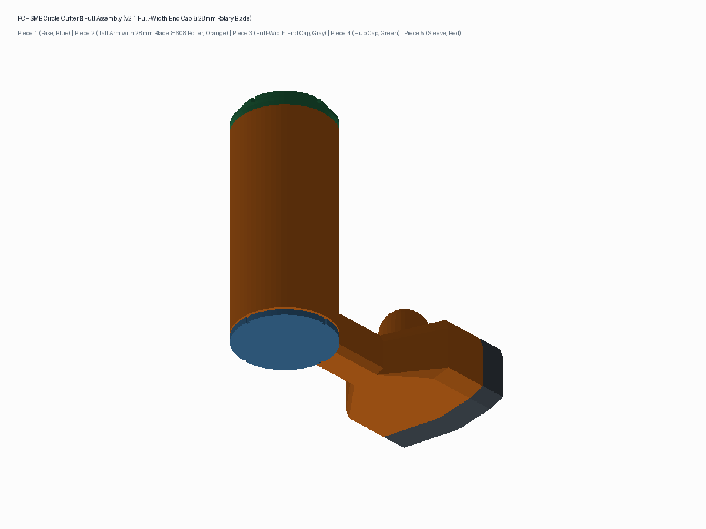
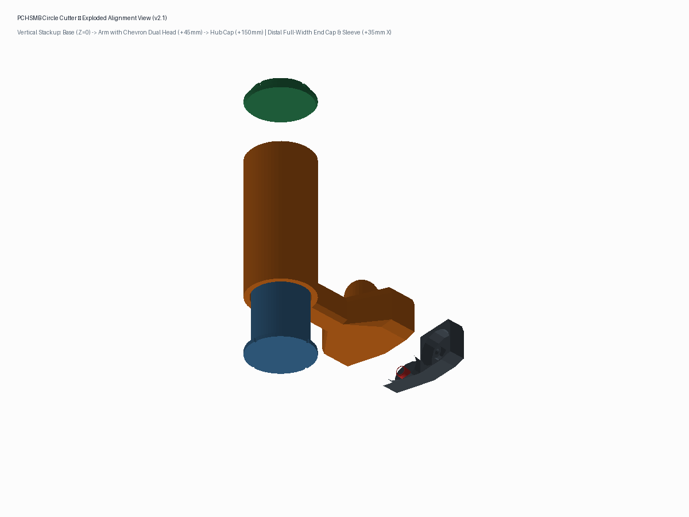
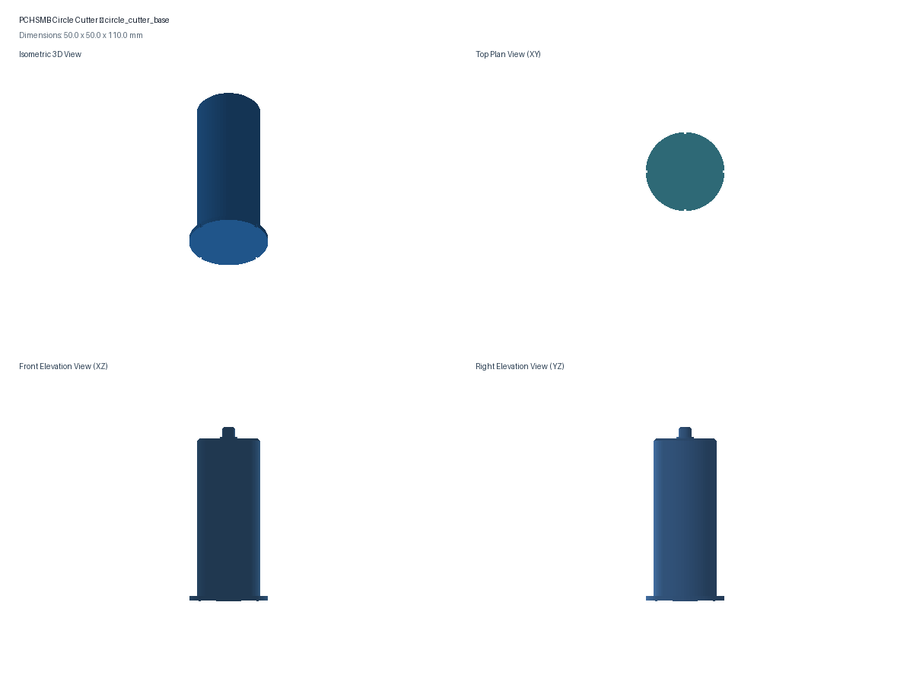
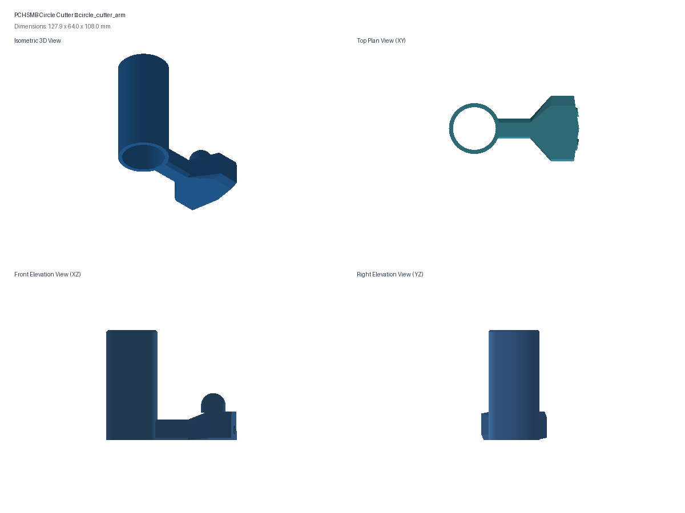
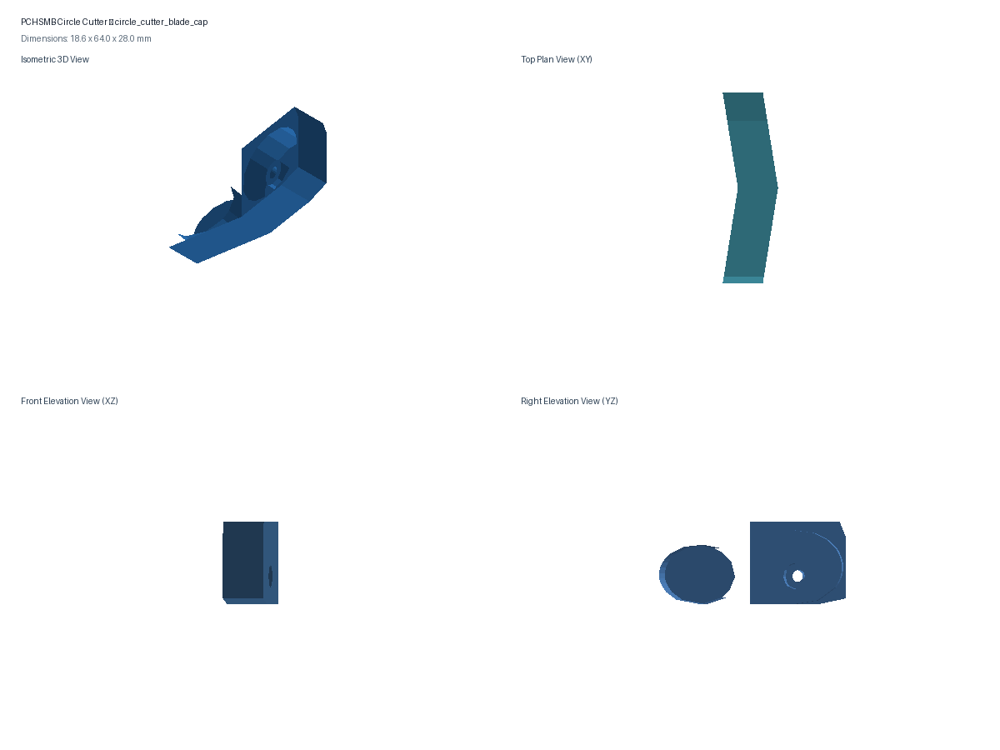
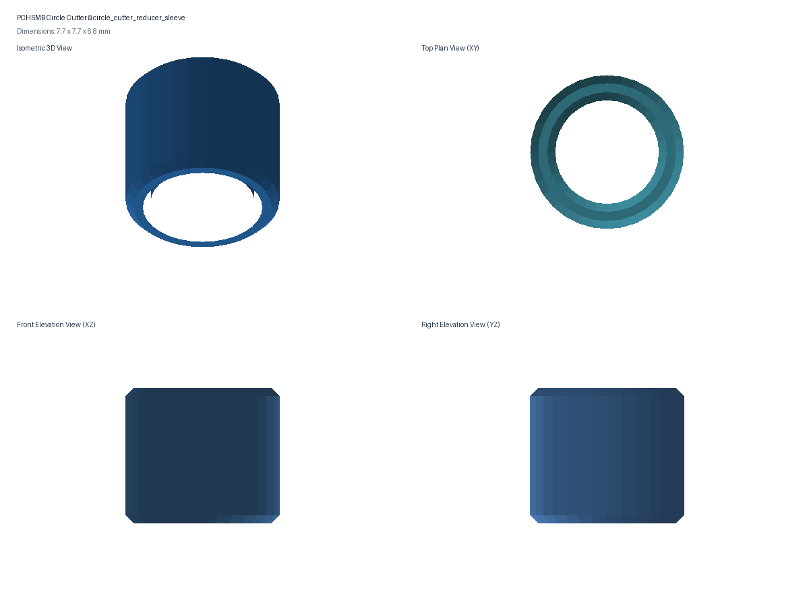
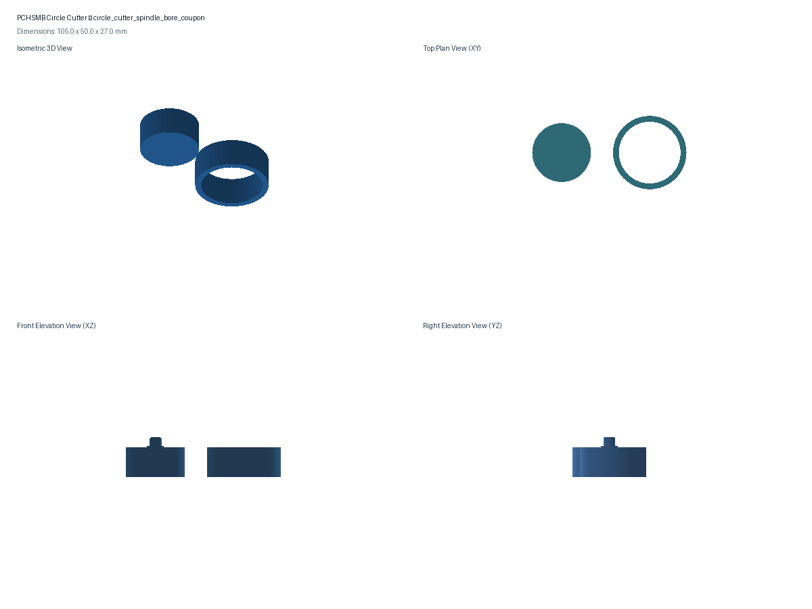
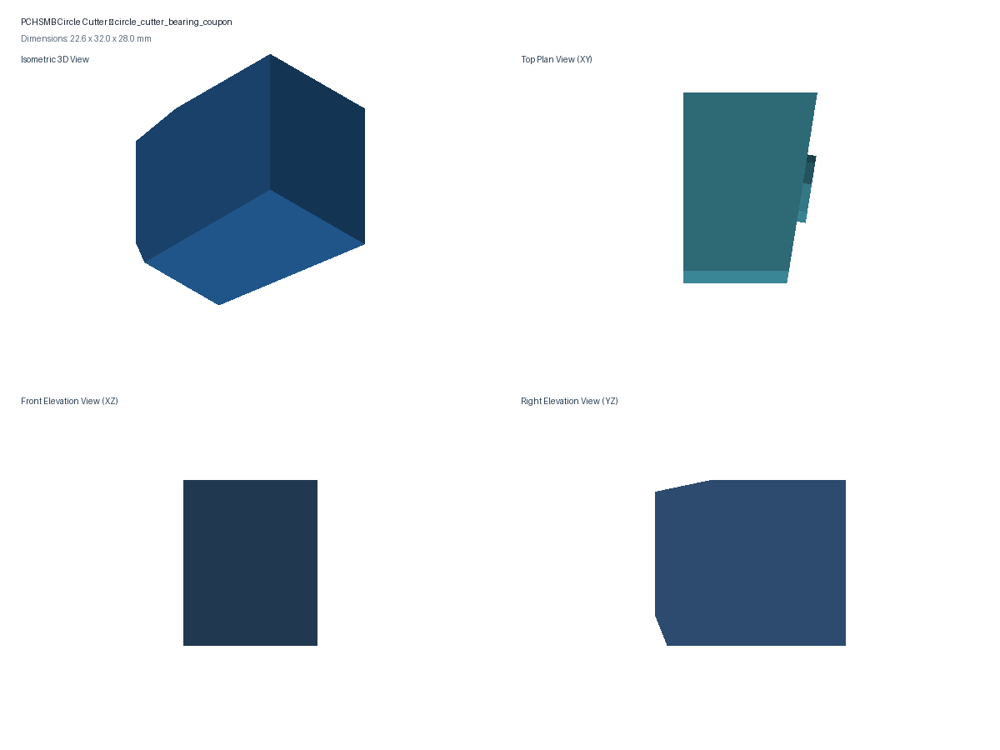
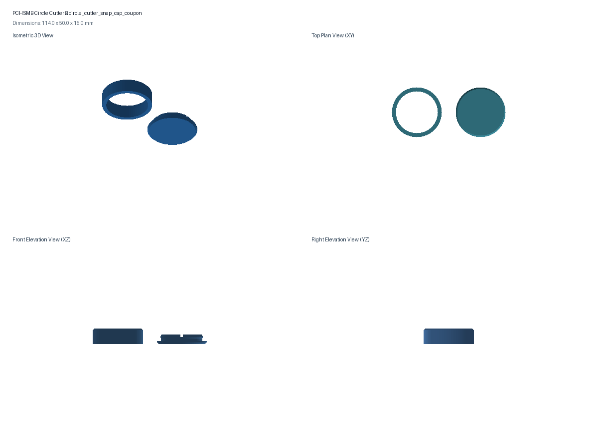

# PCHSMB Field Prop Circle Cutter

Parametric 3D-printable circle cutter engineered specifically for Pine Creek High School Marching Band (PCHSMB) field prop fabrication. Designed to produce precise, repeatable semicircular wind relief slits ($R = 4.0\text{ in.} = 101.6\text{ mm}$) in heavy-duty printed scrim vinyl for the **2026 Continuum** Sideline Screen Duck Blinds and Rolling Backdrops.

---

### 1. Overview & Mechanical Design

The tool utilizes a concentric 5-piece modular rotating pivot architecture with harmonized 608 ball bearings and integrated thrust suspension:
1. **Fixed Pivot Base (Piece 1):** Centered directly over the marked wind relief location. Four exterior vertical crosshair notches allow precise visual alignment against perpendicular layout lines on the vinyl. The top of the $100\text{ mm}$ center spindle features an integrated $\varnothing 11.5\text{ mm} \times 1.0\text{ mm}$ inner-race shoulder and $\varnothing 7.9\text{ mm} \times 6.0\text{ mm}$ center pilot post that securely captures the inner race of a standard 608 ball bearing.
2. **Rotating Arm Assembly (Piece 2):** Sleeves smoothly over the base spindle with a slip fit ($1.0\text{ mm}$ radial clearance). Features an open through-bore and internal annular retention groove ($Z = 103.5–105.5\text{ mm}$), enabling **100% support-free upright printing** with the arm resting flat on the build plate. The arm is suspended at world $Z = 4.0\text{ mm}$, maintaining a **$1.0\text{ mm}$ uniform air gap** above the base plate shoulder, reducing plastic sliding contact area from $707\text{ mm}^2$ to **$0\text{ mm}^2$**. The arm extension is calibrated to the official **$R = 101.6\text{ mm}$ ($4.0\text{ in.}$)** semicircular wind relief fleet specification ($8.0\text{ in.}$ chord). The beam features a tall **$20.0\text{ mm}$ vertical cross-section** ($4.63\times$ higher bending stiffness than 12mm) terminating in an expanded $64.0\text{ mm}\text{ W} \times 28.0\text{ mm}\text{ H}$ **Canted Symmetric Chevron Dual Head** that fully encloses and backs the 28mm blade and Piece 3 unibody end cap. The dual head features widened pad spacing at $Y = \pm 16.0\text{ mm}$ ($32.0\text{ mm}$ center-to-center), providing a generous **$7.00\text{ mm}$ circumferential clearance** between the 28mm rotary blade and 608 roller bearing. Both mounting faces are canted at $\pm 9.0607^\circ$ ($\arcsin(16.0 / 101.6)$): the Blade Pad ($Y = +16.0\text{ mm}$) is angled at $+9.06^\circ$ to slice exactly perpendicular to its radius vector ($0.00^\circ$ yaw), while the Bearing Pad ($Y = -16.0\text{ mm}$) is angled at $-9.06^\circ$ to orient the M5 axle radially toward the pivot center for pure tangential rolling with zero tire scrub. The faces meet seamlessly at centerline $Y = 0.0\text{ mm}$ with a forward-swept chevron vertex at $X = 102.88\text{ mm}$. The head houses a standard 608 roller bearing depth stop (M5 axle centered at $Z_{\text{local}} = 7.0\text{ mm}$) alongside a 28mm rotary blade mounting boss ($\varnothing 9.0\text{ mm} \times 1.5\text{ mm}$ standoff, M3 heat-set insert at $Z_{\text{local}} = 9.5\text{ mm}$, providing $14.0\text{ mm}$ of solid PETG ceiling above the boss). Integrated directly atop the head is an **Ergonomic Cylindrical Domed Push Knob** ($\varnothing 24.0\text{ mm}$ cylinder centered at $X = 80.0\text{ mm}$, straight walls to $Z = 34.0\text{ mm}$, crowned with a hemispherical dome rising to $Z_{\text{apex}} = 46.0\text{ mm}$, $+18.0\text{ mm}$ above head ceiling) featuring seamless $C^1$ tangent continuity.
3. **Full-Width Unibody End Cap & Clamp (Piece 3):** A protective unibody end cap ($64.0\text{ mm}\text{ W} \times 28.0\text{ mm}\text{ H} \times 13.7\text{ mm}\text{ D}$) that spans the entire distal chevron face of the arm. Clamped to the arm solely via the single uxcell $\varnothing 4.0\text{ mm} \times 10.0\text{ mm}$ M3 shoulder bolt through the 28mm blade bore, maintaining **$0.45\text{ mm}$ of axial running float** for silky-smooth, zero-binding rotation on the ground steel shoulder without wobble or flex. The bearing side has **zero screw holes**, featuring an arched overhead canopy ($12.5\text{ mm}$ depth, $R_y = 13.0\text{ mm}, R_z = 10.0\text{ mm}$) that completely covers the 608 roller bearing from above while remaining open at the bottom so the bearing rolls freely directly on the vinyl ($Z_{\text{world}} = 0.0\text{ mm}$). The end cap bottom is suspended $4.0\text{ mm}$ in the air above the vinyl ($Z_{\text{world}} = +4.0\text{ mm}$), preventing any plastic drag. The rear mating face matches the arm's $18.12^\circ$ included chevron angle, providing positive kinematic anti-rotation without secondary screws.
4. **Snap-in Hub Top Cap (Piece 4):** A separate 4-finger flex collet cap that snaps firmly into the internal retention groove at the top of the hub sleeve. Features an integrated $\varnothing 22.2\text{ mm} \times 3.0\text{ mm}$ outer-race pocket and $\varnothing 18.0\text{ mm} \times 1.5\text{ mm}$ inner relief cavity that captures the top 608 ball bearing. Transmits 100% of downward cutting hand pressure through the rolling elements of the 608 bearing directly into the base spindle, eliminating arm-on-base sliding resistance.
5. **608-to-M5 Reducer Bushing Sleeve (Piece 5):** A precision cylindrical bushing ($\varnothing 7.72\text{ mm OD} \times \varnothing 5.20\text{ mm ID} \times 6.80\text{ mm L}$) with dual $0.4\text{ mm} \times 45^\circ$ chamfers. Adapts the $8.0\text{ mm}$ bore of the 608 depth-stop roller bearing to standard M5 button-head machine screws, allowing inner-race clamping against the arm's angled $\varnothing 11.5\text{ mm}$ standoff boss with zero radial play and zero shield contact. ($0.20\text{ mm}$ OD reduction to $7.72\text{ mm}$ validated via physical print testing).

```
       [Piece 4: Snap-in Hub Top Cap (608 Outer Race Drive Pocket)]
              +====================+
              | [608 Ball Bearing] |  <-- Transmits 100% downward manual cutting thrust
              |   (8x22x7mm Deep)  |
       [Piece 2: Rotating Hub & Arm]                          [Domed Push Knob (Z=34-46mm)]
              |   42mm Thru-Bore   |--------------------------[64x28mm Canted Chevron Dual Head]
              |                    |                           \  (+9.06° Blade / -9.06° Roller)
              |   Internal Groove  |                            \  [Piece 5 Sleeve]   [Piece 3 Unibody Cap]
              |    (Snap Barbs)    |                             \ [608 Bearing]   [28mm Rotary Blade]
              |                    |                              \(Rolls Tangent) (Rotary Roll Cut)
              +--------------------+                               \    |             |
              : 1.0mm Air Gap (0mm² Friction!)                      \   V             V
       +------+--------------------+------+                          \ (Rolls)    (Cuts 0.5mm)
       |  Piece 1: Base Plate (Crosshairs)|                           \ |             |
 ======+==================================+============================+==============+=== (Vinyl Plane)
```

---

## 2. Component Specifications & Dimensions

| Component | Dimensions ($X \times Y \times Z$) | Material / Infill | Primary Features |
|---|---|---|---|
| **Piece 1: Fixed Pivot Base**<br>[`circle_cutter_base.stl`](circle_cutter_base.stl) | $50.0 \times 50.0 \times 110.0\text{ mm}$ | PETG / 25% Gyroid (~91.9g) | • $50\text{ mm}$ OD $\times 3.0\text{ mm}$ H base plate (creates $1.0\text{ mm}$ air gap below arm!)<br>• 4 vertical crosshair notches ($1.0\text{ mm}$ D $\times 1.8\text{ mm}$ W) at $0^\circ, 90^\circ, 180^\circ, 270^\circ$<br>• $40\text{ mm}$ OD $\times 100\text{ mm}$ H center spindle<br>• $\varnothing 11.5\text{ mm} \times 1.0\text{ mm}$ inner-race shoulder<br>• $\varnothing 7.9\text{ mm} \times 6.0\text{ mm}$ center pilot post with $0.8\text{ mm} \times 45^\circ$ chamfer |
| **Piece 2: Rotating Arm Assembly**<br>[`circle_cutter_arm.stl`](circle_cutter_arm.stl) | $127.88 \times 64.0 \times 108.0\text{ mm}$ | PETG / 30% Gyroid / 4 walls (~102.1g) | • Standardized $R = 101.6\text{ mm}$ ($4.0\text{ in.}$) cutting radius ($8.0\text{ in.}$ chord wind relief flaps)<br>• $50\text{ mm}$ OD hub sleeve with open through-bore<br>• $\varnothing 42\text{ mm}$ ID bore with internal $\varnothing 43.6\text{ mm}$ retention groove ($45^\circ$ self-supporting overhangs)<br>• **100% support-free upright printability** with arm flat on bed ($Z=0$)<br>• Suspended at world $Z=4.0\text{ mm}$ with $1.0\text{ mm}$ air gap above base plate ($0\text{ mm}^2$ sliding friction!)<br>• **Tall Rigid Arm Beam ($20.0\text{ mm}$ H) & Canted Chevron Dual Head ($64.0\text{ mm}$ W $\times 28.0\text{ mm}$ H):** $4.63\times$ higher vertical stiffness; widened axle spacing at $Y = \pm 16.0\text{ mm}$ ($32.0\text{ mm}$ center-to-center) providing $7.00\text{ mm}$ circumferential clearance between blade and roller; distal axle planes at $X = 100.33\text{ mm}$, chevron vertex at $X = 102.88\text{ mm}$ ($Y = 0\text{ mm}$); completely backs Piece 3 unibody end cap<br>• **Monolithic Cylindrical Domed Push Knob:** $\varnothing 24.0\text{ mm}$ cylinder centered at $(X=80.0\text{ mm}, Y=0.0\text{ mm})$, straight vertical walls from $Z = 28.0$ to $Z_{\text{shoulder}} = 34.0\text{ mm}$, crowned with an exact $R = 12.0\text{ mm}$ hemispherical dome with $C^1$ tangent continuity rising to $Z_{\text{apex}} = 46.0\text{ mm}$ ($+18.0\text{ mm}$ above head ceiling, $Z_{\text{world}} = 50.0\text{ mm}$); provides ergonomic downward pressure without localized pressure points<br>• **Canted Bearing Pad ($Y = -16.0\text{ mm}$, $-9.06^\circ$):** Angled $\varnothing 11.5\text{ mm} \times 1.5\text{ mm}$ standoff boss + angled $\varnothing 6.2\text{ mm} \times 11.0\text{ mm}$ M5 heat-set insert hole; aligns 608 roller bearing axle radially along $\vec{R}_{\text{bearing}} = (100.33, -16.0)\text{ mm}$ for **pure tangential rolling with zero tire scrub**<br>• **Canted Blade Pad ($Y = +16.0\text{ mm}$, $+9.06^\circ$):** $\varnothing 9.0\text{ mm} \times 1.5\text{ mm}$ standoff boss + $\varnothing 3.8\text{ mm} \times 10.5\text{ mm}$ M3 heat-set insert hole at $Z_{\text{local}} = 9.5\text{ mm}$ ($Z_{\text{world}} = 13.5\text{ mm}$, reinforced by $14.0\text{ mm}$ solid PETG ceiling); aligns 28mm rotary blade perpendicular to $\vec{R}_{\text{blade}} = (100.33, +16.0)\text{ mm}$ for **exact $0.00^\circ$ blade yaw** (pure tangential rolling cut)<br>• Calibrated $0.5\text{ mm}$ cut depth into vinyl below 608 roller bearing (cleanly slices $0.38\text{ mm}$ vinyl with $0.12\text{ mm}$ mat score) |
| **Piece 3: Full-Width Unibody End Cap**<br>[`circle_cutter_blade_cap.stl`](circle_cutter_blade_cap.stl) | $18.63 \times 64.0 \times 28.0\text{ mm}$ | PETG / 100% Solid (~37.3g) | • Full-width unibody end cap ($64.0\text{ mm}\text{ W} \times 28.0\text{ mm}\text{ H}$) spanning entire distal chevron face of the arm<br>• Single-screw retention: clamped solely via single uxcell $\varnothing 4.0\text{ mm} \times 10.0\text{ mm}$ M3 shoulder screw through 28mm blade bore into arm's M3 heat-set insert<br>• 28mm blade enclosure: elliptical cavity ($R_y = 15.5\text{ mm}, R_z = 12.5\text{ mm}$) with central clamping hub ($\varnothing 9.0\text{ mm}$) providing **$0.45\text{ mm}$ axial running float** for silky-smooth blade rotation<br>• 608 bearing canopy: generous arched overhead canopy ($12.5\text{ mm}$ depth, $R_y = 13.0\text{ mm}, R_z = 10.0\text{ mm}$) that clears 608 roller bearing with **zero screws on bearing side**; open bottom allows bearing to roll directly on vinyl at $Z_{\text{world}} = 0.0\text{ mm}$<br>• Bottom of cap elevated at $Z_{\text{local}} = 0.0\text{ mm}$ ($Z_{\text{world}} = +4.0\text{ mm}$), guaranteeing **$4.0\text{ mm}$ air clearance above vinyl** so plastic never rubs or drags on vinyl<br>• $\varnothing 7.8\text{ mm} \times 3.0\text{ mm}$ counterbore for 7.0mm shoulder bolt head + $\varnothing 4.2\text{ mm}$ through-bore for 4.0mm shoulder bolt |
| **Piece 4: Snap-in Hub Top Cap**<br>[`circle_cutter_hub_cap.stl`](circle_cutter_hub_cap.stl) | $50.0 \times 50.0 \times 9.0\text{ mm}$ | PETG / 100% Solid (~5.1g) | • $\varnothing 50\text{ mm} \times 3\text{ mm}$ top flange with $1.5\text{ mm} \times 45^\circ$ chamfer<br>• Integrated $\varnothing 22.2\text{ mm}$ outer-race pocket with $1.0\text{ mm}$ thrust face<br>• Central $\varnothing 18.0\text{ mm} \times 1.5\text{ mm}$ relief cavity (isolates inner race, shield, and post)<br>• 4 cantilever flex collet fingers with $30^\circ$ entry ramp and $45^\circ$ retention barb ($\varnothing 43.0\text{ mm}$)<br>• Tactile audible snap fit; seals bore and carries 100% downward manual pressure |
| **Piece 5: 608-to-M5 Reducer Sleeve**<br>[`circle_cutter_reducer_sleeve.stl`](circle_cutter_reducer_sleeve.stl) | $7.72 \times 7.72 \times 6.80\text{ mm}$ | PETG / 100% Solid (~0.2g) | • Precision cylindrical bushing ($\varnothing 7.72\text{ mm OD} \times \varnothing 5.20\text{ mm ID} \times 6.80\text{ mm L}$)<br>• Outer diameter fits standard $8.0\text{ mm}$ 608 bearing bore ($0.28\text{ mm}$ diametral clearance; reduced by $0.20\text{ mm}$ from $7.92\text{ mm}$ for smooth slip fit)<br>• Inner bore slips smoothly over M5 screw ($0.20\text{ mm}$ clearance)<br>• $6.80\text{ mm}$ length is $0.20\text{ mm}$ sub-flush to $7.0\text{ mm}$ bearing inner race, ensuring M5 button head clamps inner race without pinching sleeve<br>• Dual $0.4\text{ mm} \times 45^\circ$ chamfers for snag-free bearing insertion |

---

## 3. Hardware Bill of Materials (BOM)

| Item | Specification | Qty | Purpose | Source / Notes |
|---|---|:---:|---|---|
| **Ball Bearings** | 608 Miniature Ball Bearing (608ZZ / 608-2RS) | 2 | 1× Top Thrust Pivot (carries 100% downward manual pressure); 1× Front Roller Depth Stop (rolls on vinyl) | $8\text{ mm}$ ID $\times 22\text{ mm}$ OD $\times 7\text{ mm}$ W (standard skateboard/spool bearing) |
| **Bearing Axle Screw** | M5 $\times 16\text{ mm}$ (or $18\text{ mm}$) Button Head Cap Screw | 1 | Secures 608 depth-stop bearing inner race to arm via Piece 5 reducer sleeve | Stainless steel or black oxide ISO 7380 ($\varnothing 9.5\text{ mm}$ head) |
| **Bearing Insert** | M5 Brass Heat-Set Insert | 1 | Durable machine threads for bearing axle; reinforced by $3.9\text{ mm}$ solid PETG wall/floor | $\varnothing 6.2\text{ mm}$ hole spec; length 6, 8, or 10 mm ($11.0\text{ mm}$ bore depth) |
| **Reducer Sleeve** | 3D Printed PETG Bushing (Piece 5) | 1 | Adapts $8\text{ mm}$ bore of 608 bearing to M5 screw; inner-race clamping without sleeve pinch | $\varnothing 7.72\text{ mm OD} \times \varnothing 5.20\text{ mm ID} \times 6.80\text{ mm L}$ |
| **Rotary Cutting Blade** | Fiskars 28mm Premium Rotary Cutter Blade (Model 1065938) | 1 | Precision rolling circular shear cutting of scrim vinyl; eliminates blade drag and snagging | $\varnothing 28.0\text{ mm}$ OD $\times \varnothing 4.0\text{ mm}$ center bore $\times 0.35\text{ mm}$ thickness (ASIN: `B0C8BSMMN1`) |
| **Blade Shoulder Screw** | uxcell 304 Stainless Steel Shoulder Screw ($\varnothing 4\text{ mm} \times 10\text{ mm}$, M3 Thread) | 1 | Ground steel journal bearing axle for 28mm rotary blade and single Piece 3 end cap clamp (0 screws on bearing side) | $\varnothing 4.0\text{ mm}$ shoulder $\times 10.0\text{ mm}$ shoulder len, M3 $\times 5\text{ mm}$ thread, $\varnothing 7.0\text{ mm} \times 3.0\text{ mm}$ head |
| **Blade Insert** | M3 Brass Heat-Set Insert | 1 | Durable machine threads for shoulder screw on canted blade boss | $\varnothing 3.8\text{ mm}$ hole spec; length 6, 8, or 10 mm ($10.5\text{ mm}$ bore depth) |

---

## 4. 3D Printing Guidelines

* **Recommended Filament:** **PETG** (e.g. Polymaker PolyLite PETG, Bambu PETG Basic, or Prusament PETG). PETG provides superior layer bonding, dimensional impact toughness, and wear resistance over PLA for sliding mechanical fits.
* **Alternative Filament:** PLA+ / Tough PLA (acceptable for indoor shop use).
* **Layer Height:** $0.20\text{ mm}$ standard ($0.16\text{ mm}$ optional for ultra-smooth spindle and bore finishes).
* **Perimeters / Wall Loops:** **4 walls minimum** ($1.6\text{ mm}$ total wall thickness) to ensure maximum torsional stiffness.
* **Infill:** $25\%$ Gyroid or Adaptive Cubic.
* **Print Orientations:**
  * **Piece 1 (Base):** Print standing upright on the flat $50\text{ mm}$ base plate ($Z = 0$). Zero supports required (~3 hr 30 min).
  * **Piece 2 (Arm):** Print standing upright on its bottom face ($Z = 0$) with the arm resting flat on the build plate. The open through-bore and internal $45^\circ$ groove require **zero supports and zero bridging** (~3 hr 10 min).
  * **Piece 3 (Full-Width Unibody End Cap):** Print standing or flat. All counterbores and interior features are self-supporting. Zero supports required (~45 min).
  * **Piece 4 (Snap-in Hub Top Cap):** Print inverted flat on its top face ($Z = 0$) on the bed. Zero supports required (~12 min).
  * **Piece 5 (608-to-M5 Reducer Sleeve):** Print standing upright on either flat annular face ($Z = 0$). 100% solid infill, concentric wall loops. Zero supports required (~2 min).

---

## 5. Assembly & Setup

1. **Install Heat-Set Inserts:**
   * Heat a soldering iron equipped with a metric heat-set installation tip to **$230^\circ\text{C}–245^\circ\text{C}$** for PETG (or $210^\circ\text{C}$ for PLA).
   * **M3 Blade Boss Insert:** Press square into the $\varnothing 3.8\text{ mm}$ hole on the front face of the $\varnothing 9.0\text{ mm}$ **Blade Standoff Boss** ($Y = +16.0\text{ mm}, Z_{\text{local}} = 9.5\text{ mm}$) until flush with the boss surface. Reinforced by $14.0\text{ mm}$ of solid PETG ceiling above the boss.
   * **M5 Axle Insert:** Press square into the $\varnothing 6.2\text{ mm}$ hole inside the $\varnothing 11.5\text{ mm}$ standoff boss on the front face of the **Bearing Pad** ($Y = -16.0\text{ mm}, Z_{\text{local}} = 7.0\text{ mm}$) until flush with the standoff face. The reinforced $3.9\text{ mm}$ solid PETG floor completely prevents thermal blow-through.
   * Allow both inserts to cool undisturbed for at least 2 minutes.
2. **Install 608 Roller Bearing & Reducer Sleeve:**
   * Slide the Piece 5 Reducer Sleeve ($\varnothing 7.72\text{ mm OD} \times 6.80\text{ mm L}$) into the center bore of a 608 ball bearing ($8\text{ mm ID} \times 22\text{ mm OD} \times 7\text{ mm W}$). Notice the sleeve sits $0.20\text{ mm}$ sub-flush to the $7.0\text{ mm}$ steel race.
   * Slide an M5 $\times 16\text{ mm}$ (or $18\text{ mm}$) button head screw through the reducer sleeve. The $\varnothing 9.5\text{ mm}$ screw head clamps the steel inner race directly without pinching the sleeve or contacting the dust shield.
   * Thread the screw straight into the M5 heat-set insert on the bearing pad from the front face.
   * Tighten firmly. Spin the bearing by hand to verify that the outer race spins freely with zero drag or binding against the integrated $\varnothing 11.5\text{ mm}$ standoff boss.
3. **Install Full-Width End Cap & 28mm Rotary Cutter Blade:**
   * Slide the Fiskars 28mm rotary blade (precision round $\varnothing 4.0\text{ mm}$ bore) onto the uxcell 304 stainless steel shoulder screw ($\varnothing 4.0\text{ mm} \times 10.0\text{ mm}$ shoulder, M3 thread).
   * Slide the shoulder screw with blade through the central bore of Piece 3 (Full-Width Unibody End Cap) from the front counterbore.
   * Slide the Piece 3 end cap onto the distal chevron end of Piece 2. The overhead bearing canopy slides cleanly over the installed 608 roller bearing with generous radial clearance, leaving the bearing completely unencumbered to roll directly on the vinyl with **zero fasteners on the bearing side**.
   * Notice that Piece 3's hub has an axial length of $9.20\text{ mm}$, leaving **$0.80\text{ mm}$ of exposed steel shoulder**. With the $0.35\text{ mm}$ Fiskars blade, this guarantees **$0.45\text{ mm}$ of axial running float** for silky-smooth, zero-binding rotation.
   * Thread the single M3 shoulder screw into the brass insert on Piece 2's blade pad standoff boss until the shoulder seats rigidly against the insert face. Tighten firmly.
   * The $18.12^\circ$ included chevron $V$-face on the rear of Piece 3 interlocks positively with the arm, providing rock-solid anti-twist stability from a single screw.
   * Spin the rotary blade with your fingertip from underneath. The blade must spin freely on the precision ground steel journal with zero drag, zero binding, and zero lateral wobble.
   * Verify depth: The bottom edge of the 28mm rotary blade extends exactly **$0.50\text{ mm}$ below the 608 roller bearing** ($Z_{\text{world}} = -0.5\text{ mm}$) while the unibody end cap bottom maintains a **$4.0\text{ mm}$ air gap above the vinyl** ($Z_{\text{world}} = +4.0\text{ mm}$).
4. **Install 608 Thrust Bearing & Snap Cap:**
   * Slide the second 608 bearing onto the $\varnothing 7.9\text{ mm}$ center post on top of the Piece 1 spindle until the inner race seats flush on the $\varnothing 11.5\text{ mm}$ shoulder.
   * Slide Piece 2 (Rotating Arm) over the spindle.
   * Align Piece 4 (Snap-in Hub Cap) with the top of the Piece 2 hub bore. Press firmly downward with your thumb until the collet fingers snap audibly into the internal retention groove.
   * Verify that the 608 bearing outer race is captured inside Piece 4's pocket and that the arm bottom is suspended with a **$1.0\text{ mm}$ air gap above the base plate**, rotating with silky-smooth zero-drag ball-bearing action.

---

## 6. Operating Procedure (Cutting Semicircular Wind Relief Slits)

Per the **PCHSMB Field Prop Fabrication Standard** (Section 8.3):
1. **Punch Endpoint Relief Holes First:** Using a heavy-duty rotary punch or $\varnothing 3/8\text{ in.}$ ($10\text{ mm}$) hole punch, punch the two stress-relief boundary holes spaced exactly $8.0\text{ in.}$ apart on the layout baseline.
2. **Position the Base:** Place Piece 1 on the vinyl. Align the 4 perimeter crosshair notches over the marked centerpoint ($4.0\text{ in.}$ equidistant between the two punched holes) and the orthogonal baseline.
3. **Engage the Cutter Arm:** Slide Piece 2 over the spindle until the hub is fully seated on the top 608 ball bearing. Verify that the arm bottom is suspended with a uniform **$1.0\text{ mm}$ air gap above the base plate shoulder** (guaranteeing zero plastic sliding friction during rotation).
4. **Execute the Arc Cut:**
   * Hold the base plate firmly down against the vinyl with your non-dominant hand.
   * Grasp the rotating arm, align the blade with the starting punch hole, and rotate smoothly through $180^\circ$ until the blade terminates cleanly in the opposing punch hole.
   * Verify the flap drops cleanly by gravity and hangs flush with zero binding.

---

## 7. Engineering Standards & Quality Gates

Following the standards codified in [`AGENTS.md`](AGENTS.md) and aligned with `carriers` / `Parts-Database`, all 3D print deliverables in this project satisfy:

1. **Mandatory Tooling Invariant (Pure-Python CAD & LookAt Rendering Engine):** All production STL meshes and 4-view drawing sheets are generated deterministically in pure Python (using only standard library modules: `struct`, `math`, `dataclasses`, `pathlib`, with PIL/NumPy for rasterization). External CAD binaries (`openscad`, FreeCAD, Blender) are strictly prohibited.
2. **Four Non-Negotiable Mesh Quality Gates:**
   - **0 Boundary Edges:** 100% closed, watertight 2-manifold solid (no holes, cracks, or open seams).
   - **0 Non-Manifold Edges:** No internal walls, t-junctions, or self-intersecting shells.
   - **0 Degenerate Triangles:** No zero-area triangles or collinear vertices.
   - **100% Finite Coordinates:** Real, finite coordinate values only (no `NaN` or `Inf`).
3. **Mandatory 4-Stage Engineering Lifecycle:** Every iteration strictly follows **Stage 1 (Idea Intake in `IDEAS.md`) $\to$ Stage 2 (Implementation Plan in `Plans/`) $\to$ Stage 3 (Implementation & Verification in `generate_circle_cutter.py`) $\to$ Stage 4 (Structured Git Commit)**.
4. **Machine-Readable Manifest:** [`build/manifest.json`](build/manifest.json) tracks exact dimensions, volumes, estimated PETG print masses, vertical stackups, and topological audit results.
5. **Physical Calibration Before Full Prints:** Rapid pre-print test coupons are generated alongside production parts:
   - `build/circle_cutter_spindle_bore_coupon.stl`: Verifies the 40mm spindle vs 42mm bore slip fit AND 608 inner-race shoulder / pilot post fit (~18 min).
   - `build/circle_cutter_bearing_coupon.stl`: Verifies the 608 roller bearing M5 heat-set insert hole, $14\text{ mm}$ head flare, and $\varnothing 11.5\text{ mm}$ standoff boss (~10 min).
   - `build/circle_cutter_snap_cap_coupon.stl`: Verifies the 15mm hub sleeve ring snap fit AND 608 outer-race thrust pocket and relief cavity (~18 min).
6. **Caliper Verification Log:** [`PHYSICAL_TEST_NOTES.md`](PHYSICAL_TEST_NOTES.md) documents modeled targets vs physical caliper measurements and HITL observations.
7. **Engineering Enhancement Backlog:** [`IDEAS.md`](IDEAS.md) tracks all candidate features, trade-off analyses, and promotion statuses.

---

## 8. Build Pipeline & Generated Deliverables

Run the pure-Python pipeline from the project directory:

```bash
# Generate all STLs, test coupons, manifest.json, and 4-view engineering drawings
python3 generate_circle_cutter.py
```

### Directory Structure

```
PCHSMB/Circle Cutter/
├── AGENTS.md                                # Subproject engineering & lifecycle standards
├── GEMINI.md / CLAUDE.md                    # Agent adapter files
├── README.md                                # Master build & assembly manual
├── PHYSICAL_TEST_NOTES.md                   # Caliper measurements and test log
├── IDEAS.md                                 # Engineering enhancement backlog
├── Plans/                                   # Codified implementation plans
│   ├── 001-snap-in-hub-top-cap.md           # Plan 001 (Completed v1.3)
│   ├── 002-608-bearing-pivot.md             # Plan 002 (Completed v1.4)
│   ├── 003-608-front-roller-m5.md           # Plan 003 (Completed v1.5)
│   ├── 004-raised-push-plate.md             # Plan 004 (Superseded by Plan 005)
│   ├── 005-cylindrical-domed-push-knob.md   # Plan 005 (Completed v1.7)
│   ├── 006-canted-dual-head.md              # Plan 006 (Completed v1.8)
│   ├── 007-rotary-cutter-guard.md           # Plan 007 (Completed v1.9)
│   ├── 008-tall-rigid-arm-beam.md           # Plan 008 (Completed v2.0)
│   └── 009-full-width-end-cap.md            # Plan 009 (Completed v2.1)
├── generate_circle_cutter.py                # Pure-Python parametric CAD & render pipeline
├── circle_cutter_assembly.png               # Pure-Python 3D assembly render
├── circle_cutter_exploded.png               # Pure-Python 3D exploded scene render
├── circle_cutter_base.stl                   # Root production STL (Piece 1)
├── circle_cutter_arm.stl                    # Root production STL (Piece 2)
├── circle_cutter_blade_cap.stl              # Root production STL (Piece 3)
├── circle_cutter_hub_cap.stl                # Root production STL (Piece 4)
├── circle_cutter_reducer_sleeve.stl         # Root production STL (Piece 5)
└── build/                                   # Standardized build directory
    ├── circle_cutter_base.stl               # Piece 1: Fixed Pivot Base (3mm plate, 608 post)
    ├── circle_cutter_arm.stl                # Piece 2: Rotating Arm (canted chevron head, 608 roller mount, domed push knob)
    ├── circle_cutter_blade_cap.stl          # Piece 3: Full-Width Unibody End Cap & Clamp
    ├── circle_cutter_hub_cap.stl            # Piece 4: Snap Cap with 608 bearing pocket
    ├── circle_cutter_reducer_sleeve.stl     # Piece 5: 608-to-M5 Reducer Bushing Sleeve
    ├── circle_cutter_spindle_bore_coupon.stl# Fit coupon: 40mm spindle + 608 post / 42mm bore
    ├── circle_cutter_bearing_coupon.stl     # Fit coupon: 608 bearing M5 mount with -9.06° canted boss
    ├── circle_cutter_snap_cap_coupon.stl    # Fit coupon: 15mm hub ring + snap cap with 608 pocket
    ├── manifest.json                        # Parametric manifest & audit digests
    ├── circle_cutter_base_multiview.png     # 4-view drawing: Piece 1 Base
    ├── circle_cutter_arm_multiview.png      # 4-view drawing: Piece 2 Arm
    ├── circle_cutter_blade_cap_multiview.png# 4-view drawing: Piece 3 Full-Width End Cap
    ├── circle_cutter_hub_cap_multiview.png  # 4-view drawing: Piece 4 Snap Cap
    ├── circle_cutter_reducer_sleeve_multiview.png # 4-view drawing: Piece 5 Reducer Sleeve
    ├── circle_cutter_spindle_bore_coupon_multiview.png # 4-view drawing: Spindle/Bore coupon
    ├── circle_cutter_bearing_coupon_multiview.png   # 4-view drawing: 608 Bearing coupon
    └── circle_cutter_snap_cap_coupon_multiview.png  # 4-view drawing: Snap Cap coupon
```

---

## 9. Visual Engineering Gallery

### Assembly & Exploded Views
| Assembly View | Exploded Alignment View |
|:---:|:---:|
|  |  |

### 4-View Engineering Orthographic Sheets (Production Parts)
| Piece 1: Fixed Pivot Base | Piece 2: Rotating Arm Assembly |
|:---:|:---:|
|  |  |

| Piece 3: Full-Width Unibody End Cap | Piece 4: Snap-in Hub Top Cap | Piece 5: 608 Reducer Sleeve |
|:---:|:---:|:---:|
|  |  |  |

### Rapid Pre-Print Calibration Coupons
| Spindle / Bore Slip-Fit Coupon | 608 Bearing Mount Coupon | Snap-in Hub Cap Coupon |
|:---:|:---:|:---:|
|  |  |  |

---

## 10. Design Milestones & Engineering Backlog

### Implemented Milestones
* **v1.3 — Modular Snap-in Hub Top Cap ([Plan 001](Plans/001-snap-in-hub-top-cap.md)):** Converted the hub ceiling into a 4-finger snap-in cap (`circle_cutter_hub_cap.stl`), achieving 100% support-free upright printing with the arm flat on the bed.
* **v1.3 — Side-by-Side Dual Head:** Integrated depth-stop roller bearing and #11 blade mount onto the distal face of Piece 2, locking cut depth to $1.0\text{ mm}$ below the roller plane.
* **v1.4 — Top-Mounted 608 Ball Bearing Thrust Pivot ([Plan 002](Plans/002-608-bearing-pivot.md)):** Integrated standard 608 ball bearing atop center spindle and recalibrated base plate to $3.0\text{ mm}$, suspending the arm with a $1.0\text{ mm}$ air gap and eliminating $707\text{ mm}^2$ of plastic sliding contact.
* **v1.4 — Pure-Python CAD & Headless LookAt 3D Renderer:** 100% pure Python STL and 4-view drawing pipeline (`generate_circle_cutter.py`), permanently retiring external CAD binaries.
* **v1.5 — 608 Front Roller Bearing & Harmonized Single-Bearing BOM ([Plan 003](Plans/003-608-front-roller-m5.md)):** Converted distal depth-stop roller from 625 to standard 608 ball bearing ($8\times 22\times 7\text{ mm}$), harmonizing the entire tool BOM to a single bearing type across both pivot and roller. Flared head height to $14.0\text{ mm}$ and widened head to $46.0\text{ mm}$, elevating M5 axle to $Z_{\text{local}} = 7.0\text{ mm}$ ($Z_{\text{world}} = 11.0\text{ mm}$) to provide a massive **$3.9\text{ mm}$ solid PETG floor and ceiling** (+333% floor over v1.4) to completely eliminate fastener pullout risk. Engineered Piece 5 608-to-M5 reducer sleeve ($\varnothing 7.92 \times \varnothing 5.20 \times 6.80\text{ mm}$) for precision inner-race clamping without sleeve pinch, preserving $6.0\text{ mm}$ air clearance to blade clamp.
* **v1.6 — Monolithic Ergonomic Raised Push Plate ([Plan 004](Plans/004-raised-push-plate.md)):** Integrated an elevated push plate directly atop the distal dual head on Piece 2 (`circle_cutter_arm.stl`). (Superseded by v1.7 based on HITL user feedback in favor of a cylindrical domed push knob).
* **v1.7 — Monolithic Cylindrical Domed Push Knob ([Plan 005](Plans/005-cylindrical-domed-push-knob.md)):** Replaced the rectangular push plate on Piece 2 (`circle_cutter_arm.stl`) with a monolithic cylindrical push knob with a rounded top dome. Centered at $(X=158.0, Y=0.0\text{ mm})$ between the 608 roller and X-Acto blade mounts, the $\varnothing 26.0\text{ mm}$ post rises with straight vertical cylinder walls to $Z_{\text{shoulder}} = 20.0\text{ mm}$ ($6.0\text{ mm}$ above head ceiling) and transitions with seamless $C^1$ tangent continuity into a hemispherical dome reaching $Z_{\text{apex}} = 33.0\text{ mm}$ ($+19.0\text{ mm}$ above ceiling, $Z_{\text{world}} = 37.0\text{ mm}$). Preserves a $4.0\text{ mm}$ front clearance shelf for unobstructed blade insertion and M5/M3 hex key tool access, with 100% support-free upright 3D printability.
* **v1.8 — Canted Symmetric Chevron Dual Head for Pure Tangential Cutting & Rolling ([Plan 006](Plans/006-canted-dual-head.md)):** Angled both the X-Acto blade mounting pad ($+3.7607^\circ$) and the 608 roller bearing mounting pad ($-3.7607^\circ$) by $\pm \arctan(11.5 / 175.0)$ relative to the transverse plane. This aligns the blade flat precisely perpendicular to radius vector $\vec{R}_{\text{blade}} = (175.0, +11.5)\text{ mm}$ (eliminating $3.76^\circ$ yaw for exact **$0.00^\circ$ tangential slicing** with zero side-scuff or binding) and aligns the M5 axle radially along $\vec{R}_{\text{bearing}} = (175.0, -11.5)\text{ mm}$ (guaranteeing **pure tangential rolling with zero lateral tire scrub**). The distal faces join at centerline $Y = 0.0\text{ mm}$ to form a continuous, seamless forward-swept chevron vertex at $X = 175.76\text{ mm}$ ($174.24\text{ mm}$ at outer corners). Preserves the $\varnothing 26.0\text{ mm}$ domed push knob, $1.0\text{ mm}$ vinyl cut depth, $4.00–4.76\text{ mm}$ front clearance shelf, and 100% support-free upright 3D printability.
* **v1.9 — 28mm Rotary Cutter Blade, Safety Finger Guard Cowl & 4.0in Radius Standardization ([Plan 007](Plans/007-rotary-cutter-guard.md)):**
  - Replaced fragile X-Acto #11 hobby blade with industrial-grade 28mm circular rotary blade (Fiskars Model 1065938 / ASIN B0C8BSMMN1, precision round $\varnothing 4.0\text{ mm}$ bore).
  - Ground 304 stainless steel shoulder screw (uxcell $\varnothing 4.0\text{ mm} \times 10.0\text{ mm}$, M3 thread) acts as a precision metal journal axle into an M3 brass heat-set insert on Piece 2's $\varnothing 9.0\text{ mm} \times 1.5\text{ mm}$ blade standoff boss.
  - Piece 3 (`circle_cutter_blade_cap.stl`) redesigned as a wrap-around safety guard cowl covering top and flanks of the spinning blade with $1.5\text{ mm}$ radial clearance and $1.0\text{ mm}$ air gap above vinyl, eliminating operator razor laceration hazards.
  - Precision hub thickness of $9.20\text{ mm}$ leaves $0.80\text{ mm}$ exposed shoulder length, providing **$0.45\text{ mm}$ axial running clearance** against the $0.35\text{ mm}$ blade for effortless, wobble-free rotation without binding.
  - Standardized cutting radius to exact **$R = 101.6\text{ mm}$ ($4.0\text{ in.}$)** matching the $8.0\text{ in.}$ chord ($203.2\text{ mm}$ diameter) fleet ops standard, correcting prior oversized $175\text{ mm}$ radius.
  - Recalibrated cant angle to **$\pm 6.4992^\circ$** ($\pm \arcsin(11.5 / 101.6)$); distal faces at $X = 100.95\text{ mm}$ meet at forward chevron vertex $X = 102.26\text{ mm}$.
  - Scaled domed push knob to $\varnothing 24.0\text{ mm}$ centered at $(X = 80.0\text{ mm}, Y = 0.0\text{ mm})$, rising to $Z_{\text{apex}} = 32.0\text{ mm}$.
  - Reduced arm print mass from $143\text{ g}$ to $70.1\text{ g}$ (~2 hr 15 min print time) while increasing rigidity.
* **v2.0 — Tall Rigid Arm Beam (20x28mm), Head Cowl Backing & Calibrated 0.5mm Cut Depth ([Plan 008](Plans/008-tall-rigid-arm-beam.md)):**
  - Increased straight arm beam height from $12.0\text{ mm}$ to $20.0\text{ mm}$ ($4.63\times$ higher vertical bending stiffness).
  - Raised dual head ceiling from $14.0\text{ mm}$ to $28.0\text{ mm}$, fully backing the 28mm blade and Piece 3 cap with $14.0\text{ mm}$ of solid PETG above the M3 insert.
  - Calibrated blade cut depth to $0.50\text{ mm}$ below the roller bearing (blade axle at $Z_{\text{local}} = 9.5\text{ mm}$, blade bottom at $Z_{\text{local}} = -4.5\text{ mm}$, bearing bottom at $Z_{\text{local}} = -4.0\text{ mm}$), cleanly slicing $0.38\text{ mm}$ vinyl while preventing cutting mat damage.
  - Elevated cylindrical domed push knob apex to $Z_{\text{local}} = 46.0\text{ mm}$ ($+18.0\text{ mm}$ above ceiling) with $C^1$ tangent continuity.
* **v2.1 — Full-Width Unibody End Cap with Bearing Canopy & Single M3 Fastener Attachment ([Plan 009](Plans/009-full-width-end-cap.md)):**
  - Widened distal axle spacing from $Y = \pm 11.5\text{ mm}$ to $Y = \pm 16.0\text{ mm}$ ($32.0\text{ mm}$ center-to-center), eliminating blade/bearing planar overlap and providing $7.00\text{ mm}$ circumferential clearance between 28mm blade and 608 roller bearing.
  - Recalibrated cant angle to $\pm 9.0607^\circ$ ($\arcsin(16.0 / 101.6)$); distal axle plane at $X = 100.3322\text{ mm}$, chevron vertex at $X = 102.8838\text{ mm}$. Head width expanded to $64.0\text{ mm}$.
  - Redesigned Piece 3 (`circle_cutter_blade_cap.stl`) as a Full-Width Unibody End Cap ($64.0\text{ mm}\text{ W} \times 28.0\text{ mm}\text{ H} \times 13.7\text{ mm}\text{ D}$) spanning the full distal chevron face.
  - Single-screw retention: Attaches to the arm solely via the single uxcell $\varnothing 4.0\text{ mm} \times 10.0\text{ mm}$ M3 shoulder bolt through the 28mm blade bore, maintaining $0.45\text{ mm}$ axial running float.
  - Bearing clearance canopy: Bearing side has 0 screw holes; an arched overhead canopy ($12.5\text{ mm}$ depth, $R_y = 13.0\text{ mm}, R_z = 10.0\text{ mm}$) covers the 608 roller bearing from above with an open bottom allowing the bearing to roll freely on vinyl at $Z_{\text{world}} = 0.0\text{ mm}$.
  - Cap bottom elevated to $Z_{\text{local}} = 0.0\text{ mm}$ ($Z_{\text{world}} = +4.0\text{ mm}$), guaranteeing $4.0\text{ mm}$ air clearance above vinyl.
  - Mating $18.12^\circ$ included chevron $V$-face provides positive kinematic anti-rotation. All 8 STL meshes 100% watertight manifold (0 boundary, 0 non-manifold edges).

### Evaluated & Archived Concepts ([`IDEAS.md`](IDEAS.md))
* **Idea 002: Ergonomic Top Swivel Knob:** Archived. A single 180° sweep by hand provides direct tactile control; an added swivel knob adds unnecessary height, mass, and mechanical play.
* **Idea 003: Tool-Free Captive Quick-Clamp End Cap:** Archived in favor of the standard M3 machine screw clamp. Socket head machine screws into brass heat-set inserts provide maximum clamping rigidity, zero blade flutter, and zero snag points.
* **Idea 006: Ergonomic Raised Push Plate with Directional Traction Ribs:** Superseded by Idea 007 in v1.7 per HITL user feedback.

### Active Enhancement Queue
*(No pending enhancements currently in queue. All v2.1 engineering requirements are fully implemented and verified.)*

