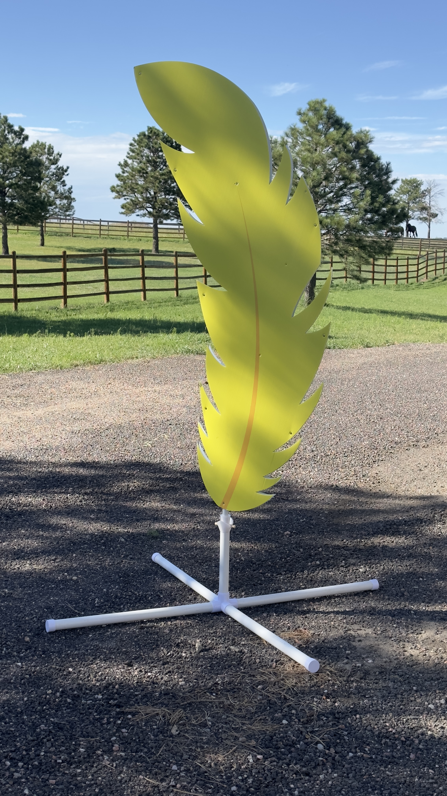
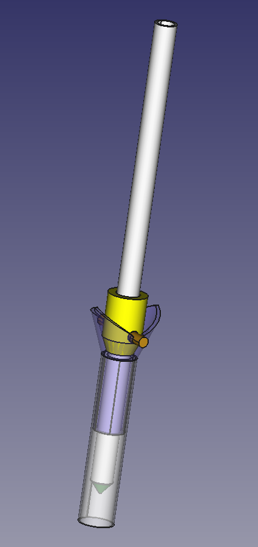

The feathers were used in the 2023 season show.  They consisted of 20 corrugated plastic feathers, printed on both sides with a feather image.  One side was printed in black, and the reverse in color (yellow through orange).

At the beginning of the show, the feathers were showing the black side to the audience.  Near the end of the show as part of the reveal, the feathers were spun around by band members to reveal the color side.

The design of the base in these files were made with the following requirements in mind:
1. Withstand Colorado force winds.  Designed with 15-20mph winds in mind.  In practice, they began to fail around 30mph, but the files here have a reinforced design that should go further (untested).
2. Lock the orientation of the feather in one of two positions (front or back).
3. Quickly and accurately transition between those two positions.

The file contains the 3d printed components.  The remainder of the components were fabricated from PVC and manually assembled.  

These components should be printed from an engineering filament such as PETG, ASA, or ABS.  When under wind load, they take a fair amount of force, and during one incident one of the "Inner Collar" pieces broke apart under the load.

1. The cross portion of the base is made of 4x 2' sections of 1.25" PVC, coupled with a 5 way connector.  The ends are capped.  A 1' section is added to the top.  The components are all attached using PVC cement, and painted black with krylon paint.
2. The 3d printed "Interface" is installed into the top section of the base, and secured with a small set screw drilled through the PVC.
3. The feathers are then constructed using 0.75" PVC to reinforce them.  The 0.75" PVC extends out the bottom of the feather.
4. The 0.75" PVC has a hole drilled in it using the 3d printed drill guide approximately 7" from the end.  The 3d printed "Inner Collar" is installed over the hole, and a wooden pin is installed through the hole.
5. The 0.75" PVC is capped with the 3d printed "PVC Tip".
6. The base was then stabilized with sand bags.  20lbs worked for 30mph winds.

We used binding posts to attach the feather to the 0.75" PVC, which included a cross piece for stabilization of the corrugated board.

In use, the 0.75" PVC "mast" was inserted into the "Interface" piece at teh top of the base.  The wood pin rides along the ridge of the mast to one of two locations.  To rotate to the new position, lift the feather about 2", rotate by hand > 90" and release.

Lessons learned
1. The weakest part of the design was the pin location.  The designs in these files have a slighly beefier Inner Collar to help.  In the future a couple different options might help:
  1. Use ABS printed parts, then use PVC<->ABS cement to weld the parts together.
  2. Modify the inner collar such that the pin doesn't need to go through the PVC.
2. The black paint used did not hold up to rough treatment, and by finals was covered in scratches.  Future props with large awkward pvc bases such as this should take more care in the application of the paint (we did not pre-sand the PVC for example, and relied on the "plastic rated" paint).
3. Double or even triple bag the sand.  We had several instances where bags started leaking.
4. Don't use cheap PETG.  I found the Sunlu branded PETG I used originally was significantly weaker than the replacement parts I printed from a different manufacturer.  I was able to hit the Sunlu parts with a hammer and have them shatter - which is not something PETG should be doing.

