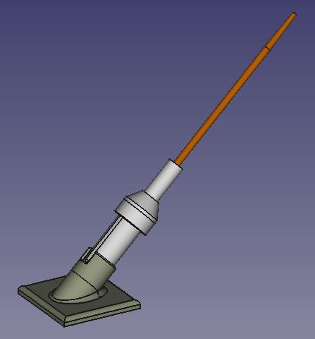

This chopstick launcher was designed to prove out the spring calculations on a small scale prior to moving up in scale to much larger springs.

Utilizes this spring: [McMaster Carr](https://www.mcmaster.com/9657K108/)

In practice, a single chopstick launched using a single spring installed in this device flew 18'.

