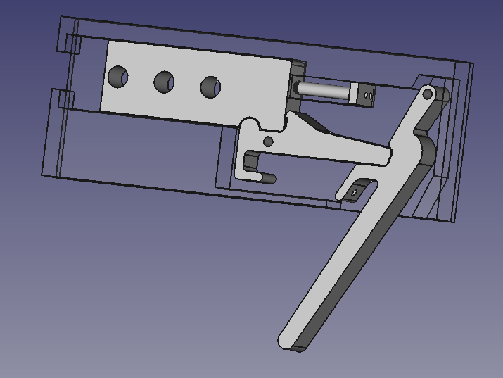

This is a design for a trigger released chopstick launcher.  The trigger is purposefully built oversized relative to the spring and payload to minimize rework as we scale up.

In practice, this trigger design does work and allows for the future addition of a safety catch.  However it also significantly reduced the initial velocity and therefore range of the payload.  I believe this is due to inefficiencies in:
  * The oversized trigger imparts extra friction.  Even a properly scaled trigger will impart extra friction with this design as the ball of the catch rides under the launch mass. 
  * The captive launch mass used as a pusher on the payload absorbs significant energy.  I don't know yet if this can be scaled properly to minimize this loss or if we need to include the catch feature into the flag itself (for safety reasons I believe this should be avoided, as it precludes unloading of the launcher without first firing it).
  * The launching spring is not fully compressed or released.  Future iterations will need to address this.

  