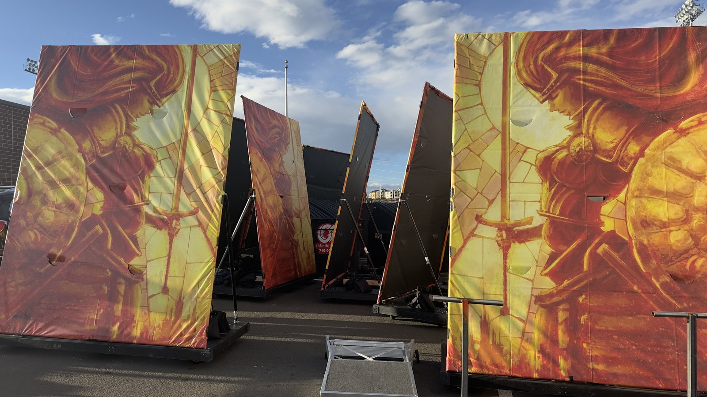

# Rolling Backdrop System

The **Rolling Backdrop System** is a modular, mobile field prop developed for the Pine Creek High School Marching Band (PCHSMB). It provides a nominal 10 ft high x 8 ft wide visual display surface mounted on a dedicated, heavy-duty rolling wood cart base for rapid entry, positioning, and exit during competitive field show performances.

> **Design Credit:** Special thanks and credit to the **Plainfield North Bands** for creating the original cart design and foundational engineering concept, which has been adapted and refined here for the Pine Creek High School Marching Band.

---

## 📖 Build & Operations Manual

The authoritative, fully illustrated manual is maintained in the [`docs/`](docs/) directory:

👉 **[Backdrop Construction and Assembly Guide (DOCX)](docs/Backdrop_Assembly_Guide.docx)**

The manual covers:
- **System Overview & Technical Geometry:** Base cart dimensions (96" x 44.5"), 10' x 8' steel frame, diagonal bracing, and print units.
- **2026 Competition Rules Compliance:** Extracted rules from the 2026 CBA Rulebook (Rule 8.05 surface protection/secondary sandbag containment, Rule 8.07 pneumatic-like wheels, Rule 8.08 12' height limit, Rule 8.09 staging/Falcon Stadium 2025/2026 clearance update, Rule 9.07 25 parent field wristbands).
- **Bill of Materials & Fastener Schedule:** 2x4 lumber cut list, 3/4" ballast posts & flanges, 1-5/8" steel fence posts, GRK screws, clamp brackets, casters, and 3D printed parts.
- **Stage 1 (Cart Base Fabrication):** 2x4 lumber layout, squaring, and fastener placement map.
- **Stage 2 (Decking, Ballast Posts & Casters):** 1/2" plywood left/right decks, 3/4" x 18" vertical iron pipe retention posts, plate casters, and ASA corner bumpers.
- **Stage 3 (Upright Frame Assembly):** 10' x 8' steel tube rectangle and tension band cart mounts.
- **Stage 4 (Diagonal Support Struts):** Guided pre-drilling with 1/8" cobalt drill bit and 3D printed Drill Alignment Jig, end caps, and base U-bolts.
- **Stage 5 (Vinyl Banner Installation):** Double-sided carpet tape underlayment and 1-5/8" pipe snap clamps.
- **Field Operations & Training Protocol:** Student/parent volunteer division of responsibility, field entrance/exit flow, 4–6 double-bagged 15-lb sandbags on wing posts, and 70-lb tube sand reserve.

---

## 🛠️ 3D Printed Parts & Fabrication Jigs

All 3D-printed parts should be printed in **Black ASA** (or UV/heat-stable PETG) for outdoor durability.

| Component / Tool | CAD Source / File | Purpose |
|---|---|---|
| **Corner Bumper Braces** | [`Hardware/Corner Brace.FCStd`](Hardware/Corner%20Brace.FCStd) | 4 required per cart; protects wood and paint from transport scuffs |
| **Drill Alignment Jig** | [`Hardware/Drill Alignment Jig.3mf`](Hardware/Drill%20Alignment%20Jig.3mf) | Clamps onto 1-5/8" fence pipe to guide 1/8" pilot holes for end caps |
| **Strut Bracket Marker** | [`Hardware/Steel Support Strut Bracket Marker.FCStd`](Hardware/Steel%20Support%20Strut%20Bracket%20Marker.FCStd) | Templates mounting positions for base U-bolts and upper tension bands |

---

## 📐 Materials Overview (Per Backdrop)

- **2x** 2x4 x 8-ft SPF/Doug Fir Lumber (Outer Rails A — 96.0")
- **2x** 2x4 x 8-ft Lumber (End Rails B — 44.5")
- **2x** 2x4 Lumber (Inner Longitudinal Rails C)
- **6x** 2x4 Lumber (Transverse Cross Joists D)
- **2x** 1/2-in. Plywood Decking Panels (Left & Right Wings)
- **2x** [3/4" Black Iron Floor Flanges](https://www.homedepot.com/p/The-Plumber-s-Choice-3-4-in-Black-Malleable-Iron-Floor-Flange-5-Pack-FBNF034-5/308967916)
- **2x** 3/4" Dia. x 18" Black Iron Threaded Pipe (Ballast Retention Posts)
- **8x** 1/4-20 x 1-1/2" Carriage Bolts, Washers & Lock Nuts (Flange Fasteners)
- **4x** [Heavy-Duty Swivel Casters with Brakes](https://www.amazon.com/dp/B0CPXFJCJL)
- **4–6x** [Abccanopy 15-lb Heavy-Duty Sandbags with Handle](https://www.amazon.com/dp/B0DFVVZDVK) (Primary Wing Ballast)
- **4–6x** [Plastic Sandbag Liner Bags](https://www.amazon.com/dp/B0BG3F5XVS) (Mandatory Double-Bagging Compliance)
- **1–2x** [Sakrete 70-lb Traction Tube Sand](https://www.lowes.com/pd/Sakrete-0-07-cu-ft-70-lb-Traction-Sand/5015728687) + Contractor Bags (High-Wind Reserve)
- **2x** [1-5/8" Dia. x 10' 16-Ga. Steel Fence Line Posts](https://www.homedepot.com/p/Everbilt-1-5-8-in-Dia-x-8-ft-16-Gauge-Galvanized-Steel-Chain-Link-Fence-Line-Post-328923DPTSEB/312373067)
- **2x** 1-5/8" Dia. x 8' Steel Fence Top Rails
- **4x** [1-5/8" 3-Way Clamp Corner Elbow Brackets](https://www.amazon.com/dp/B0CD7QT6L6)
- **2x** [1-5/8" Galvanized Steel Tension Bands](https://www.homedepot.com/p/Everbilt-1-5-8-in-Galvanized-Steel-Chain-Link-Fence-Tension-Band-328521EB/312373099)
- **2x** [Heavy-Duty Steel U-Bolts](https://www.amazon.com/dp/B09L41JFMS)
- **16–24x** [1-5/8" Pipe Snap Clamps](https://www.amazon.com/dp/B0CDZP8YVF)
- **1x** [GRK #9 x 2-1/2" Star-Drive Wood Screws](https://www.homedepot.com/p/GRK-Fasteners-9-x-2-1-2-in-Star-Drive-Torx-Bugle-Head-R4-Multi-Purpose-Wood-Screw-300-Pack-100101/203533402)
- **1x** [GRK #10 x 4" Star-Drive Structural Screws](https://www.homedepot.com/p/GRK-Fasteners-10-x-4-in-R4-Self-Countersinking-Flat-Head-Multi-Purpose-Screw-50-per-Pack-103141/203525231)
- **1x** 1/8" HSS / Cobalt drill bit rated for steel

---

## 💰 Estimated Cost Breakdown (Per Backdrop Prop)

*Excludes custom printed 10 ft x 8 ft vinyl banner.*

| Component Category | Key Items Included | Est. Cost |
|---|---|:---:|
| **Rolling Cart Base Framing** | 8x 2x4 lumber, 1/2 sheet 1/2" plywood, GRK screws, black paint | $98.00 |
| **Casters & Bumpers** | 4x Heavy-duty swivel plate casters with brakes, 4x ASA corner bumpers | $51.00 |
| **Ballast Retention Posts & Tote** | 2x 3/4" floor flanges & 18" iron pipes, 1x HDX 14-gal storage tote | $46.00 |
| **Upright Steel Frame** | 2x 10-ft 16-ga fence posts, 2x 8-ft top rails, 4x 3-way clamp brackets, tension bands | $121.00 |
| **Diagonal Support Struts** | 1x 10-ft top rail (2 struts), 4x end caps, tension bands, 2x base U-bolts | $49.50 |
| **Vinyl Attachment Hardware** | 1-5/8" pipe snap clamps pack, heavy-duty carpet tape, pilot hardware | $25.00 |
| **TOTAL ESTIMATED COST PER PROP** | | **~$390.00** |

> **Optional Ballast Pack (Rule 8.05 Compliant):**
> 4–6 Abccanopy 15-lb handle sandbags + inner double-bag liners + traction sand: **+$37.00 per cart**.
