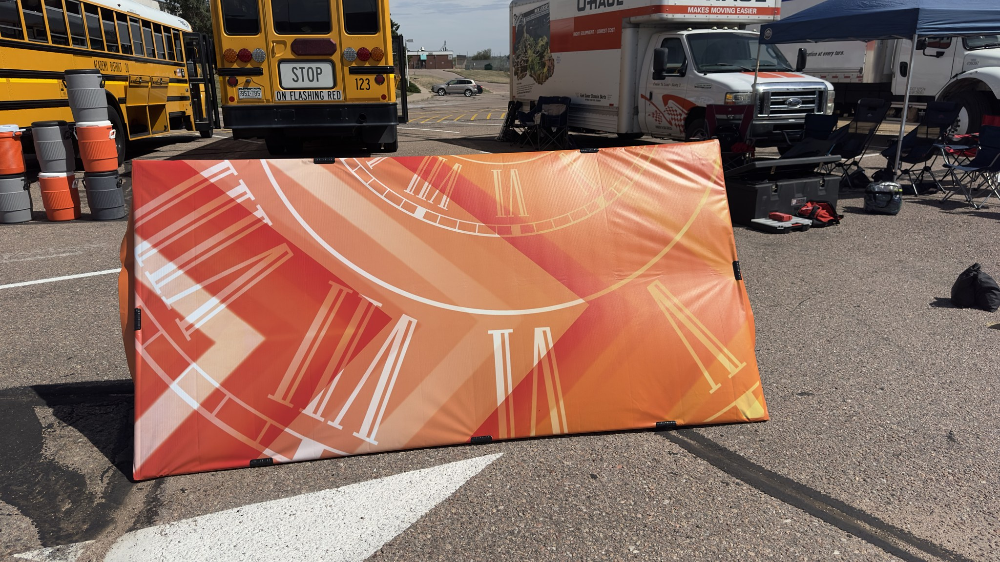
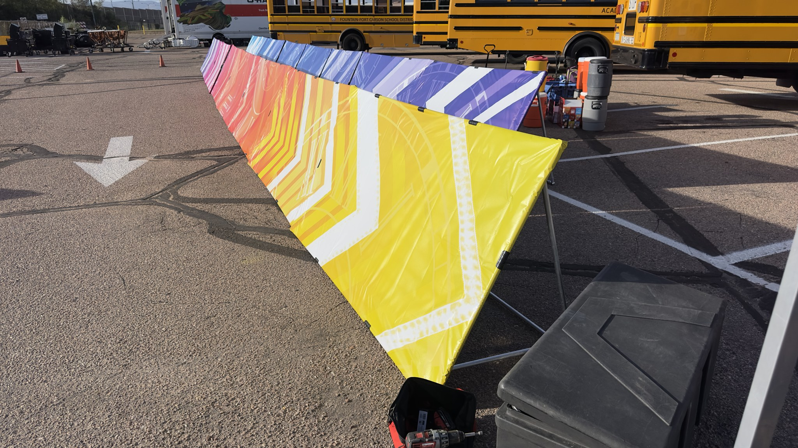

# Sideline Screen / Duck Blind

The **Sideline Screen / Duck Blind** is a modular, folding field prop developed for the Pine Creek High School Marching Band (PCHSMB). It provides the color guard with a nominal 4 ft x 8 ft concealed area for equipment staging, storage, and costume/equipment changes during field show performances.

| Single Completed Screen with Mounted Vinyl | Complete Sideline Screen Fleet Deployed |
| :---: | :---: |
|  |  |

The frame is constructed from 3/4-in. EMT conduit, off-the-shelf clamp brackets, and 3D-printed hardware, faced with a custom-printed decorative vinyl banner. It folds completely flat for transport/storage in a band trailer and quickly unfolds into a stable, self-supporting triangular structure on the field.

---

## 📖 Build & Operations Manual

The authoritative, fully illustrated manual is maintained in the [`docs/`](docs/) directory:

👉 **[View Complete Manual (PDF)](docs/Sideline_Screen_Duck_Blind_Build_Instructions.pdf)** *(Release v0 (D32) — 26 Pages)*  
📄 **[Typst Master Source](docs/Sideline_Screen_Duck_Blind_Build_Instructions.typ)** | 📋 **[Project Manifest](docs/project.json)**

The manual uses a standardized cross-project appendix architecture harmonized with the [Backdrop Manual](../_Backdrop/docs/Backdrop_Assembly_Guide.pdf):
- **Master Cover & Preamble (Pages 1–2):** Prop identity, folding mechanics, visible version history (Build D32), and master manual organization.
- **Appendix A: Field Operations Manual (Sections 1.1–1.7):**
  - **1.1 Roles & Responsibilities:** Parent logistics crew & duck blind managers vs student carry pairs.
  - **1.2 Staging, Transport & Field Gate Entry:** Staging, transport on stage platforms, and Rule 5.02 rear gate entry.
  - **1.3 Field Deployment Protocol:** Two-Student Direct Carry walkthrough (55.7s expected, +139s buffer against Rule 4.03/5.06 cap).
  - **1.4 Post-Performance Retrieval & Continuous Exit:** Direct sprint egress walkthrough (55.0s expected, +65s buffer against Rule 8.05 benchmark).
  - **1.5 Ballasting System & Tiered Wind Safety:** Complete aerodynamic stability envelope, Tier 0–4 schedules, sliding resistance ($17.8\text{ mph}$ Tier 1), and Rule 8.05 double-bagging.
  - **1.6 2026 CBA Competition Rules:** Rules 4.02, 4.03/5.06, 5.02, 8.05, 8.07, 8.08, 8.09, and 9.07 (25 field wristbands).
  - **1.7 Post-Use Teardown & Trailer Packout:** Unsnapping, collapsing flat ($< 2.0"$ nesting thickness), and trailer packout.
- **Appendix B: Construction & Fabrication Manual (Sections 2.1–2.10):**
  - **2.1–2.4:** Shop safety, materials BOM, tools/equipment, and 3D printed parts.
  - **2.5 Raw Material Cutting Schedules:** 7-stick 3/4" EMT electrical conduit cutting schedule.
  - **2.6 Estimated Fabrication Cost Breakdown:** Detailed itemized budget (~$105.00/screen; $1,680.00 fleet total, saving $440 by eliminating carts).
  - **2.7 Step-by-Step Frame Assembly:** Stage 1 (Outer Rectangle), Stage 2 (Cross Rails), Stage 3 (Rear Support Frame), and Stage 4 (Support Arms & Snap Clips).
  - **2.8 Mechanical Inspection & QA Protocol:** Acceptance criteria table and formal sign-off sheet.
  - **2.9 Vinyl Banner Installation:** Ordering bleed, tensioning/clamping procedure, Section 2.9.3 dedicated **Semicircular Wind Relief Flap Cutting** ($R = 4.0\text{ in.}$, $8.0\text{ in.} \times 4.0\text{ in.}$, 6-flap fleet grid $2 \times 3$, 3/8" punch holes, and [PCHSMB Field Prop Circle Cutter](../Circle%20Cutter/) tooling), and seasonal removal.
  - **2.10 Appendix B Index & Purchasing References:** Vendor links, CAD part repositories, and governing rule citations.
- **Appendix C & C.1:** On-prop laminated field operations placard & 4" × 6" drill placement card template.
- **Appendix D:** Parent volunteer competition day guide & checklist.
- **Engineering References:**
  - Technical specifications & ballasting model: [`docs/references/TECHNICAL_SPEC.md`](docs/references/TECHNICAL_SPEC.md)
  - Semicircular wind relief cuts engineering specification: [`docs/references/WIND_RELIEF_CUTS_SPECIFICATION.md`](docs/references/WIND_RELIEF_CUTS_SPECIFICATION.md)
  - Severe wind feasibility study (30 mph limits & failure modes): [`docs/references/WIND_LOADING_30MPH_ANALYSIS.md`](docs/references/WIND_LOADING_30MPH_ANALYSIS.md)
  - Deployment & egress Monte Carlo simulation: [`simulation/results/MONTE_CARLO_REPORT.md`](simulation/results/MONTE_CARLO_REPORT.md) and [`simulation/results/EGRESS_MONTE_CARLO_REPORT.md`](simulation/results/EGRESS_MONTE_CARLO_REPORT.md)

---

## 🚶 Two-Person Direct Carry Architecture (No Transport Carts Required)

With the official adoption of the **Two-Student Carry** field strategy, dedicated rolling transport carts are **not built or required**:
- **Direct Hand-Carry Deployment:** 16 student pairs (32 performers total) carry the fully assembled, 26-lb screens directly from the backfield queue across the turf to the front sideline (~13 lbs per student).
- **Direct Egress Sprint:** At the conclusion of the performance, student pairs pick up their assembled screens and jog straight through the stadium exit gate/tunnel directly to the trailer staging lot without folding on the field.
- **Cost & Logistics Savings:** Eliminating transport carts saves over **$440 in materials**, eliminates cart traffic jams at narrow stadium gates, and reduces adult field-presence penalty risk to zero.

---

## 🛠️ 3D Printed Parts & Hardware

All 3D-printed parts should be printed in **Black ASA** (or UV/weather-stable PETG) for outdoor heat and sunlight resistance. **Do not use PLA** for structural field parts.

| Component | CAD Source (`.FCStd`) | 3MF Slicer File | STEP Model | Notes |
|---|---|---|---|---|
| **Corner Plug (H)** | [`Hardware/Corner Plug.FCStd`](Hardware/Corner%20Plug.FCStd) | [`Hardware/3MF/Corner Plug-Part.step.3mf`](Hardware/3MF/Corner%20Plug-Part.step.3mf) | [`Hardware/STEP/Corner Plug-Part.step`](Hardware/STEP/Corner%20Plug-Part.step) | 6 required; aligns outer corners |
| **Hinged Arm Clip (I)** | [`Hardware/Hinged Arm Clip.FCStd`](Hardware/Hinged%20Arm%20Clip.FCStd) | [`Hardware/3MF/Hinged Arm Clip-Part001.3mf`](Hardware/3MF/Hinged%20Arm%20Clip-Part001.3mf) | [`Hardware/STEP/Hinged Arm Clip-Part001.step`](Hardware/STEP/Hinged%20Arm%20Clip-Part001.step) | 2 required; locks bottom support arms open |
| **Weight Clip** | [`Hardware/Weight Clip.FCStd`](Hardware/Weight%20Clip.FCStd) | [`Hardware/3MF/Weight Clip-Part.3mf`](Hardware/3MF/Weight%20Clip-Part.3mf) | [`Hardware/STEP/Weight Clip-Part001.step`](Hardware/STEP/Weight%20Clip-Part001.step) | Ballast/weight retaining clip |
| **PCHSMB Field Prop Circle Cutter** | [`PCHSMB/Circle Cutter/`](../Circle%20Cutter/) | — | — | Parametric 5-piece cutter with #11 blade and 608 bearings for $R=4.0"$ semicircular flaps |

---

## 📐 Materials Overview (Per Screen)

- **7x** 3/4-in. x 10-ft EMT Electrical Conduit sticks
- **6x** 3/4-in. EMT 3-way Corner Brackets (F)
- **8x** 3/4-in. EMT T-Brackets (G)
- **6x** 3D-Printed Corner Plugs (H)
- **2x** 3D-Printed Hinged Arm Clips (I)
- **36x** #8 x 1/2-in. External-Hex Flange Self-Drilling Screws (J)
- **1x** 4 ft x 8 ft Heavyweight Vinyl Banner with hem and grommets

---

## 💰 Estimated Cost Breakdown

### 1. Per Sideline Screen / Duck Blind (Excl. Vinyl)

| Component Category | Key Items Included | Est. Cost |
|---|---|:---:|
| **Conduit Framing** | 7x 3/4" x 10-ft EMT conduit sticks | $40.50 |
| **Corner Brackets (F)** | 6x 3/4" 3-way corner brackets | $27.00 |
| **T-Brackets (G)** | 8x 3/4" T-brackets | $23.00 |
| **Fasteners (J)** | 36x #8 x 1/2" self-drilling screws | $4.00 |
| **3D-Printed Parts** | 6x Plugs H, 2x Clips I, 2x Weight Clips in Black ASA | $10.00 |
| **TOTAL PER SCREEN** | | **~$105.00** |

> **Optional Ballast Pack (Rule 8.05 Compliant):**
> 2x 15-lb double-bagged sandbags suspended from weight clips: **+$18.00 per screen**.

### 2. Total Fleet Fabrication Estimate (16 Screens Total)

| Fleet Category | Breakdown | Est. Total Cost |
|---|---|:---:|
| **16x Sideline Screens** | 16 frames @ ~$105.00 (EMT, brackets, 3D parts, fasteners; excl. vinyl) | ~$1,680.00 |
| **TOTAL HARDWARE ESTIMATE** | *(No transport carts built — saves $440.00)* | **~$1,680.00** |

> *Note: Custom printed vinyl banners (16x 4'x8' outdoor scrim vinyl) and double-bagged sandbags are quoted separately.*
