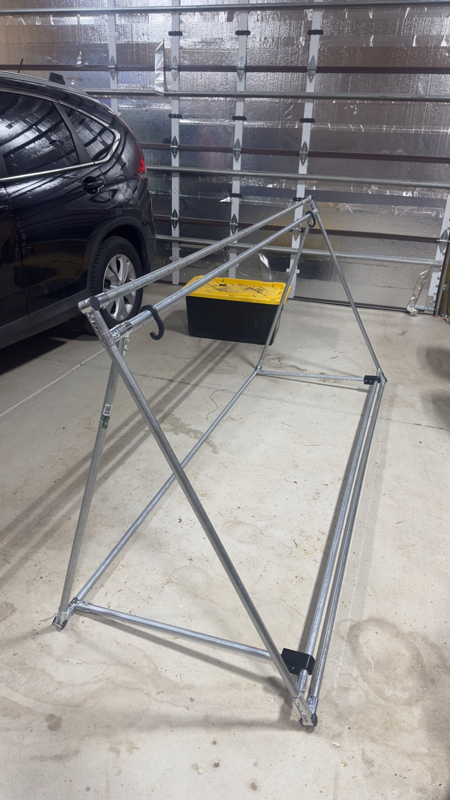

# Sideline Screen / Duck Blind

The **Sideline Screen / Duck Blind** is a modular, folding field prop developed for the Pine Creek High School Marching Band (PCHSMB). It provides the color guard with a nominal 4 ft x 8 ft concealed area for equipment staging, storage, and costume/equipment changes during field show performances.

The frame is constructed from 3/4-in. EMT conduit, off-the-shelf clamp brackets, and 3D-printed hardware, faced with a custom-printed decorative vinyl banner. It folds completely flat for transport/storage in a band trailer and quickly unfolds into a stable, self-supporting triangular structure on the field.

---

## 📖 Build & Operations Manual

The authoritative, fully illustrated manual is maintained in the [`docs/`](docs/) directory:

👉 **[Sideline Screen / Duck Blind Construction and Field Operations Manual (DOCX)](docs/Sideline_Screen_Duck_Blind_Build_Instructions.docx)**

The manual covers:
- **Intro & Overview:** System geometry, folding mechanics, and print units.
- **Appendix A (Field Operations):** Field deployment, transport cart staging, unfolding/folding procedures, wind ballasting, 2026 CBA competition rules compliance, and post-use storage.
- **Appendix B (Construction Manual):** Illustrated parts inventory, conduit cut plan, 4-stage frame assembly, transport cart fabrication (backdrop base + side rails + front/back latching gates), vinyl installation, and digital/purchase source lookup.

---

## 🛒 Transport Cart System (Component 2)

To transport multiple folded sideline screens efficiently between the equipment trailer and the stadium field, a dedicated rolling transport cart is built:
- **Shared Chassis:** Uses the standardized 96 in. x 44.5 in. 2x4 lumber base framing, 1/2" plywood decking, and heavy-duty swivel casters from the [PCHSMB Backdrop System](../_Backdrop/).
- **Side Guide Rails:** Vertical guide rails installed along the left and right sides contain folded screens upright.
- **Front & Rear Latching Gates:** Retaining gates secured with 3D-printed latches ([`Cart Gate Latch.FCStd`](Cart%20Gate%20Latch.FCStd)) keep screens contained during transit and open for rapid sideline unloading and loading.
- **Sideline Stowage:** During field performance, the empty transport cart is parked along the sideline outside the performance area.

---

## 🛠️ 3D Printed Parts & Hardware

All 3D-printed parts should be printed in **Black ASA** (or UV/weather-stable PETG) for outdoor heat and sunlight resistance. **Do not use PLA** for structural field parts.

| Component | CAD Source (`.FCStd`) | 3MF Slicer File | STEP Model | Notes |
|---|---|---|---|---|
| **Corner Plug (H)** | [`Hardware/Corner Plug.FCStd`](Hardware/Corner%20Plug.FCStd) | [`Hardware/3MF/Corner Plug-Part.step.3mf`](Hardware/3MF/Corner%20Plug-Part.step.3mf) | [`Hardware/STEP/Corner Plug-Part.step`](Hardware/STEP/Corner%20Plug-Part.step) | 6 required; aligns outer corners |
| **Hinged Arm Clip (I)** | [`Hardware/Hinged Arm Clip.FCStd`](Hardware/Hinged%20Arm%20Clip.FCStd) | [`Hardware/3MF/Hinged Arm Clip-Part001.3mf`](Hardware/3MF/Hinged%20Arm%20Clip-Part001.3mf) | [`Hardware/STEP/Hinged Arm Clip-Part001.step`](Hardware/STEP/Hinged%20Arm%20Clip-Part001.step) | 2 required; locks bottom support arms open |
| **Weight Clip** | [`Hardware/Weight Clip.FCStd`](Hardware/Weight%20Clip.FCStd) | [`Hardware/3MF/Weight Clip-Part.3mf`](Hardware/3MF/Weight%20Clip-Part.3mf) | [`Hardware/STEP/Weight Clip-Part001.step`](Hardware/STEP/Weight%20Clip-Part001.step) | Ballast/weight retaining clip |
| **Cart Gate Latch** | `Hardware/Cart Gate Latch.FCStd` *(In development)* | — | — | Gate latch mechanism for prop cart transport (provisional) |

---

## 📐 Materials Overview (Per Screen)

- **7x** 3/4-in. x 10-ft EMT Electrical Conduit sticks
- **6x** 3/4-in. EMT 3-way Corner Brackets (F)
- **8x** 3/4-in. EMT T-Brackets (G)
- **6x** 3D-Printed Corner Plugs (H)
- **2x** 3D-Printed Hinged Arm Clips (I)
- **36x** #8 x 1/2-in. External-Hex Flange Self-Drilling Screws (J)
- **1x** 4 ft x 8 ft Heavyweight Vinyl Banner with hem and grommets
