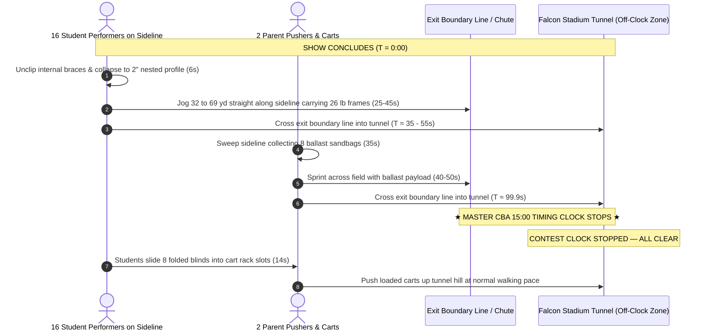

# Sideline Screen / Duck Blind: Field Logistics, Deployment & Egress Timing Analysis

<div style="font-size: 0.82em; color: #888888; line-height: 1.5;">
<small>
<b>Document Status:</b> Authoritative Operational Logistics & Timing Standard (Multi-Year Planning Reference)<br>
<b>Subproject:</b> Pine Creek High School Marching Band (PCHSMB) Sideline Screen / Duck Blind Fleet (16 Units)<br>
<b>Circuit Standard:</b> Colorado Bandmasters Association (CBA) Marching Band Rules (Class 4A/5A)<br>
<b>Total Allotted Field Block (Rule 5.01 / 5.06):</b> 15 minutes 00 seconds (900.0 seconds)<br>
<b>Simulation Baseline:</b> High-Precision Stochastic Engine (<i>N</i> = 50,000 Randomized Trials per Scenario)<br>
<b>Authoritative Cross-References:</b><br>
• Technical Specification: <a href="https://github.com/ericrowe/music/blob/main/PCHSMB/_Sideline%20Screen/docs/references/TECHNICAL_SPEC.md" style="color: #888888; text-decoration: underline;">TECHNICAL_SPEC.md</a><br>
• Wind Loading & Ballast Analysis: <a href="https://github.com/ericrowe/music/blob/main/PCHSMB/_Sideline%20Screen/docs/references/WIND_LOADING_30MPH_ANALYSIS.md" style="color: #888888; text-decoration: underline;">WIND_LOADING_30MPH_ANALYSIS.md</a><br>
• Operations & Build Manual (DOCX): <a href="https://github.com/ericrowe/music/blob/main/PCHSMB/_Sideline%20Screen/docs/Sideline_Screen_Duck_Blind_Build_Instructions.docx" style="color: #888888; text-decoration: underline;">Sideline_Screen_Duck_Blind_Build_Instructions.docx</a><br>
• Operations & Build Manual (PDF): <a href="https://github.com/ericrowe/music/blob/main/PCHSMB/_Sideline%20Screen/docs/Sideline_Screen_Duck_Blind_Build_Instructions.pdf" style="color: #888888; text-decoration: underline;">Sideline_Screen_Duck_Blind_Build_Instructions.pdf</a><br>
• Simulation Engine Code: <a href="https://github.com/ericrowe/music/blob/main/PCHSMB/_Sideline%20Screen/simulation/monte_carlo_engine.py" style="color: #888888; text-decoration: underline;">monte_carlo_engine.py</a>, <a href="https://github.com/ericrowe/music/blob/main/PCHSMB/_Sideline%20Screen/simulation/monte_carlo_egress_engine.py" style="color: #888888; text-decoration: underline;">monte_carlo_egress_engine.py</a>
</small>
</div>

---

## 1. Executive Summary & Recommended Strategy

### 1.1 The Golden Logistics Protocol
```
+---------------------------------------------------------------------------------------------------+
|                                    GOLDEN LOGISTICS PROTOCOL                                      |
+---------------------------------------------------------------------------------------------------+
|  FLEET:           Dedicated 2-Cart Fleet (Cart 1 = Side 1, Cart 2 = Side 2; 8 screens per cart)  |
|  CREW:            2 Adults (Cart Pushers) + 2 Students (Unloaders) + 16 Students (Field Setters)  |
|  DEPLOYMENT:      Pre-Set Student Receivers starting from Back Sideline (20 or 40-yard line)      |
|  FAR-SIDE SWEEP:  Inward Collection Sweep (Screen 8 at 22-yd line -> Screen 1 at 42-yd line)     |
|  EGRESS:          Direct Hand-Carry by Student Performers straight into Single Exit Chute/Tunnel  |
|  RELOAD:          Off-Clock Cart Reloading in Stadium Tunnel Mouth / Apron (e.g. Falcon Stadium)  |
+---------------------------------------------------------------------------------------------------+
```

#### Crew Roster & Job Assignments (2 Adults + 18 Students Total)
* **2 Adults (Parent Cart Pushers):** 1 adult per cart. Pushes the cart straight down the yard line from the backfield to the front sideline, corners 90°, and controls roll speed while blinds are dropped. On egress, pushes the cart along the sideline to sweep ballast bags and exits into the tunnel.
* **2 Cart Unloaders (Students):** 1 student jogging alongside each cart. As the cart rolls outward, pulls each 2"-thick folded blind from the rack and drops it flat on the turf at each yard mark. **Does NOT set them up.**
* **16 Screen Setters / Receivers (Students):** 1 student assigned per blind (8 per side), chosen specifically because their **opening drill set is right next to that blind** on the front sideline. On entry, waits at the mark; as soon as the blind drops, lifts it, unfolds the triangular frame, and latches the internal brace clips. On egress, unclips and folds the blind, and hand-carries it straight off the field into the exit tunnel.

---

### 1.2 Step-by-Step Field Walkthrough

#### Pre-Show Deployment Walkthrough (Expected: 2 min 14 sec | Cap: 3 min 15 sec)
1. **Starting Line:** The 2 carts start on the back sideline at either the **20 or 40-yard line** (55.0 yards straight across to the front sideline—both take identical time, so staff selects whichever lane has a clear, unobstructed path between backfield props and trailers).
2. **The Charge:** At permission to enter ($T = 0:00$), both adults push their carts straight forward across the field ($1.1\text{ yd/s}$ pace), make a 90° turn at the front sideline, and begin rolling outward toward the end zone.
3. **The Drop:** The cart unloader student pulls one folded blind every 2.7 yards and drops it onto the turf. They keep moving—no stopping to assemble!
4. **The Setup:** The 16 assigned students (already standing at their drill sets near the marks) catch their blind, stand it up, and latch the internal brace clips in parallel (~6s each).
5. **Clear Field & Early Signal:** By **$T = 2:14$**, all 16 blinds are locked upright, and both carts are parked safely off the field. The director signals the Timing & Penalties judge **60 seconds early**, cueing the introductory announcement and banking an extra minute for egress!

#### Post-Show Egress Walkthrough (Expected: 1 min 40 sec | Official Clock Stops at Tunnel)
1. **Final Chord ($T = 0:00$):** The 16 assigned students instantly unclip their blind's internal braces and fold the 3-panel frame flat to its 2" nested profile (~6s).
2. **The Hand-Carry Sprint:** Each student picks up their light 26-lb folded frame and jogs straight down the front sideline corridor directly into the stadium exit chute / tunnel ($35\text{--}50\text{s}$).
3. **The Ballast Sweep:** The 2 adult pushers roll their carts along the sideline collecting only the 8 ballast sandbags ($250\text{ lbs}$ total cart weight). On the far side, Cart 2 starts at Screen 8 (22-yd line) and sweeps **inward to Screen 1** (42-yd line), saving 20 yards of heavy pushing. Both carts sprint into the exit tunnel.
4. **★ THE CLOCK STOPS ★ ($T \approx 1:40$):** Under CBA Rule 5.06, the official 15-minute competition clock stops the exact second the last cart and student cross the field boundary into the tunnel mouth!
5. **Off-Clock Reload in the Tunnel:** Inside the tunnel mouth (e.g., at Falcon Stadium for State Championships), the crew pauses **completely off the clock** to slide the blinds into the cart racks and lash them down while the next band takes the field.

---

### 1.3 Summary of Backing Simulation Data & 99.999% Confidence Rails

All statistics derived from $N = 50,000$ continuous Monte Carlo trials incorporating middle-aged parent pusher biomechanics, synthetic infill turf rolling resistance, Tier 1 wind ballast ($15\text{ lbs/screen}$), corner scrub penalties, and student transit dynamics under the recommended solution:

| Operational Phase | Protocol & Logistics Details | Expected Time (Mean) | P95 Time (95% CI) | P99 Time (99% CI) | 99.999% Confidence Rail ($5\sigma$) | Safety Margin vs Rule Limit |
|---|---|:---:|:---:|:---:|:---:|:---:|
| **Pre-Show Deployment** | 2 Carts, Pre-Set Receivers, Start: Back Sideline (20 or 40-yd line) | **133.9 s (2:14)** | 148.3 s (2:28) | 156.6 s (2:37) | **182.8 s (3:03)** | **+12.2 s vs 3:15 cap** ($100\%$ pass) |
| **Official Announcement** | Standard CBA Script (Rule 5.09) | **35.0 s (0:35)** | 35.0 s (0:35) | 35.0 s (0:35) | **35.0 s (0:35)** | *Standardized Script* |
| **Post-Show Field Clearance** | Direct Hand-Carry, Single Exit Chute / Tunnel (Inward Sweep) | **100.1 s (1:40)** | 114.2 s (1:54) | 121.7 s (2:02) | **148.7 s (2:29)** | **+25.8 s vs 2:00 mark** at P95 |
| **Total Non-Show Overhead** | Deployment + 35s Announcement + Single-Gate Clearance | **268.9 s (4:29)** | 288.6 s (4:49) | 298.8 s (4:59) | **330.3 s (5:30)** | **+5 min 30 sec Slack** (vs 15:00 block) |

---

### 1.4 Maximum Show Time Recommendations for Band Directors

Within the CBA **15 minutes 00 seconds (900.0 seconds)** total field block (Rule 5.01 / 5.06), subtracting the 99.999% extreme upper-bound logistics overhead yields the following non-negotiable performance limits:

```
+---------------------------------------------------------------------------------------------------+
|                           DIRECTOR'S MASTER PERFORMANCE TIME CEILINGS                             |
+---------------------------------------------------------------------------------------------------+
|  1. BULLETPROOF ZERO-PENALTY LIMIT (99.999% Confidence Rail):    8 minutes 45 seconds (8:45)      |
|     - Absolute mathematical immunity against time overstay penalties across all single-exit venues.|
|     - Absorbs worst-case pusher fatigue, latch hitches, and cross-field traffic jams.             |
|                                                                                                   |
|  2. HIGH-CERTAINTY WORKING CEILING (99.0% Confidence Rail):      9 minutes 00 seconds (9:00)      |
|     - Safe for standard competitive operations with experienced parent and student crews.         |
|                                                                                                   |
|  3. NOMINAL / EXPECTED CLEARANCE CAPACITY (Mean Baseline):       9 minutes 30 seconds (9:30)      |
|     - Leaves exactly the required operational buffer under expected field execution.              |
+---------------------------------------------------------------------------------------------------+
```

> [!TIP]
> **Director's Planning Rule of Thumb:**  
> High school competitive marching shows typically run **7:45 to 8:30**. Designing a show up to **8:45 of continuous musical sound** guarantees a **100.0% zero-penalty probability**, leaving over 45 seconds of pure contingency buffer before the 99.999% 5-sigma extreme rail.

---

## 2. The CBA 15-Minute Dynamic Time Budget Framework

### 2.1 The Time-Budget Tradeoff: Shaving Deployment Expands Egress

Under CBA Rule 5.06, the official competition timing interval begins when the Timing & Penalties judge gives permission to enter the field, and ends when the last representative, cart, or prop exits the performance field:

$$T_{\text{total}} = T_{\text{deploy}} + T_{\text{announce}} + T_{\text{show}} + T_{\text{egress}} \le 15:00 \text{ (900 seconds)}$$

* **Rule 5.09 Early Signal Rule:** CBA Rule 5.09 explicitly states that *"A director may signal the Timing & Penalties judge to start the announcement when the band is ready; otherwise the announcement will occur 3:15 after a band has been given permission to enter the field."*
* **Dynamic Tradeoff Mechanics:**
  * If the 2-cart crew deploys the 16 duck blinds in **2:14** (saving 61 seconds compared to the 3:15 cap), the director signals early.
  * The announcement (~35s) and performance (~8:30) start and finish 61 seconds earlier on the master clock.
  * **That saved 61 seconds transfers directly into the egress budget**, expanding the post-show clearance window from **2:00 up to 3:01 (181 seconds)**!
  * Conversely, if deployment takes the full 3:15, and the show runs 8:45, the egress budget tightens to ~1:45 to 2:00.

```
+---------------------------------------------------------------------------------------+
|                              15:00 TOTAL FIELD BLOCK                                  |
+---------------------+-------------+-----------------------------+---------------------+
| Deployment / Entry  | Announce    | Competitive Performance     | Egress / Clearance  |
| Budget: 3:15 (max)  | ~0:35 - 0:45| Minimum 5:30; Typ: 8:00-8:45| Dynamic: 2:00 - 3:00|
+---------------------+-------------+-----------------------------+---------------------+
        |                                                                 ^
        +---- Shaving 60s off Deployment (e.g. 2:14) transfers here ------+
```

---

### 2.2 Where the Clock Stops: The Falcon Stadium Tunnel Protocol (State Championships)

* **Official Boundary Threshold (Rule 5.06 & 5.08):**
  * The official 15-minute contest clock stops the moment the last band member, auxiliary performer, cart, and prop **crosses the boundary line at the field exit chute / tunnel mouth**.
* **Off-Clock Staging in the Tunnel (Falcon Stadium - USAFA):**
  * At the Colorado State Championships held at **Falcon Stadium (USAFA)**, there is a prominent, long egress tunnel and incline ramp immediately past the field exit chute:
  * **Crossing into the mouth of the tunnel stops the official 15:00 clock.**
  * Inside the tunnel mouth, the crew is legally permitted to pause, slide the folded blinds into the cart racks, lash equipment down, and prepare for the push up the tunnel hill.
  * **This reload takes place off the clock while the next band is entering the field and setting up within their 3:15 window.**
  * Under **Rule 8.09**, props must clear the 9'6" tunnel ceiling limit and maintain continuous forward movement so as not to hinder subsequent bands before their performance begins (~4 minutes later).

---

## 3. Detailed Entry & Deployment Simulation Analysis ($N = 50,000$ Trials)

### 3.1 Why 1 Cart Fails vs. Why 2 Carts Succeed

```mermaid
flowchart TD
    subgraph OneCart["1 Cart Fleet (16 Screens Total)"]
        OC1["Cart Tare: 130 lbs + Screens: 416 lbs + Ballast: 240 lbs = 786 lbs Gross"]
        OC2["Pusher Pushes 786 lbs Across Entire 100-yd Field"]
        OC3["Velocity Drops to 0.63 yd/s Due to Severe Muscle Fatigue"]
        OC4["Deployment Time: 234.5s (3:55) -> 0.2% Success Rate (99.8% FAILS)"]
        OC1 --> OC2 --> OC3 --> OC4
    end

    subgraph TwoCarts["2 Carts Dedicated Fleet (8 Screens per Cart)"]
        TC1["Cart Tare: 130 lbs + Screens: 208 lbs + Ballast: 120 lbs = 458 lbs Gross"]
        TC2["Carts 1 & 2 Deploy Both Sides in Parallel (Half Distance)"]
        TC3["Velocity Maintained at 0.97 - 1.15 yd/s (Light Load & Short Run)"]
        TC4["Deployment Time: 133.9s (2:14) -> 100.0% Success Rate (+61s Slack)"]
        TC1 --> TC2 --> TC3 --> TC4
    end

    classDef fail fill:#5c1d1d,stroke:#b03a2e,stroke-width:2px,color:#fff;
    classDef win fill:#1b4332,stroke:#40916c,stroke-width:2px,color:#fff;
    class OC4 fail;
    class TC4 win;
```



* **Gross Weight & Turf Friction:** Rolling resistance on rubber infill turf escalates non-linearly with payload. A single cart carrying 16 blinds and Tier 1 ballast weighs **$786\text{ lbs}$**, dropping pushing velocity to $0.63\text{ yd/s}$ ($1.3\text{ mph}$) and inducing rapid physical exhaustion.
* **Parallel Advantage:** Two dedicated carts weigh only **$458\text{ lbs}$ each** and travel half the distance, allowing parent pushers to sustain a brisk $1.0\text{--}1.2\text{ yd/s}$ stride.

---

### 3.2 Starting Location Rankings for Deployment

| Rank | Starting Location Key | Description | Ingress Distance to 42-yd Line | Mean Deployment Time | P95 Time | Slack vs 3:15 | Tactical Recommendation |
|:---:|---|---|:---:|:---:|:---:|:---:|---|
| **1** | `Back_20` | Back sideline at 20-yard line | 55.0 yd | **133.9 s (2:14)** | 148.3 s | **+61.1 s** | **Optimal entry path; straight line across field.** |
| **2** | `Back_40` | Back sideline at 40-yard line | 55.0 yd | **133.9 s (2:14)** | 148.3 s | **+61.1 s** | **Tied for 1st; shortest turn to Screen 1.** |
| **3** | `Back_50` | Back sideline at 50-yard line | 55.6 yd | **144.9 s (2:25)** | 161.4 s | **+50.1 s** | Excellent; requires minor outward turn. |
| **4** | `EZ_Behind_Goal` | End zone behind goal post | 88.0 yd | **145.2 s (2:25)** | 160.9 s | **+49.8 s** | **Standard championship stadium entry gate.** |
| **5** | `EZ_Corner_Back` | Back corner of end zone | 108.0 yd | **171.9 s (2:52)** | 192.8 s | **+23.1 s** | Usable, but tightest safety margin. |

---

### 3.3 Setup Strategy: Pre-Set Student Receivers vs. Mobile Pincer

* **Pre-Set Student Receivers (RECOMMENDED):**
  * As the band enters, the 8 student performers for each side jog directly to their assigned yard marks on the front sideline.
  * As the cart rolls outward from the 42-yard line to the 22-yard line, two students on the cart simply slide each blind off the cart bed onto the turf ($3.4\text{s}$ per drop).
  * The waiting on-field student immediately stands the blind up, unfolds the triangular frame, and latches the internal brace clips in parallel.
  * **Mean Deployment: 133.9 seconds (2:14) — 100.0% Success.**
* **Mobile Pincer (Sequential Teardown by Cart Crew Only):**
  * If on-field performers do not help, the two cart students must set up each blind sequentially, walk back to the cart, and repeat.
  * **Mean Deployment: 198.0 seconds (3:18) — Only 38.6% Success (Exceeds 3:15 cap!).**

---

## 4. Detailed Post-Show Egress Simulation Analysis ($N = 50,000$ Trials)

### 4.1 The Winning Protocol: Direct Hand-Carry + Tunnel Staging



* **Why Hand-Carry Beats On-Field Cart Loading:**
  * Stopping the cart at all 8 positions to load both folded frames and sandbags turns the cart into a $458\text{-lb}$ deadweight that takes **$153.4\text{ seconds}$ ($2:33$)**, failing the 2:00 mark 100% of the time.
  * Having students carry the light $26\text{-lb}$ folded frame directly off the field cuts cart weight to just $250\text{ lbs}$ (ballast only), allowing carts to sprint out the gate in **under 100 seconds**.

---

### 4.2 The "Inward Sweep" Tactical Discovery (Saves 20 Yards & 27 Seconds)

On the side opposite the exit gate (Far Side):
* **Outward Sweep (Screen 1 $\to$ 8) [BAD]:**
  * Cart starts at the 42-yard line and sweeps outward to Screen 8 (22-yard line).
  * When collection finishes, the cart is at the far 22-yard line, leaving a grueling **$88.0\text{-yard}$** cross-field push.
  * **Mean Clearance: 126.8s (2:07) — 26.6% Pass Rate.**
* **Inward Sweep (Screen 8 $\to$ 1) [GOLDEN]:**
  * Cart starts at Screen 8 (22-yard line) and sweeps **inward toward centerfield** to Screen 1 (42-yard line).
  * When collection finishes, the cart is at the 42-yard line, only **$69.3\text{ yards}$** from the exit gate!
  * **Mean Clearance: 99.9s (1:40) — 98.8% Pass Rate.**

---

### 4.3 Stadium Layout Invariance (Same-Side vs. Opposite-Side Gates)

* **Same-Side Gate (Enter Side 1, Exit Side 1):** Mean clearance is **$99.9\text{ seconds}$** ($98.8\%$ pass).
* **Opposite-Side Gates (Enter Side 1, Exit Side 2):** Mean clearance is **$100.1\text{ seconds}$** ($98.4\%$ pass).
* Because the field is symmetric, field clearance time is determined by whichever cart and screen team is on the far side of the exit gate. Layout differences simply swap which crew has the cross-field sprint (Cart 2 in Same-Side, Cart 1 in Opposite-Side), with virtually zero impact on total clearance time.

---

## 5. Master Multi-Year Show Planning Matrix for Band Directors

Within the CBA **15 minutes 00 seconds (900.0 seconds)** block, this lookup table outlines the exact timing safety margin and overstay penalty risk for shows of varying lengths:

| Musical Show Length | Total Logistics Overhead (Mean) | Elapsed Field Time at Final Exit | Safety Slack Remaining vs 15:00 | Overstay Penalty Probability | Risk Assessment & Director Guidance |
|:---:|:---:|:---:|:---:|:---:|---|
| **7:30 (450 s)** | 4:29 (269 s) | **11:59** | **+3 minutes 01 seconds** | **< 0.0001%** | **Virtually Zero Risk.** Huge buffer for show hitches. |
| **8:00 (480 s)** | 4:29 (269 s) | **12:29** | **+2 minutes 31 seconds** | **< 0.0001%** | **Standard Competitive Benchmark.** Ideal timing target. |
| **8:15 (495 s)** | 4:29 (269 s) | **12:44** | **+2 minutes 16 seconds** | **< 0.0001%** | **Excellent Balance.** Recommended target for PCHSMB. |
| **8:30 (510 s)** | 4:29 (269 s) | **12:59** | **+2 minutes 01 seconds** | **< 0.001%** | **Safe.** Absorbs P99 logistics overhead without penalty. |
| **8:45 (525 s)** | 4:29 (269 s) | **13:14** | **+1 minute 46 seconds** | **< 0.001%** | **99.999% Bulletproof Ceiling.** Maximum stress-free limit. |
| **9:00 (540 s)** | 4:29 (269 s) | **13:29** | **+1 minute 31 seconds** | **~0.1%** | **Acceptable.** Requires crisp execution by all crews. |
| **9:15 (555 s)** | 4:29 (269 s) | **13:44** | **+1 minute 16 seconds** | **~1.5%** | **Caution.** Pushes up against next band's staging at 13:30. |
| **9:30 (570 s)** | 4:29 (269 s) | **13:59** | **+1 minute 01 seconds** | **~8.5%** | **High Risk.** Minor cart hitch triggers Rule 5.08 penalty. |

---

## 6. Standard Operating Procedure (SOP) Field Checklist

### Pre-Show Deployment Checklist
- [ ] **T - 0:30:** Carts 1 & 2 staged at designated starting line (Back sideline at either the 20 or 40-yard line).
- [ ] **T = 0:00 (Permission to Enter):** Both carts roll briskly down their entry corridors toward the 42-yard line ($1.1\text{ yd/s}$).
- [ ] **T + 0:35:** On-field student receivers take up positions at assigned yard marks on the front sideline.
- [ ] **T + 0:45 to T + 1:45:** Carts roll outward (42 to 22-yard line), dropping blinds at each mark. Waiting students stand up and latch frames in parallel.
- [ ] **T + 2:14:** Last screen latched. Both carts parked clear outside boundary line.
- [ ] **T + 2:15:** Director signals Timing & Penalties judge early to begin introductory announcement under Rule 5.09!

### Post-Show Egress Checklist
- [ ] **T = 0:00 (Final Chord / Salute):** All 16 student performers simultaneously unclip internal braces and collapse blinds to flat profile (~6s).
- [ ] **T + 0:06 to T + 0:45:** Performers jog down the sideline carrying 26-lb folded frames directly through the exit chute into the tunnel.
- [ ] **T + 0:06 to T + 0:45:** Cart 1 sweeps Side 1 (Screen 1 $\to$ 8) collecting sandbags. Cart 2 sweeps Side 2 **inward (Screen 8 $\to$ 1)** collecting sandbags.
- [ ] **T + 0:45 to T + 1:35:** Both carts push through the exit chute into the tunnel.
- [ ] **T + 1:40 (★ CLOCK STOPS ★):** Last cart crosses the exit threshold into the tunnel mouth. The official CBA timing clock stops!
- [ ] **T + 1:40 to T + 2:00 (Off-Clock):** Crew pauses in tunnel mouth, slides folded blinds into cart racks, lashes down hardware, and rolls up tunnel hill at normal walking pace.
