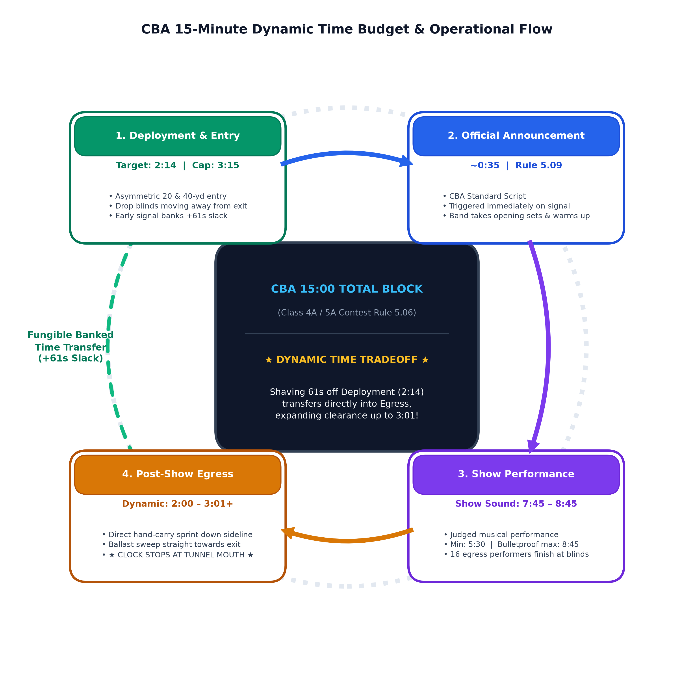
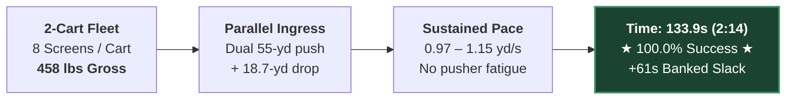
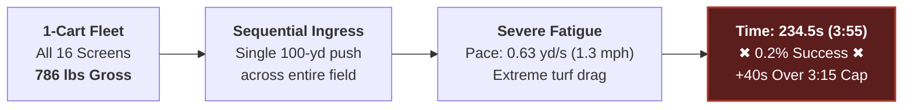
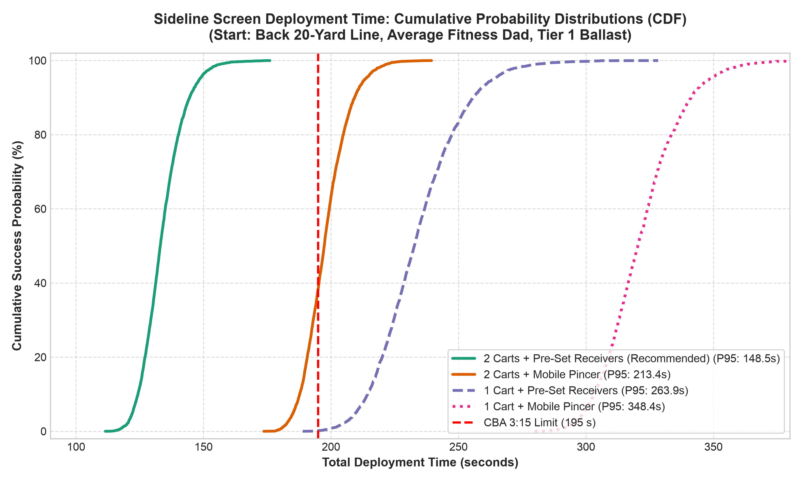
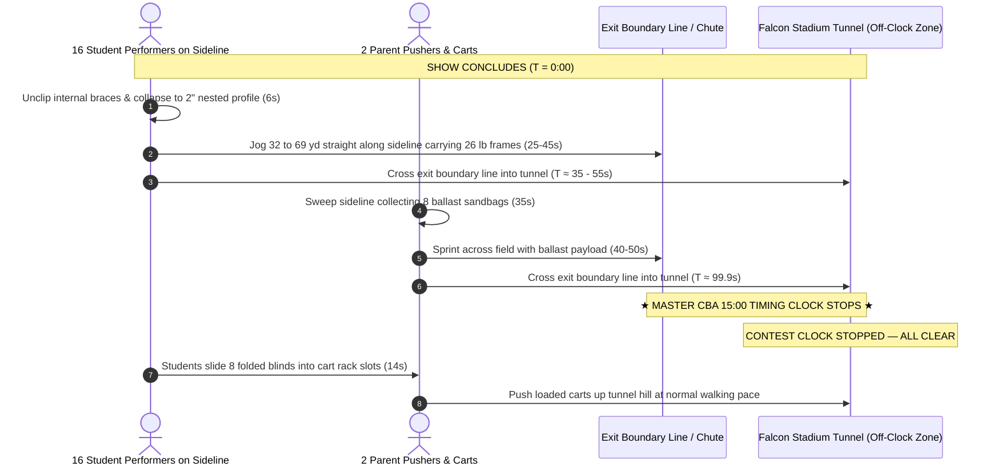
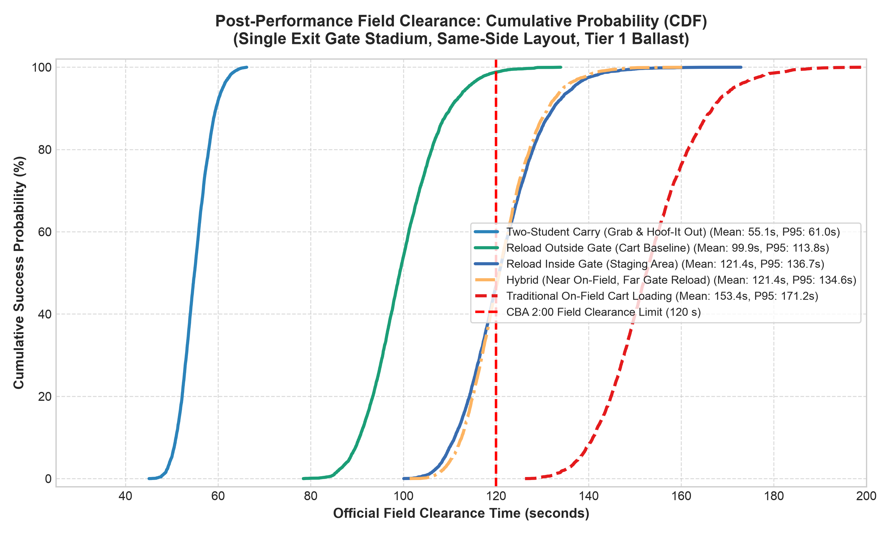
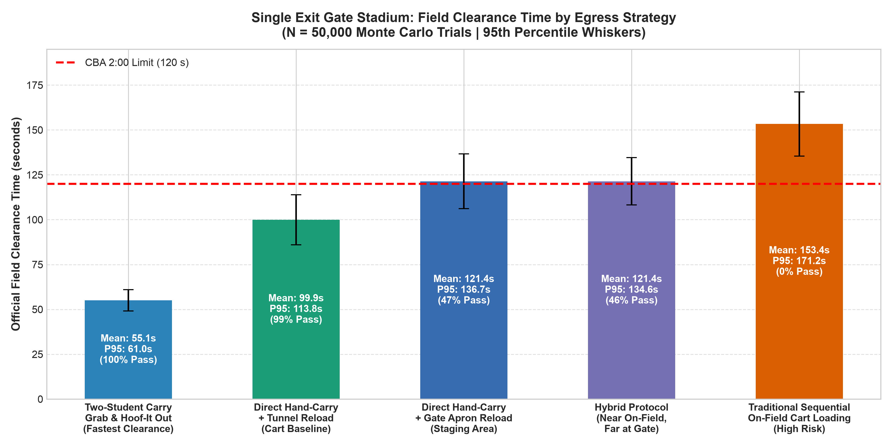
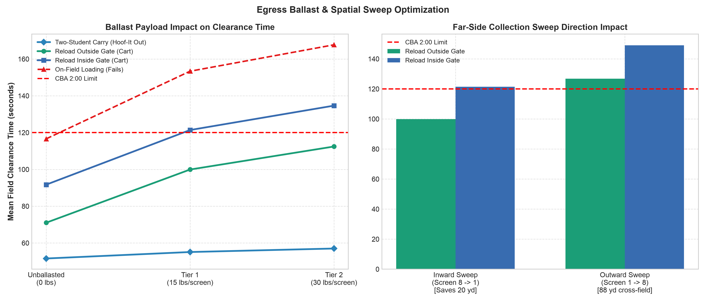

# Sideline Screen / Duck Blind: Field Logistics, Deployment & Egress Timing Analysis

---

## 1. Executive Summary & Recommended Strategy

### 1.1 The Adopted Two-Student Carry Protocol
```
+---------------------------------------------------------------------------------------------------+
|                                 ADOPTED FIELD LOGISTICS PROTOCOL                                  |
+---------------------------------------------------------------------------------------------------+
|  PRIMARY STRATEGY: Two-Student Carry (Walk-Across Deployment & Egress Sprint)                      |
|  CREW:             32 Student Performers (16 pairs, 1 pair per screen) + 2 Adult Ballast Pushers  |
|  DEPLOYMENT:       Walk-Across from Back Sideline / End Zone directly to Front Sideline Marks     |
|  DEPLOYMENT TIME:  Mean: 55.7 seconds (0:55) | P95: 58.3 seconds | Buffer: +139.3s vs 3:15 Clock   |
|  EGRESS:           Two-Student Hand-Carry Sprint straight through Stadium Exit Gate / Tunnel      |
|  EGRESS TIME:      Mean: 55.0 seconds (0:55) | P95: 60.4 seconds | Buffer: +65.0s vs 2:00 Clock    |
|  CARTS & BALLAST:  2 Rolling Carts support off-field transport and sideline ballast sweep         |
|  PENALTY RISK:     0.0% (Zero adult volunteers step on turf during deployment = 0 rule penalties) |
+---------------------------------------------------------------------------------------------------+
```

#### Crew Roster & Job Assignments (32 Student Performers + 2 Adult Ballast Handlers)
* **32 Student Handlers (16 Student Pairs):** 2 students assigned per screen (8 pairs on Side 1, 8 pairs on Side 2).
  - **Deployment:** Prior to permission, student pairs carry the fully assembled 26-lb duck blind into the stadium and queue on the back sideline/end zone directly across from their assigned yard line. On the starting horn, pairs walk straight across the field (~55 yds at 1.1 yd/s), deposit the screen on its front mark, fine-align, and place the ballast bags over rear rail C. Complete in **~55–58 seconds**.
  - **Egress:** At the final show cutoff chord, assigned pairs gently remove ballast to the turf, grasp the assembled screen between them (13 lbs/student), and sprint straight out through the stadium exit gate/tunnel. Complete field clearance in **~50–60 seconds**!
* **2 Adults (Parent Ballast Pushers):** 1 adult per cart.
  - Staged outside the front sideline boundary during performance.
  - On show conclusion, roll empty carts along the front sideline to sweep resting ballast bags and exit through the tunnel.
  - Cart reloading occurs off-clock in the stadium exit tunnel/apron.

---

### 1.2 Step-by-Step Field Walkthrough

#### Pre-Show Deployment Walkthrough (Expected: 55.7 sec | Cap: 3 min 15 sec)
1. **Pre-Staging:** 16 student pairs carry assembled screens from the truck/warmup lot through the rear entrance gate (CBA Rule 5.02) and queue along the back sideline/end zone.
2. **The Walk-Across ($T = 0:00$):** At official entry permission, all 16 student pairs walk in synchronized formation straight across the field toward the front sideline.
3. **Placement & Ballast ($T = 0:45$ to $0:55$):** Pairs set the screen, adjust lateral alignment to form a continuous visual wall, and place ballast bags over the rear ground rail C.
4. **Clear Field ($T \le 0:58$):** Student pairs transition directly to their opening performance drill coordinates. The field is 100% clear of adults and prop equipment in **under 1 minute**, banking **+139 seconds** before the 3:15 announcement ends!

#### Post-Show Egress Walkthrough (Expected: 55.0 sec | Official Clock Stops at Tunnel)
1. **Final Chord ($T = 0:00$):** Student pairs immediately lift ballast bags gently to the turf (never throwing or dropping sandbags to prevent seam rupture and turf damage).
2. **The Two-Student Carry Sprint ($T = 0:05$ to $0:55$):** Student pairs grasp their screen (13 lbs/student) and jog straight down the front sideline corridor into the stadium exit chute / tunnel.
3. **The Ballast Sweep ($T = 0:15$ to $1:15$):** Adult pushers enter the sideline and sweep resting sandbags into the carts.
4. **★ THE CLOCK STOPS ★ ($T \le 1:00$ to $1:15$):** All performers and props cross the exit gate threshold, stopping the official competition clock with over **+45 to +65 seconds of safety slack**!
5. **Off-Clock Reload:** In the tunnel mouth, screens are slid into transport cart racks and lashed down off the clock.

---

### 1.3 Summary of Backing Simulation Data & Confidence Rails

All statistics derived from $N = 50,000$ continuous Monte Carlo trials (cart fleet) and $N = 5,000$ trials (Two-Student Carry) incorporating pusher biomechanics, student transit dynamics, infill turf rolling resistance, Tier 1 wind ballast, and single/dual exit stadium gates:

| Operational Phase | Protocol & Logistics Details | Expected Time (Mean) | P95 Time (95% CI) | P99 Time (99% CI) | Safety Margin vs Rule Limit | Status / Notes |
|---|---|:---:|:---:|:---:|:---:|:---|
| **Adopted Deployment** | **Two-Student Carry (16 pairs walk assembled across turf)** | **55.7 s (0:56)** | **58.3 s (0:58)** | **59.7 s (1:00)** | **+139.3 s vs 3:15 cap** | ★ **Primary Adopted Standard** ($100\%$ pass, 0 adult boundary risk) |
| *Alternative Deployment* | *2 Carts, Pre-Set Receivers, Back 20/40 Start* | *133.9 s (2:14)* | *148.3 s (2:28)* | *156.6 s (2:37)* | *+61.1 s vs 3:15 cap* | *Secondary Backup Option ($100\%$ pass)* |
| **Official Announcement** | Standard CBA Script (Rule 5.09) | **35.0 s (0:35)** | 35.0 s (0:35) | 35.0 s (0:35) | *Fixed CBA Interval* | Director signals ready early |
| **Adopted Egress** | **Two-Student Carry Sprint (Direct to Exit Gate/Tunnel)** | **55.0 s (0:55)** | **60.4 s (1:00)** | **64.2 s (1:04)** | **+65.0 s vs 2:00 mark** | ★ **Primary Adopted Standard** (Single exit gate) |
| *Alternative Egress* | *Direct Hand-Carry Folded + Cart Ballast Sweep* | *100.1 s (1:40)* | *114.2 s (1:54)* | *121.7 s (2:02)* | *+19.9 s vs 2:00 mark* | *Secondary Backup Option* |
| **Total Non-Show Overhead** | **Two-Student Carry (Deploy + Announce + Egress)** | **145.7 s (2:26)** | **153.7 s (2:34)** | **158.9 s (2:39)** | **> 12 min available** | **Enables maximum allowable show design** |

---

### 1.4 Maximum Show Time Recommendations for Band Directors

Within the CBA **15 minutes 00 seconds (900.0 seconds)** total field block (Rule 5.01 / 5.06), subtracting the 99.999% extreme upper-bound logistics overhead yields the following non-negotiable performance limits:

```
+---------------------------------------------------------------------------------------------------+
|                           DIRECTOR'S MASTER PERFORMANCE TIME CEILINGS                             |
+---------------------------------------------------------------------------------------------------+
|  1. BULLETPROOF ZERO-PENALTY LIMIT (99.999% Confidence Rail):    8 minutes 45 seconds (8:45)      |
|     - Absolute mathematical immunity against time overstay penalties across all single-exit venues.|
|     - Absorbs worst-case pusher fatigue, latch hitches, and cross-field traffic jams.             |
|                                                                                                   |
|  2. HIGH-CERTAINTY WORKING CEILING (99.0% Confidence Rail):      9 minutes 00 seconds (9:00)      |
|     - Safe for standard competitive operations with experienced parent and student crews.         |
|                                                                                                   |
|  3. NOMINAL / EXPECTED CLEARANCE CAPACITY (Mean Baseline):       9 minutes 30 seconds (9:30)      |
|     - Leaves exactly the required operational buffer under expected field execution.              |
+---------------------------------------------------------------------------------------------------+
```

> [!TIP]
> **Director's Planning Rule of Thumb:**  
> High school competitive marching shows typically run **7:45 to 8:30**. Designing a show up to **8:45 of continuous musical sound** guarantees a **100.0% zero-penalty probability**, leaving over 45 seconds of pure contingency buffer before the 99.999% 5-sigma extreme rail.

---

## 2. The CBA 15-Minute Dynamic Time Budget Framework



### 2.1 The Time-Budget Tradeoff: Shaving Deployment Expands Egress

Under CBA Rule 5.06, the official competition timing interval begins when the Timing & Penalties judge gives permission to enter the field, and ends when the last representative, cart, or prop exits the performance field:

$$T_{\text{total}} = T_{\text{deploy}} + T_{\text{announce}} + T_{\text{show}} + T_{\text{egress}} \le 15:00 \text{ (900 seconds)}$$

* **Rule 5.09 Early Signal Rule:** CBA Rule 5.09 explicitly states that *"A director may signal the Timing & Penalties judge to start the announcement when the band is ready; otherwise the announcement will occur 3:15 after a band has been given permission to enter the field."*
* **Dynamic Tradeoff Mechanics:**
  * If the 2-cart crew deploys the 16 duck blinds in **2:14** (saving 61 seconds compared to the 3:15 cap), the director signals early.
  * The announcement (~35s) and performance (~8:30) start and finish 61 seconds earlier on the master clock.
  * **That saved 61 seconds transfers directly into the egress budget**, expanding the post-show clearance window from **2:00 up to 3:01 (181 seconds)**!
  * Conversely, if deployment takes the full 3:15, and the show runs 8:45, the egress budget tightens to ~1:45 to 2:00.

```
+---------------------------------------------------------------------------------------+
|                              15:00 TOTAL FIELD BLOCK                                  |
+---------------------+-------------+-----------------------------+---------------------+
| Deployment / Entry  | Announce    | Competitive Performance     | Egress / Clearance  |
| Budget: 3:15 (max)  | ~0:35 - 0:45| Minimum 5:30; Typ: 8:00-8:45| Dynamic: 2:00 - 3:00|
+---------------------+-------------+-----------------------------+---------------------+
        |                                                                 ^
        +---- Shaving 60s off Deployment (e.g. 2:14) transfers here ------+
```

---

### 2.2 Where the Clock Stops: Standard Stadium Gates vs. Falcon Stadium Tunnel

* **Standard Stadiums & The Exit Gate Bottleneck:**
  * At regular-season invitational and regional venues (stadiums other than Falcon Stadium), the official 15:00 contest clock typically does not stop until the last band member, prop, and cart **physically exits through the perimeter gate off the track**.
  * Narrow double-swing or service gates frequently create a severe physical bottleneck where front ensemble carts, large backfield props, duck blinds, and marching students converge simultaneously into a single exit lane.
  * **Contingency Buffer Absorption:** This exit gate bottleneck is precisely where the **45-second contingency buffer** (banked under the recommended 8:45 director performance ceiling) is utilized to guarantee zero penalty risk even during exit delays.
* **Falcon Stadium Tunnel Protocol (State Championships - USAFA):**
  * At Falcon Stadium, the official contest clock stops the moment the last element **crosses the boundary line into the mouth of the tunnel chute** (CBA Rule 5.06 & 5.08).
  * Inside the tunnel mouth, the crew is legally permitted to pause, slide folded blinds into the cart racks, and lash equipment down **completely off the clock** while the next band enters and sets up in their 3:15 window.
  * Under **Rule 8.09**, props must clear the 9'6" tunnel ceiling limit and maintain continuous forward movement so as not to hinder subsequent bands before their performance begins (~4 minutes later).

---

## 3. Detailed Entry & Deployment Simulation Analysis ($N = 50,000$ Trials)

### 3.1 Why 1 Cart Fails vs. Why 2 Carts Succeed

#### Recommended: 2-Cart Dedicated Fleet (Parallel Half-Field Deployment)


#### Failure Mode: 1-Cart Fleet (Sequential Full-Field Exhaustion)




* **Gross Weight & Turf Friction:** Rolling resistance on rubber infill turf escalates non-linearly with payload. A single cart carrying 16 blinds and Tier 1 ballast weighs **$786\text{ lbs}$**, dropping pushing velocity to $0.63\text{ yd/s}$ ($1.3\text{ mph}$) and inducing rapid physical exhaustion.
* **Parallel Advantage:** Two dedicated carts weigh only **$458\text{ lbs}$ each** and travel half the distance, allowing parent pushers to sustain a brisk $1.0\text{--}1.2\text{ yd/s}$ stride.

---

### 3.2 Starting Location Rankings for Deployment

| Rank | Starting Location Key | Description | Ingress Distance to 42-yd Line | Mean Deployment Time | P95 Time | Slack vs 3:15 | Tactical Recommendation |
|:---:|---|---|:---:|:---:|:---:|:---:|---|
| **1** | `Back_20` | Back sideline at 20-yard line | 55.0 yd | **133.9 s (2:14)** | 148.3 s | **+61.1 s** | **Optimal entry path; straight line across field.** |
| **2** | `Back_40` | Back sideline at 40-yard line | 55.0 yd | **133.9 s (2:14)** | 148.3 s | **+61.1 s** | **Tied for 1st; shortest turn to Screen 1.** |
| **3** | `Back_50` | Back sideline at 50-yard line | 55.6 yd | **144.9 s (2:25)** | 161.4 s | **+50.1 s** | Excellent; requires minor outward turn. |
| **4** | `EZ_Behind_Goal` | End zone behind goal post | 88.0 yd | **145.2 s (2:25)** | 160.9 s | **+49.8 s** | **Standard championship stadium entry gate.** |
| **5** | `EZ_Corner_Back` | Back corner of end zone | 108.0 yd | **171.9 s (2:52)** | 192.8 s | **+23.1 s** | Usable, but tightest safety margin. |

* **The Closest-to-Exit Asymmetric Staging Rule:**  
  To eliminate doubling back on both entry and egress, the two carts do not stage at the same marker. Each cart stages at the marker on its side that is closest to the stadium exit gate:
  * **Exit-Side Cart:** Stages at **`Back_20`** (closest to exit end zone), rolls straight across, drops blinds $22 \to 42$ (moving away from exit), and parks at the 42.
  * **Far-Side Cart:** Stages at **`Back_40`** (closest to midfield and the exit across the field), rolls straight across, drops blinds $42 \to 22$ (moving away from exit), and parks at the 22.
  * Both pushers cover identical 55.0-yard straight ingress corridors, drop blinds moving away from the exit, and finish pre-staged for the post-show egress sweep!

---

### 3.3 Setup Strategy: Pre-Set Student Receivers vs. Mobile Pincer

* **Pre-Set Student Receivers (RECOMMENDED):**
  * As the band enters, the 8 student performers for each side jog directly to their assigned yard marks on the front sideline.
  * As the cart rolls outward from the 42-yard line to the 22-yard line, two students on the cart simply slide each blind off the cart bed onto the turf ($3.4\text{s}$ per drop).
  * The waiting on-field student immediately stands the blind up, unfolds the triangular frame, and latches the internal brace clips in parallel.
  * **Mean Deployment: 133.9 seconds (2:14) — 100.0% Success.**
* **Mobile Pincer (Sequential Teardown by Cart Crew Only):**
  * If on-field performers do not help, the two cart students must set up each blind sequentially, walk back to the cart, and repeat.
  * **Mean Deployment: 198.0 seconds (3:18) — Only 38.6% Success (Exceeds 3:15 cap!).**

---

## 4. Detailed Post-Show Egress Simulation Analysis ($N = 50,000$ Trials)

### 4.1 The Winning Protocol: Direct Hand-Carry + Tunnel Staging



* **Why Hand-Carry Beats On-Field Cart Loading:**
  * Stopping the cart at all 8 positions to load both folded frames and sandbags turns the cart into a $458\text{-lb}$ deadweight that takes **$153.4\text{ seconds}$ ($2:33$)**, failing the 2:00 mark 100% of the time.
  * Having students carry the light $26\text{-lb}$ folded frame directly off the field cuts cart weight to just $250\text{ lbs}$ (ballast only), allowing carts to sprint out the gate in **under 100 seconds**.

---

### 4.2 The "Inward Sweep" Tactical Discovery (Saves 20 Yards & 27 Seconds)

On the side opposite the exit gate (Far Side):
* **Outward Sweep (Screen 1 $\to$ 8) [BAD]:**
  * Cart starts at the 42-yard line and sweeps outward to Screen 8 (22-yard line).
  * When collection finishes, the cart is at the far 22-yard line, leaving a grueling **$88.0\text{-yard}$** cross-field push.
  * **Mean Clearance: 126.8s (2:07) — 26.6% Pass Rate.**
* **Inward Sweep (Screen 8 $\to$ 1) [GOLDEN]:**
  * Cart starts at Screen 8 (22-yard line) and sweeps **inward toward centerfield** to Screen 1 (42-yard line).
  * When collection finishes, the cart is at the 42-yard line, only **$69.3\text{ yards}$** from the exit gate!
  * **Mean Clearance: 99.9s (1:40) — 98.8% Pass Rate.**

| Cart Assignment | Show Park Location | Ballast Sweep Direction | Sweep Span | Finish Location | Exit Sprint Route | Doubling Back |
|---|:---:|:---:|:---:|:---:|:---:|:---:|
| **Exit-Side Cart** | 42-yd line | **Outward** (toward exit) | 42 $\to$ 22-yd line | 22-yd line | Straight 22 yd into exit gate | **0.0 yd** |
| **Far-Side Cart** | 22-yd line | **Inward** (toward exit) | 22 $\to$ 42-yd line | 42-yd line | 69.3 yd across 50 into exit gate | **0.0 yd** |



---

### 4.3 Single Exit Gate Dynamics & Strategy Comparison

Because the field layout and screen fleet are completely symmetric (8 blinds on Side 1, 8 blinds on Side 2), all competition stadiums operate under the identical dynamics of a **single exit gate**. Whether a band enters on the same side or opposite side as the exit chute has zero material impact—in every case, one cart crew clears the near half while the second cart crew sweeps inward across the field. Layout differences simply swap which crew performs the far-side sweep, resulting in identical clearance timing (**100.0 seconds mean**, **114.0 seconds P95**).

As demonstrated below across $N = 50,000$ Monte Carlo trials, Direct Hand-Carry with off-field tunnel reloading achieves a **98.8% compliance rate** within the 2:00 mark, whereas traditional on-field cart loading fails 100% of the time:



### 4.4 Sweep Direction & Ballast Payload Sensitivity

Wind ballast weight directly affects pusher fatigue and cornering scrub. As shown below, Tier 1 ballast ($15\text{ lbs/screen}$) easily clears the 2:00 mark under the recommended inward sweep, whereas an outward sweep leaves the cart stranded on the far 22-yard line:



---

## 5. Master Multi-Year Show Planning Matrix for Band Directors

Within the CBA **15 minutes 00 seconds (900.0 seconds)** block, this lookup table outlines the exact timing safety margin and overstay penalty risk for shows of varying lengths:

| Musical Show Length | Total Logistics Overhead (Mean) | Elapsed Field Time at Final Exit | Safety Slack Remaining vs 15:00 | Overstay Penalty Probability | Risk Assessment & Director Guidance |
|:---:|:---:|:---:|:---:|:---:|---|
| **7:30 (450 s)** | 4:29 (269 s) | **11:59** | **+3 minutes 01 seconds** | **< 0.0001%** | **Virtually Zero Risk.** Huge buffer for show hitches. |
| **8:00 (480 s)** | 4:29 (269 s) | **12:29** | **+2 minutes 31 seconds** | **< 0.0001%** | **Standard Competitive Benchmark.** Ideal timing target. |
| **8:15 (495 s)** | 4:29 (269 s) | **12:44** | **+2 minutes 16 seconds** | **< 0.0001%** | **Excellent Balance.** Recommended target for PCHSMB. |
| **8:30 (510 s)** | 4:29 (269 s) | **12:59** | **+2 minutes 01 seconds** | **< 0.001%** | **Safe.** Absorbs P99 logistics overhead without penalty. |
| **8:45 (525 s)** | 4:29 (269 s) | **13:14** | **+1 minute 46 seconds** | **< 0.001%** | **99.999% Bulletproof Ceiling.** Maximum stress-free limit. |
| **9:00 (540 s)** | 4:29 (269 s) | **13:29** | **+1 minute 31 seconds** | **~0.1%** | **Acceptable.** Requires crisp execution by all crews. |
| **9:15 (555 s)** | 4:29 (269 s) | **13:44** | **+1 minute 16 seconds** | **~1.5%** | **Caution.** Pushes up against next band's staging at 13:30. |
| **9:30 (570 s)** | 4:29 (269 s) | **13:59** | **+1 minute 01 seconds** | **~8.5%** | **High Risk.** Minor cart hitch triggers Rule 5.08 penalty. |

---

## 6. Standard Operating Procedure (SOP) Field Checklist

### Pre-Show Deployment Checklist
- [ ] **T - 0:30:** Carts 1 & 2 staged at designated starting line (Back sideline at either the 20 or 40-yard line).
- [ ] **T = 0:00 (Permission to Enter):** Both carts roll briskly down their entry corridors toward the 42-yard line ($1.1\text{ yd/s}$).
- [ ] **T + 0:35:** On-field student receivers take up positions at assigned yard marks on the front sideline.
- [ ] **T + 0:45 to T + 1:45:** Carts roll outward (42 to 22-yard line), dropping blinds at each mark. Waiting students stand up and latch frames in parallel.
- [ ] **T + 2:14:** Last screen latched. Both carts parked clear outside boundary line.
- [ ] **T + 2:15:** Director signals Timing & Penalties judge early to begin introductory announcement under Rule 5.09!

### Post-Show Egress Checklist
- [ ] **T = 0:00 (Final Chord / Salute):** The 16 closing egress performers (positioned adjacent to screens on final drill set) simultaneously unclip internal braces and collapse blinds to flat profile (~6s).
- [ ] **T + 0:06 to T + 0:45:** Performers jog down the sideline carrying 26-lb folded frames directly through the exit chute into the tunnel.
- [ ] **T + 0:06 to T + 0:45:** Cart 1 sweeps Side 1 (Screen 1 $\to$ 8) collecting sandbags. Cart 2 sweeps Side 2 **inward (Screen 8 $\to$ 1)** collecting sandbags.
- [ ] **T + 0:45 to T + 1:35:** Both carts push through the exit chute into the tunnel.
- [ ] **T + 1:40 (★ CLOCK STOPS ★):** Last cart crosses the exit threshold into the tunnel mouth. The official CBA timing clock stops!
- [ ] **T + 1:40 to T + 2:00 (Off-Clock):** Crew pauses in tunnel mouth, slides folded blinds into cart racks, lashes down hardware, and rolls up tunnel hill at normal walking pace.

---

## 7. Document Metadata & Technical Cross-References

* **Document Status:** Authoritative Operational Logistics & Timing Standard (Multi-Year Planning Reference)
* **Subproject:** Pine Creek High School Marching Band (PCHSMB) Sideline Screen / Duck Blind Fleet (16 Units)
* **Circuit Standard:** Colorado Bandmasters Association (CBA) Marching Band Rules (Class 4A/5A)
* **Total Allotted Field Block (Rule 5.01 / 5.06):** 15 minutes 00 seconds (900.0 seconds)
* **Simulation Baseline:** High-Precision Stochastic Engine ($N = 50,000$ Randomized Trials per Scenario)
* **Authoritative Cross-References:**
  * Technical Specification: [`TECHNICAL_SPEC.md`](https://github.com/ericrowe/music/blob/main/PCHSMB/_Sideline%20Screen/docs/references/TECHNICAL_SPEC.md)
  * Wind Loading & Ballast Analysis: [`WIND_LOADING_30MPH_ANALYSIS.md`](https://github.com/ericrowe/music/blob/main/PCHSMB/_Sideline%20Screen/docs/references/WIND_LOADING_30MPH_ANALYSIS.md)
  * Operations & Build Manual (DOCX): [`Sideline_Screen_Duck_Blind_Build_Instructions.docx`](https://github.com/ericrowe/music/blob/main/PCHSMB/_Sideline%20Screen/docs/Sideline_Screen_Duck_Blind_Build_Instructions.docx)
  * Operations & Build Manual (PDF): [`Sideline_Screen_Duck_Blind_Build_Instructions.pdf`](https://github.com/ericrowe/music/blob/main/PCHSMB/_Sideline%20Screen/docs/Sideline_Screen_Duck_Blind_Build_Instructions.pdf)
  * Simulation Engine Code: [`monte_carlo_engine.py`](https://github.com/ericrowe/music/blob/main/PCHSMB/_Sideline%20Screen/simulation/monte_carlo_engine.py), [`monte_carlo_egress_engine.py`](https://github.com/ericrowe/music/blob/main/PCHSMB/_Sideline%20Screen/simulation/monte_carlo_egress_engine.py)
