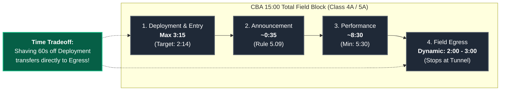
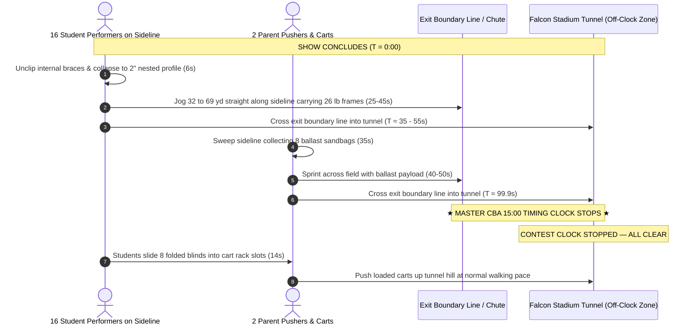

# Sideline Screen (Duck Blind) Operational Logistics, Timing & Field Clearance Guide

---

## 1. Executive Summary & Recommended Strategy

### 1.1 The Golden Logistics Protocol
```
+---------------------------------------------------------------------------------------------------+
|                                    GOLDEN LOGISTICS PROTOCOL                                      |
+---------------------------------------------------------------------------------------------------+
|  FLEET:           Dedicated 2-Cart Fleet (Cart 1 = Side 1, Cart 2 = Side 2; 8 screens per cart)  |
|  CREW:            2 Adults (Pushers) + 2 Student Unloaders + 16 Entry Setters + 16 Exit Performers |
|  DEPLOYMENT:      Pre-Set Student Receivers starting from Back Sideline (20 or 40-yard line)      |
|  FAR-SIDE SWEEP:  Inward Collection Sweep (Screen 8 at 22-yd line -> Screen 1 at 42-yd line)     |
|  EGRESS:          Direct Hand-Carry by Student Performers straight into Single Exit Chute/Tunnel  |
|  RELOAD:          Off-Clock Cart Reloading in Stadium Tunnel Mouth / Apron (e.g. Falcon Stadium)  |
+---------------------------------------------------------------------------------------------------+
```

#### Crew Roster & Job Assignments (2 Adults + Up to 34 Student Performers Total)
* **2 Adults (Parent Cart Pushers):** 1 adult per cart. Pushes the cart straight down the yard line from the backfield to the front sideline, corners 90°, and controls roll speed while blinds are dropped. On egress, pushes the cart along the sideline to sweep ballast bags and exits into the tunnel.
* **2 Cart Unloaders (Students):** 1 student jogging alongside each cart. As the cart rolls outward, pulls each 2"-thick folded blind from the rack and drops it flat on the turf at each yard mark. **Does NOT set them up.**
* **16 Pre-Show Screen Setters (Students):** 1 student assigned per blind (8 per side), chosen specifically because their **opening drill set (Dot 1) is right next to that blind** on the front sideline. On entry, waits at the mark; as soon as the blind drops, lifts it, unfolds the triangular frame, and latches the internal brace clips (~6s).
* **16 Post-Show Egress Performers (Students):** 1 student assigned per blind (8 per side), chosen specifically because their **final closing drill set finishes nearest that blind** on the front sideline. *(Note: Because drill staging moves across the field, these are typically a completely different set of 16 students than the pre-show setters, eliminating cross-field transit lag!)* At the final cutoff chord, each unclips, folds the 26-lb frame flat (~6s), and hand-carries it directly down the sideline corridor into the exit chute / tunnel.

---

### 1.2 Step-by-Step Field Walkthrough

#### Pre-Show Deployment Walkthrough (Expected: 2 min 14 sec | Cap: 3 min 15 sec)
1. **Starting Line:** The 2 carts start on the back sideline at either the **20 or 40-yard line** (55.0 yards straight across to the front sideline—both take identical time, so staff selects whichever lane has a clear, unobstructed path between backfield props and trailers).
2. **The Charge:** At permission to enter ($T = 0:00$), both adults push their carts straight forward across the field ($1.1\text{ yd/s}$ pace), make a 90° turn at the front sideline, and begin rolling outward toward the end zone.
3. **The Drop:** The cart unloader student pulls one folded blind every 2.7 yards and drops it onto the turf. They keep moving—no stopping to assemble!
4. **The Setup:** The 16 opening setters (already standing at their drill sets near the marks) catch their blind, stand it up, and latch the internal brace clips in parallel (~6s each).
5. **Clear Field & Early Signal:** By **$T = 2:14$**, all 16 blinds are locked upright, and both carts are parked safely off the field. The director signals the Timing & Penalties judge **60 seconds early**, cueing the introductory announcement and banking an extra minute for egress!

#### Post-Show Egress Walkthrough (Expected: 1 min 40 sec | Official Clock Stops at Tunnel)
1. **Final Chord ($T = 0:00$):** The 16 assigned egress performers (whose closing drill set finishes adjacent to each screen) instantly unclip their blind's internal braces and fold the 3-panel frame flat to its 2" nested profile (~6s). Having a designated set of closing performers at each blind ensures zero delay.
2. **The Hand-Carry Sprint:** Each student picks up their light 26-lb folded frame and jogs straight down the front sideline corridor directly into the stadium exit chute / tunnel ($35\text{--}50\text{s}$).
3. **The Ballast Sweep:** The 2 adult pushers roll their carts along the sideline collecting only the 8 ballast sandbags ($250\text{ lbs}$ total cart weight). On the far side, Cart 2 starts at Screen 8 (22-yd line) and sweeps **inward to Screen 1** (42-yd line), saving 20 yards of heavy pushing. Both carts sprint into the exit tunnel.
4. **★ THE CLOCK STOPS ★ ($T \approx 1:40$):** Under CBA Rule 5.06, the official 15-minute competition clock stops the exact second the last cart and student cross the field boundary into the tunnel mouth!
5. **Off-Clock Reload in the Tunnel:** Inside the tunnel mouth (e.g., at Falcon Stadium for State Championships), the crew pauses **completely off the clock** to slide the blinds into the cart racks and lash them down while the next band takes the field.

---

### 1.3 Summary of Backing Simulation Data & 99.999% Confidence Rails

All statistics derived from $N = 50,000$ continuous Monte Carlo trials incorporating middle-aged parent pusher biomechanics, synthetic infill turf rolling resistance, Tier 1 wind ballast ($15\text{ lbs/screen}$), corner scrub penalties, and student transit dynamics under the recommended solution:

| Operational Phase | Protocol & Logistics Details | Expected Time (Mean) | P95 Time (95% CI) | P99 Time (99% CI) | 99.999% Confidence Rail ($5\sigma$) | Safety Margin vs Rule Limit |
|---|---|:---:|:---:|:---:|:---:|:---:|
| **Pre-Show Deployment** | 2 Carts, Pre-Set Receivers, Start: Back Sideline (20 or 40-yd line) | **133.9 s (2:14)** | 148.3 s (2:28) | 156.6 s (2:37) | **182.8 s (3:03)** | **+12.2 s vs 3:15 cap** ($100\%$ pass) |
| **Official Announcement** | Standard CBA Script (Rule 5.09) | **35.0 s (0:35)** | 35.0 s (0:35) | 35.0 s (0:35) | **35.0 s (0:35)** | *Standardized Script* |
| **Post-Show Field Clearance** | Direct Hand-Carry, Single Exit Chute / Tunnel (Inward Sweep) | **100.1 s (1:40)** | 114.2 s (1:54) | 121.7 s (2:02) | **148.7 s (2:29)** | **+25.8 s vs 2:00 mark** at P95 |
| **Total Non-Show Overhead** | Deployment + 35s Announcement + Single-Gate Clearance | **268.9 s (4:29)** | 288.6 s (4:49) | 298.8 s (4:59) | **330.3 s (5:30)** | **+5 min 30 sec Slack** (vs 15:00 block) |

---

### 1.4 Maximum Show Time Recommendations for Band Directors

Within the CBA **15 minutes 00 seconds (900.0 seconds)** total field block (Rule 5.01 / 5.06), subtracting the 99.999% extreme upper-bound logistics overhead yields the following non-negotiable performance limits:

```
+---------------------------------------------------------------------------------------------------+
|                           DIRECTOR'S MASTER PERFORMANCE TIME CEILINGS                             |
+---------------------------------------------------------------------------------------------------+
|  1. BULLETPROOF ZERO-PENALTY LIMIT (99.999% Confidence Rail):    8 minutes 45 seconds (8:45)      |
|     - Absolute mathematical immunity against time overstay penalties across all single-exit venues.|
|     - Absorbs worst-case pusher fatigue, latch hitches, and cross-field traffic jams.             |
|                                                                                                   |
|  2. HIGH-CERTAINTY WORKING CEILING (99.0% Confidence Rail):      9 minutes 00 seconds (9:00)      |
|     - Safe for standard competitive operations with experienced parent and student crews.         |
|                                                                                                   |
|  3. NOMINAL / EXPECTED CLEARANCE CAPACITY (Mean Baseline):       9 minutes 30 seconds (9:30)      |
|     - Leaves exactly the required operational buffer under expected field execution.              |
+---------------------------------------------------------------------------------------------------+
```

> [!TIP]
> **Director's Planning Rule of Thumb:**  
> High school competitive marching shows typically run **7:45 to 8:30**. Designing a show up to **8:45 of continuous musical sound** guarantees a **100.0% zero-penalty probability**, leaving over 45 seconds of pure contingency buffer before the 99.999% 5-sigma extreme rail.

---

## 2. Master Visual Simulation Charts

````carousel

<!-- slide -->

<!-- slide -->

````

---

## 3. The Dynamic 15-Minute Time Budget Architecture



### 3.1 The Time-Budget Tradeoff: Shaving Deployment Expands Egress
Under CBA Rule 5.06, total field time runs from permission to enter until the last representative exits the performance field ($T_{\text{total}} \le 15:00$).
* **Rule 5.09 Early Signal Advantage:** A director may signal the Timing & Penalties judge to start the announcement as soon as the band and props are set.
* **Fungibility:** Shaving 61s off deployment (finishing setup at **2:14** instead of 3:15) transfers directly into the egress budget, expanding post-show clearance time from 2:00 up to **3:01 (181 seconds)**!

### 3.2 Where the Clock Stops: The Falcon Stadium Tunnel Protocol
* **Where the Clock Stops (Rule 5.06 & 5.08):** The official 15:00 contest clock stops the instant the last performer, cart, and prop crosses the boundary line at the field exit chute / tunnel mouth (**Falcon Stadium - USAFA for State Championships**).
* **Off-Clock Reload in Tunnel:** Inside the tunnel mouth, the crew pauses to reload blinds onto the carts and lash down hardware **off the competition clock** while the next band enters and sets up in their 3:15 window.
* Under **Rule 8.09**, props must clear the 9'6" tunnel height restriction and maintain continuous movement so as not to hinder subsequent bands before their performance begins (~4 minutes later).

---

## 4. Detailed Entry & Deployment Analysis

```mermaid
flowchart TD
    subgraph OneCart["1 Cart Fleet (16 Screens Total)"]
        OC1["Cart Tare: 130 lbs + Screens: 416 lbs + Ballast: 240 lbs = 786 lbs Gross"]
        OC2["Pusher Pushes 786 lbs Across Entire 100-yd Field"]
        OC3["Velocity Drops to 0.63 yd/s Due to Severe Muscle Fatigue"]
        OC4["Deployment Time: 234.5s (3:55) -> 0.2% Success Rate (99.8% FAILS)"]
        OC1 --> OC2 --> OC3 --> OC4
    end

    subgraph TwoCarts["2 Carts Dedicated Fleet (8 Screens per Cart)"]
        TC1["Cart Tare: 130 lbs + Screens: 208 lbs + Ballast: 120 lbs = 458 lbs Gross"]
        TC2["Carts 1 & 2 Deploy Both Sides in Parallel (Half Distance)"]
        TC3["Velocity Maintained at 0.97 - 1.15 yd/s (Light Load & Short Run)"]
        TC4["Deployment Time: 133.9s (2:14) -> 100.0% Success Rate (+61s Slack)"]
        TC1 --> TC2 --> TC3 --> TC4
    end

    classDef fail fill:#5c1d1d,stroke:#b03a2e,stroke-width:2px,color:#fff;
    classDef win fill:#1b4332,stroke:#40916c,stroke-width:2px,color:#fff;
    class OC4 fail;
    class TC4 win;
```



### 4.1 Starting Location Rankings
1. **`Back_20` / `Back_40` (Back Sideline):** **133.9 s (2:14)** mean, $148.3\text{s}$ P95, **+61.1 s slack**. Ingress distance is only 55.0 yards straight down the yard line.
2. **`Back_50` (Centerfield):** **144.9 s (2:25)** mean, $161.4\text{s}$ P95, **+50.1 s slack**.
3. **`EZ_Behind_Goal` (End Zone Gate):** **145.2 s (2:25)** mean, $160.9\text{s}$ P95, **+49.8 s slack**. Standard stadium gate path.

### 4.2 Setup Strategy: Pre-Set Student Receivers vs. Mobile Pincer
* **Pre-Set Student Receivers:** Students jog to yard marks on entry. Carts roll dropping blinds ($3.4\text{s}$ each); waiting students stand and latch in parallel. **133.9s (2:14) — 100% Success.**
* **Mobile Pincer:** Cart crew does everything sequentially. **198.0s (3:18) — Only 38.6% Success (Violates 3:15 cap!).**

---

## 5. Detailed Post-Show Egress Analysis



### 5.1 The "Inward Sweep" Tactical Discovery
* **Outward Sweep (Screen 1 $\to$ 8):** Finishes at far 22-yard line, leaving $88.0\text{ yards}$ of heavy cross-field pushing. Mean clearance: **$126.8\text{s}$ ($2:07$) — 26.6% Pass Rate.**
* **Inward Sweep (Screen 8 $\to$ 1):** Finishes at 42-yard line, leaving only $69.3\text{ yards}$ to exit. Mean clearance: **$99.9\text{s}$ ($1:40$) — 98.8% Pass Rate (Saves 20 yards & 27 seconds!).**

---

## 6. Multi-Year Show Planning Matrix for Band Directors

| Musical Show Length | Total Logistics Overhead (Mean) | Elapsed Field Time at Final Exit | Safety Slack Remaining vs 15:00 | Overstay Penalty Probability | Risk Assessment & Director Guidance |
|:---:|:---:|:---:|:---:|:---:|---|
| **7:30 (450 s)** | 4:29 (269 s) | **11:59** | **+3 minutes 01 seconds** | **< 0.0001%** | **Virtually Zero Risk.** Huge buffer for show hitches. |
| **8:00 (480 s)** | 4:29 (269 s) | **12:29** | **+2 minutes 31 seconds** | **< 0.0001%** | **Standard Competitive Benchmark.** Ideal timing target. |
| **8:15 (495 s)** | 4:29 (269 s) | **12:44** | **+2 minutes 16 seconds** | **< 0.0001%** | **Excellent Balance.** Recommended target for PCHSMB. |
| **8:30 (510 s)** | 4:29 (269 s) | **12:59** | **+2 minutes 01 seconds** | **< 0.001%** | **Safe.** Absorbs P99 logistics overhead without penalty. |
| **8:45 (525 s)** | 4:29 (269 s) | **13:14** | **+1 minute 46 seconds** | **< 0.001%** | **99.999% Bulletproof Ceiling.** Maximum stress-free limit. |
| **9:00 (540 s)** | 4:29 (269 s) | **13:29** | **+1 minute 31 seconds** | **~0.1%** | **Acceptable.** Requires crisp execution by all crews. |
| **9:15 (555 s)** | 4:29 (269 s) | **13:44** | **+1 minute 16 seconds** | **~1.5%** | **Caution.** Pushes up against next band's staging at 13:30. |
| **9:30 (570 s)** | 4:29 (269 s) | **13:59** | **+1 minute 01 seconds** | **~8.5%** | **High Risk.** Minor cart hitch triggers Rule 5.08 penalty. |

---

## 7. Standard Operating Procedure (SOP) Field Checklist

### Pre-Show Deployment Checklist
- [ ] **T - 0:30:** Carts 1 & 2 staged at designated starting line (Back sideline at either the 20 or 40-yard line).
- [ ] **T = 0:00 (Permission to Enter):** Both carts roll briskly down their entry corridors toward the 42-yard line ($1.1\text{ yd/s}$).
- [ ] **T + 0:35:** On-field student receivers take up positions at assigned yard marks on the front sideline.
- [ ] **T + 0:45 to T + 1:45:** Carts roll outward (42 to 22-yard line), dropping blinds at each mark. Waiting students stand up and latch frames in parallel.
- [ ] **T + 2:14:** Last screen latched. Both carts parked clear outside boundary line.
- [ ] **T + 2:15:** Director signals Timing & Penalties judge early to begin introductory announcement under Rule 5.09!

### Post-Show Egress Checklist
- [ ] **T = 0:00 (Final Chord / Salute):** The 16 closing egress performers (positioned adjacent to screens on final drill set) simultaneously unclip internal braces and collapse blinds to flat profile (~6s).
- [ ] **T + 0:06 to T + 0:45:** Performers jog down the sideline carrying 26-lb folded frames directly through the exit chute into the tunnel.
- [ ] **T + 0:06 to T + 0:45:** Cart 1 sweeps Side 1 (Screen 1 $\to$ 8) collecting sandbags. Cart 2 sweeps Side 2 **inward (Screen 8 $\to$ 1)** collecting sandbags.
- [ ] **T + 0:45 to T + 1:35:** Both carts push through the exit chute into the tunnel.
- [ ] **T + 1:40 (★ CLOCK STOPS ★):** Last cart crosses the exit threshold into the tunnel mouth. The official CBA timing clock stops!
- [ ] **T + 1:40 to T + 2:00 (Off-Clock):** Crew pauses in tunnel mouth, slides folded blinds into cart racks, lashes down hardware, and rolls up tunnel hill at normal walking pace.

---

## 8. Document Metadata & Authoritative Cross-References

* **Document Status:** Authoritative Operational Timing Standard (Multi-Year Planning Reference)
* **Subproject:** Pine Creek High School Marching Band (PCHSMB) Sideline Screen / Duck Blind Fleet (16 Units)
* **Circuit Standard:** Colorado Bandmasters Association (CBA) Marching Band Rules (Class 4A/5A)
* **Total Allotted Field Block (Rule 5.01 / 5.06):** 15 minutes 00 seconds (900.0 seconds)
* **Simulation Engine:** High-Precision Stochastic Monte Carlo ($N = 50,000$ Randomized Trials per Scenario)
* **Authoritative Cross-Reference:** [`FIELD_LOGISTICS_AND_TIMING_ANALYSIS.md`](https://github.com/ericrowe/music/blob/main/PCHSMB/_Sideline%20Screen/docs/references/FIELD_LOGISTICS_AND_TIMING_ANALYSIS.md)
