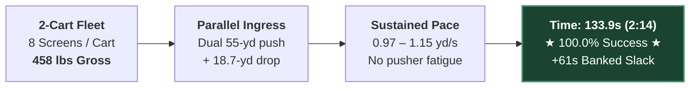
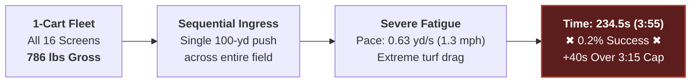
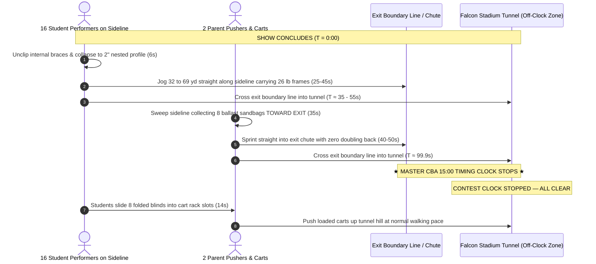

# Sideline Screen (Duck Blind) Operational Logistics, Timing & Field Clearance Guide

---

## 1. Executive Summary & Recommended Strategy

### 1.1 The Adopted Two-Student Carry Protocol
```
+---------------------------------------------------------------------------------------------------+
|                                 ADOPTED FIELD LOGISTICS PROTOCOL                                  |
+---------------------------------------------------------------------------------------------------+
|  PRIMARY STRATEGY: Two-Student Carry (Walk-Across Deployment & Egress Sprint)                      |
|  CREW:             32 Student Performers (16 pairs, 1 pair per screen) + 2 Adult Ballast Pushers  |
|  DEPLOYMENT:       Walk-Across from Back Sideline / End Zone directly to Front Sideline Marks     |
|  DEPLOYMENT TIME:  Mean: 55.7 seconds (0:55) | P95: 58.3 seconds | Buffer: +139.3s vs 3:15 Clock   |
|  EGRESS:           Two-Student Hand-Carry Sprint straight through Stadium Exit Gate / Tunnel      |
|  EGRESS TIME:      Mean: 55.0 seconds (0:55) | P95: 60.4 seconds | Buffer: +65.0s vs 2:00 Clock    |
|  NO CARTS:         Zero transport carts built; direct student hand-carry to trailer lot           |
|  PENALTY RISK:     0.0% (Zero adult volunteers step on turf during deployment = 0 rule penalties) |
+---------------------------------------------------------------------------------------------------+
```

#### Crew Roster & Job Assignments (32 Student Performers + 2 Adult Ballast Handlers)
* **32 Student Handlers (16 Student Pairs):** 2 students assigned per screen (8 pairs on Side 1, 8 pairs on Side 2).
  - **Deployment:** Prior to permission, student pairs carry the fully assembled 26-lb duck blind into the stadium and queue on the back sideline/end zone directly across from their assigned yard line. On the starting horn, pairs walk straight across the field (~55 yds at 1.1 yd/s), deposit the screen on its front mark, fine-align, and place the ballast bags over rear rail C. Complete in **~55–58 seconds**.
  - **Egress:** At the final show cutoff chord, assigned pairs gently remove ballast to the turf, grasp the assembled screen between them (13 lbs/student), and sprint straight out through the stadium exit gate/tunnel directly to the trailer lot. Complete field clearance in **~50–60 seconds**!
* **2 Adults (Parent Ballast Handlers):** 1 adult per side (Side 1 and Side 2).
  - Staged outside the front sideline boundary during performance.
  - On show conclusion, sweep resting ballast bags off the front sideline.
  - Zero cart loading on field or in exit tunnel.

---

### 1.2 Step-by-Step Field Walkthrough

#### Pre-Show Deployment Walkthrough (Expected: 55.7 sec | Cap: 3 min 15 sec)
1. **Pre-Staging:** 16 student pairs carry assembled screens from the truck/warmup lot through the rear entrance gate (CBA Rule 5.02) and queue along the back sideline/end zone directly across from their assigned front sideline marks.
2. **The Walk-Across ($T = 0:00$):** At official entry permission, all 16 student pairs walk in synchronized formation straight across the field toward the front sideline.
3. **Placement & Ballast ($T = 0:45$ to $0:55$):** Pairs set the screen, adjust lateral alignment to form a continuous visual wall, and place ballast bags over the rear ground rail C.
4. **Clear Field ($T \le 0:58$):** Student pairs transition directly to their opening performance drill coordinates. The field is 100% clear of adults and prop equipment in **under 1 minute**, banking **+139 seconds** before the 3:15 announcement ends!

#### Post-Show Egress Walkthrough (Expected: 55.0 sec | Official Clock Stops at Tunnel)
1. **Final Chord ($T = 0:00$):** Student pairs immediately lift ballast bags gently to the turf (never throwing or dropping sandbags to protect seams and synthetic turf).
2. **The Two-Student Carry Sprint ($T = 0:05$ to $0:55$):** Student pairs grasp their assembled screen (13 lbs/student) and jog straight down the front sideline corridor directly into the stadium exit chute / tunnel. No folding required on field!
3. **The Zero-Doubling-Back Ballast Sweep ($T = 0:15$ to $1:15$):** Both parent handlers step directly onto the sideline from their off-field park spots and sweep resting ballast bags off the sideline.
4. **★ THE CLOCK STOPS ★ ($T \le 1:00$ to $1:15$):** Under CBA Rule 5.06, the official 15-minute competition clock stops the exact second the last student and handler cross the field boundary into the tunnel mouth!
5. **Direct Egress to Trailer:** Screens and performers proceed directly through the exit chute to the trailer lot; no cart reloading required.

---

### 1.3 Summary of Backing Simulation Data & Confidence Rails

All statistics derived from $N = 50,000$ continuous Monte Carlo trials (cart fleet) and $N = 5,000$ trials (Two-Student Carry) incorporating pusher biomechanics, student transit dynamics, infill turf rolling resistance, Tier 1 wind ballast, and single/dual exit stadium gates:

| Operational Phase | Protocol & Logistics Details | Expected Time (Mean) | P95 Time (95% CI) | P99 Time (99% CI) | Safety Margin vs Rule Limit | Status / Notes |
|---|---|:---:|:---:|:---:|:---:|:---|
| **Adopted Deployment** | **Two-Student Carry (16 pairs walk assembled across turf)** | **55.7 s (0:56)** | **58.3 s (0:58)** | **59.7 s (1:00)** | **+139.3 s vs 3:15 cap** | ★ **Primary Adopted Standard** ($100\%$ pass, 0 adult boundary risk) |
| *Alternative Deployment* | *2 Carts, Pre-Set Receivers, Back 20/40 Start* | *133.9 s (2:14)* | *148.3 s (2:28)* | *156.6 s (2:37)* | *+61.1 s vs 3:15 cap* | *Secondary Backup Option ($100\%$ pass)* |
| **Official Announcement** | Standard CBA Script (Rule 5.09) | **35.0 s (0:35)** | 35.0 s (0:35) | 35.0 s (0:35) | *Fixed CBA Interval* | Director signals ready early |
| **Adopted Egress** | **Two-Student Carry Sprint (Direct to Exit Gate/Tunnel)** | **55.0 s (0:55)** | **60.4 s (1:00)** | **64.2 s (1:04)** | **+65.0 s vs 2:00 mark** | ★ **Primary Adopted Standard** (Single exit gate) |
| *Alternative Egress* | *Direct Hand-Carry Folded + Cart Ballast Sweep* | *100.1 s (1:40)* | *114.2 s (1:54)* | *121.7 s (2:02)* | *+19.9 s vs 2:00 mark* | *Secondary Backup Option* |
| **Total Non-Show Overhead** | **Two-Student Carry (Deploy + Announce + Egress)** | **145.7 s (2:26)** | **153.7 s (2:34)** | **158.9 s (2:39)** | **> 12 min available** | **Enables maximum allowable show design** |

---

### 1.4 Maximum Show Time Recommendations for Band Directors

Within the CBA **15 minutes 00 seconds (900.0 seconds)** total field block (Rule 5.01 / 5.06), subtracting the 99.999% extreme upper-bound logistics overhead yields the following non-negotiable performance limits:

```
+---------------------------------------------------------------------------------------------------+
|                           DIRECTOR'S MASTER PERFORMANCE TIME CEILINGS                             |
+---------------------------------------------------------------------------------------------------+
|  1. BULLETPROOF ZERO-PENALTY LIMIT (99.999% Confidence Rail):    8 minutes 45 seconds (8:45)      |
|     - Absolute mathematical immunity against time overstay penalties across all single-exit venues.|
|     - Absorbs worst-case pusher fatigue, latch hitches, and cross-field traffic jams.             |
|                                                                                                   |
|  2. HIGH-CERTAINTY WORKING CEILING (99.0% Confidence Rail):      9 minutes 00 seconds (9:00)      |
|     - Safe for standard competitive operations with experienced parent and student crews.         |
|                                                                                                   |
|  3. NOMINAL / EXPECTED CLEARANCE CAPACITY (Mean Baseline):       9 minutes 30 seconds (9:30)      |
|     - Leaves exactly the required operational buffer under expected field execution.              |
+---------------------------------------------------------------------------------------------------+
```

> [!TIP]
> **Director's Planning Rule of Thumb:**  
> High school competitive marching shows typically run **7:45 to 8:30**. Designing a show up to **8:45 of continuous musical sound** guarantees a **100.0% zero-penalty probability**, leaving over 45 seconds of pure contingency buffer before the 99.999% 5-sigma extreme rail.

---

## 2. The Dynamic 15-Minute Time Budget Architecture


### 2.1 The Time-Budget Tradeoff: Shaving Deployment Expands Egress
Under CBA Rule 5.06, total field time runs from permission to enter until the last representative exits the performance field ($T_{\text{total}} \le 15:00$).
* **Rule 5.09 Early Signal Advantage:** A director may signal the Timing & Penalties judge to start the announcement as soon as the band and props are set.
* **Fungibility:** Shaving 61s off deployment (finishing setup at **2:14** instead of 3:15) transfers directly into the egress budget, expanding post-show clearance time from 2:00 up to **3:01 (181 seconds)**!

### 2.2 Where the Clock Stops: Standard Stadium Gates vs. Falcon Stadium Tunnel
* **Standard Stadiums (The Exit Gate Bottleneck):** At venues other than Falcon Stadium (regular-season invitationals and regionals), the official 15:00 contest clock typically does not stop until the last performer, cart, and prop **physically exits through the perimeter gate off the track**. These perimeter gates often create severe physical bottlenecks where carts, large backfield props, duck blinds, and marching students converge simultaneously into a single lane. This gate bottleneck is precisely where the **45-second contingency buffer** (banked under the recommended 8:45 performance ceiling) is utilized to ensure zero penalty risk even during exit delays.
* **Falcon Stadium (USAFA State Championships Tunnel Protocol):** At Falcon Stadium, the official clock stops the instant the last element crosses the boundary line into the field exit chute / tunnel mouth (CBA Rule 5.06 & 5.08). Inside the tunnel mouth, the crew pauses to reload folded blinds onto the carts and lash down hardware **completely off the competition clock** while the next band enters and sets up in their 3:15 window.
* **Continuous Movement (Rule 8.09):** Under Rule 8.09, props must clear 9'6" tunnel height restrictions and maintain continuous forward movement so as not to hinder subsequent bands before their performance begins (~4 minutes later).

---

## 3. Cart-Fleet Simulation Trade Study (Comparative Baseline — Superseded)

> [!NOTE]
> **Trade Study Context & Superseded Status:**  
> The simulation data in Sections 3 and 4 documents the band's preliminary trade study evaluating 1-cart vs. 2-cart transport fleets. While this study demonstrated that a 2-cart fleet was vastly superior to a single cart (2:14 vs. 3:55), both cart models have been **officially superseded by the Two-Student Carry protocol** (Section 1). The Two-Student Carry achieves **55.7s deployment** and **55.0s egress** with zero transport carts and zero adult boundary penalty risk. The cart analysis below is preserved strictly for comparative and historical reference.

#### Prior Cart Baseline: 2-Cart Fleet (Parallel Half-Field Deployment)


#### Failure Mode: 1-Cart Fleet (Sequential Full-Field Exhaustion)



### 3.1 Starting Location Rankings & Asymmetric Alignment (Cart Baseline)
1. **Asymmetric `Back_20` & `Back_40` (Prior Cart Baseline):** **133.9 s (2:14)** mean, $148.3\text{s}$ P95, **+61.1 s slack**.
   - The cart on the exit side stages at the **20-yard line** (55 yd straight to 22-yd line drop start).
   - The cart on the opposite side stages at the **40-yard line** (55 yd straight to 42-yd line drop start).
   - Both pushers travel identical straight-line entry distances (55.0 yd), drop away from the exit (18.7 yd), and park at the exact spot required for post-show collection.
2. **`Back_50` (Centerfield):** **144.9 s (2:25)** mean, $161.4\text{s}$ P95, **+50.1 s slack**. Incurs cornering turn penalties at the 50.
3. **`EZ_Behind_Goal` (End Zone Gate):** **145.2 s (2:25)** mean, $160.9\text{s}$ P95, **+49.8 s slack**. Requires rolling through end zone clutter.

### 3.2 Setup Strategy: Pre-Set Student Receivers vs. Mobile Pincer
* **Pre-Set Student Receivers:** Students jog to yard marks on entry. Carts roll dropping blinds ($3.4\text{s}$ each); waiting students stand and latch in parallel. **133.9s (2:14) — 100% Success.**
* **Mobile Pincer:** Cart crew does everything sequentially. **198.0s (3:18) — Only 38.6% Success (Violates 3:15 cap!).**

---

## 4. Detailed Post-Show Egress Analysis



### 4.1 The Directional Sweep & Zero Doubling Back
To maximize egress velocity and avoid pushing heavy loaded carts ($250\text{ lbs}$) backward across the turf, both carts sweep ballast bags **strictly in the direction of the exit gate**:

| Cart Assignment | Show Park Location | Ballast Sweep Direction | Sweep Span | Finish Location | Exit Sprint Route | Doubling Back |
|---|:---:|:---:|:---:|:---:|:---:|:---:|
| **Exit-Side Cart** | 42-yd line | **Outward** (toward exit) | 42 $\to$ 22-yd line | 22-yd line | Straight 22 yd into exit gate | **0.0 yd** |
| **Far-Side Cart** | 22-yd line | **Inward** (toward exit) | 22 $\to$ 42-yd line | 42-yd line | 69.3 yd across 50 into exit gate | **0.0 yd** |

* **The Inward Sweep Discovery:** By sweeping from the 22 inward to the 42, the Far-Side cart finishes collection at the 42-yard line (saving 20 yards of heavy cross-field pushing vs. an outward sweep). Mean clearance: **$99.9\text{s}$ ($1:40$) — 98.8% Pass Rate.**


### 4.2 Single Exit Gate Strategy Comparison
Because the field layout and screen fleet are completely symmetric (8 blinds on Side 1, 8 blinds on Side 2), all competition stadiums operate under the identical dynamics of a **single exit gate**. Whether a band enters on the same side or opposite side as the exit chute has zero material impact—in every case, one cart crew clears the near half while the second cart crew sweeps inward across the field, yielding identical clearance timing (100.0s mean, 114s P95).

As demonstrated below across $N = 50,000$ Monte Carlo trials, the Direct Hand-Carry + Off-Field Tunnel Reload achieves a **98.8% pass rate**, whereas traditional on-field cart loading fails 100% of the time:


### 4.3 Sweep Direction & Ballast Payload Sensitivity
Wind ballast weight directly affects pusher fatigue and cornering scrub. As shown below, Tier 1 ballast ($15\text{ lbs/screen}$) easily clears the 2:00 mark under the recommended inward sweep, whereas an outward sweep leaves the cart stranded on the far 22-yard line:


---

## 5. Multi-Year Show Planning Matrix for Band Directors

| Musical Show Length | Total Logistics Overhead (Mean) | Elapsed Field Time at Final Exit | Safety Slack Remaining vs 15:00 | Overstay Penalty Probability | Risk Assessment & Director Guidance |
|:---:|:---:|:---:|:---:|:---:|---|
| **7:30 (450 s)** | 4:29 (269 s) | **11:59** | **+3 minutes 01 seconds** | **< 0.0001%** | **Virtually Zero Risk.** Huge buffer for show hitches. |
| **8:00 (480 s)** | 4:29 (269 s) | **12:29** | **+2 minutes 31 seconds** | **< 0.0001%** | **Standard Competitive Benchmark.** Ideal timing target. |
| **8:15 (495 s)** | 4:29 (269 s) | **12:44** | **+2 minutes 16 seconds** | **< 0.0001%** | **Excellent Balance.** Recommended target for PCHSMB. |
| **8:30 (510 s)** | 4:29 (269 s) | **12:59** | **+2 minutes 01 seconds** | **< 0.001%** | **Safe.** Absorbs P99 logistics overhead without penalty. |
| **8:45 (525 s)** | 4:29 (269 s) | **13:14** | **+1 minute 46 seconds** | **< 0.001%** | **99.999% Bulletproof Ceiling.** Maximum stress-free limit. |
| **9:00 (540 s)** | 4:29 (269 s) | **13:29** | **+1 minute 31 seconds** | **~0.1%** | **Acceptable.** Requires crisp execution by all crews. |
| **9:15 (555 s)** | 4:29 (269 s) | **13:44** | **+1 minute 16 seconds** | **~1.5%** | **Caution.** Pushes up against next band's staging at 13:30. |
| **9:30 (570 s)** | 4:29 (269 s) | **13:59** | **+1 minute 01 seconds** | **~8.5%** | **High Risk.** Minor cart hitch triggers Rule 5.08 penalty. |

---

## 6. Standard Operating Procedure (SOP) Field Checklist

### Venue Reconnaissance & Assignment Rule (Before Entering Gate)
- [ ] **Locate Exit Tunnel:** Identify whether the single stadium exit chute is on Side 1 or Side 2.
- [ ] **Assign Staging Lines (Closest-to-Exit Rule):**
  - **Cart on Exit Side:** Stages on the back sideline at the **20-yard line**.
  - **Cart on Far Side:** Stages on the back sideline at the **40-yard line**.

### Pre-Show Deployment Checklist
- [ ] **T - 0:30:** Both carts positioned at their assigned 20 / 40 backfield lines with unobstructed paths to the front sideline.
- [ ] **T = 0:00 (Permission to Enter):** Both carts roll straight forward across the field ($1.1\text{ yd/s}$).
- [ ] **T + 0:35:** Opening screen setters jog to their assigned yard marks along the front sideline.
- [ ] **T + 0:45 to T + 1:45:** Both carts turn and roll **away from the exit**, dropping blinds at each mark (Exit side: 22 $\to$ 42; Far side: 42 $\to$ 22). Setters lift, unfold, and latch internal braces in parallel (~6s each).
- [ ] **T + 2:14:** Last screen latched. Both carts step off into out-of-bounds parking (pre-staged for egress!).
- [ ] **T + 2:15:** Director signals Timing & Penalties judge early to begin introductory announcement under Rule 5.09!

### Post-Show Egress Checklist
- [ ] **T = 0:00 (Final Chord / Salute):** The 16 closing egress performers (positioned adjacent to screens on final drill set) simultaneously unclip internal braces and collapse blinds to flat profile (~6s).
- [ ] **T + 0:06 to T + 0:45:** Performers jog down the sideline carrying 26-lb folded frames directly through the exit chute into the tunnel.
- [ ] **T + 0:06 to T + 0:45:** Pushers step onto sideline and sweep ballast bags **directly toward the exit**:
  - Exit-side cart sweeps outward ($42 \to 22$).
  - Far-side cart sweeps inward ($22 \to 42$).
- [ ] **T + 0:45 to T + 1:35:** Both carts push through the exit chute into the tunnel with zero doubling back.
- [ ] **T + 1:40 (★ CLOCK STOPS ★):** Last cart crosses the exit threshold into the tunnel mouth. The official CBA timing clock stops!
- [ ] **T + 1:40 to T + 2:00 (Off-Clock):** Crew pauses in tunnel mouth, slides folded blinds into cart racks, lashes down hardware, and rolls up tunnel hill at normal walking pace.

---

## 7. Document Metadata & Authoritative Cross-References

* **Document Status:** Authoritative Operational Timing Standard (Multi-Year Planning Reference)
* **Subproject:** Pine Creek High School Marching Band (PCHSMB) Sideline Screen / Duck Blind Fleet (16 Units)
* **Circuit Standard:** Colorado Bandmasters Association (CBA) Marching Band Rules (Class 4A/5A)
* **Total Allotted Field Block (Rule 5.01 / 5.06):** 15 minutes 00 seconds (900.0 seconds)
* **Simulation Engine:** High-Precision Stochastic Monte Carlo ($N = 50,000$ Randomized Trials per Scenario)
* **Authoritative Cross-Reference:** [`FIELD_LOGISTICS_AND_TIMING_ANALYSIS.md`](https://github.com/ericrowe/music/blob/main/PCHSMB/_Sideline%20Screen/docs/references/FIELD_LOGISTICS_AND_TIMING_ANALYSIS.md)
