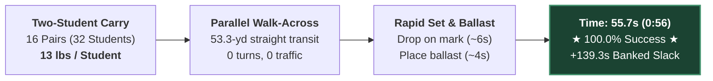
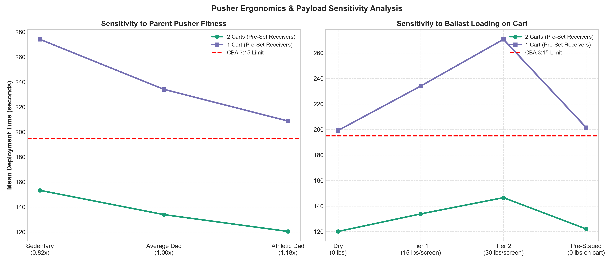
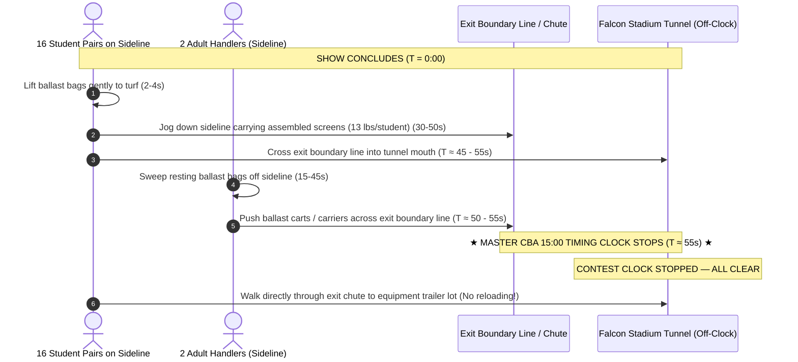

# Sideline Screen (Duck Blind) Operational Logistics, Timing & Field Clearance Guide

---

## 1. Executive Summary & Recommended Strategy

### 1.1 The Adopted Two-Student Carry Protocol
```
+---------------------------------------------------------------------------------------------------+
|                                 ADOPTED FIELD LOGISTICS PROTOCOL                                  |
+---------------------------------------------------------------------------------------------------+
|  PRIMARY STRATEGY: Two-Student Carry (Walk-Across Deployment & Egress Sprint)                      |
|  CREW:             32 Student Performers (16 pairs, 1 pair per screen) + 2 Adult Ballast Pushers  |
|  DEPLOYMENT:       Walk-Across from Back Sideline / End Zone directly to Front Sideline Marks     |
|  DEPLOYMENT TIME:  Mean: 55.7 seconds (0:56) | P95: 58.3 seconds | Buffer: +139.3s vs 3:15 Clock   |
|  EGRESS:           Two-Student Hand-Carry Sprint straight through Stadium Exit Gate / Tunnel      |
|  EGRESS TIME:      Mean: 55.0 seconds (0:55) | P95: 60.4 seconds | Buffer: +65.0s vs 2:00 Clock    |
|  NO CARTS:         Zero transport carts built; direct student hand-carry to trailer lot           |
|  PENALTY RISK:     0.0% (Zero adult volunteers step on turf during deployment = 0 rule penalties) |
+---------------------------------------------------------------------------------------------------+
```

#### Crew Roster & Job Assignments (32 Student Performers + 2 Adult Ballast Handlers)
* **32 Student Handlers (16 Student Pairs):** 2 students assigned per screen (8 pairs on Side 1, 8 pairs on Side 2).
  - **Deployment:** Prior to permission, student pairs carry the fully assembled 26-lb duck blind into the stadium and queue on the back sideline/end zone directly across from their assigned yard line. On the starting horn, pairs walk straight across the field (~55 yds at 1.1 yd/s), deposit the screen on its front mark, fine-align, and place the ballast bags over rear rail C. Complete in **~55–58 seconds**.
  - **Egress:** At the final show cutoff chord, assigned pairs gently remove ballast to the turf, grasp the assembled screen between them (13 lbs/student), and sprint straight out through the stadium exit gate/tunnel directly to the trailer lot. Complete field clearance in **~50–60 seconds**!
* **2 Adults (Parent Ballast Handlers):** 1 adult per side (Side 1 and Side 2).
  - Staged outside the front sideline boundary during performance.
  - On show conclusion, sweep resting ballast bags off the front sideline.
  - Zero cart loading on field or in exit tunnel.

---

### 1.2 Step-by-Step Field Walkthrough

#### Pre-Show Deployment Walkthrough (Expected: 55.7 sec | Cap: 3 min 15 sec)
1. **Pre-Staging:** 16 student pairs carry assembled screens from the truck/warmup lot through the rear entrance gate (CBA Rule 5.02) and queue along the back sideline/end zone directly across from their assigned front sideline marks.
2. **The Walk-Across ($T = 0:00$):** At official entry permission, all 16 student pairs walk in synchronized formation straight across the field toward the front sideline.
3. **Placement & Ballast ($T = 0:45$ to $0:55$):** Pairs set the screen, adjust lateral alignment to form a continuous visual wall, and place ballast bags over the rear ground rail C.
4. **Clear Field ($T \le 0:58$):** Student pairs transition directly to their opening performance drill coordinates. The field is 100% clear of adults and prop equipment in **under 1 minute**, banking **+139 seconds** before the 3:15 announcement ends!

#### Post-Show Egress Walkthrough (Expected: 55.0 sec | Official Clock Stops at Tunnel)
1. **Final Chord ($T = 0:00$):** Student pairs immediately lift ballast bags gently to the turf (never throwing or dropping sandbags to protect seams and synthetic turf).
2. **The Two-Student Carry Sprint ($T = 0:05$ to $0:55$):** Student pairs grasp their assembled screen (13 lbs/student) and jog straight down the front sideline corridor directly into the stadium exit chute / tunnel. No folding required on field!
3. **The Zero-Doubling-Back Ballast Sweep ($T = 0:15$ to $1:15$):** Both parent handlers step directly onto the sideline from their off-field park spots and sweep resting ballast bags off the sideline.
4. **★ THE CLOCK STOPS ★ ($T \le 1:00$ to $1:15$):** Under CBA Rule 5.06, the official 15-minute competition clock stops the exact second the last student and handler cross the field boundary into the tunnel mouth!
5. **Direct Egress to Trailer:** Screens and performers proceed directly through the exit chute to the trailer lot; no cart reloading required.

---

### 1.3 Summary of Backing Simulation Data & Confidence Rails

All statistics derived from $N = 5,000$ continuous Monte Carlo trials per scenario incorporating student walking biomechanics, wind sail drag, turf friction, Tier 1 wind ballast, and stadium exit configurations:

| Operational Phase | Protocol & Logistics Details | Expected Time (Mean) | P95 Time (95% CI) | P99 Time (99% CI) | Safety Margin vs Rule Limit | Status / Notes |
|---|---|:---:|:---:|:---:|:---:|:---|
| **Adopted Deployment** | **Two-Student Carry (16 pairs walk assembled across turf)** | **55.7 s (0:56)** | **58.3 s (0:58)** | **59.7 s (1:00)** | **+139.3 s vs 3:15 cap** | ★ **Primary Adopted Standard** ($100\%$ pass, 0 adult boundary risk) |
| *Alternative Deployment* | *2 Carts, Pre-Set Receivers, Back 20/40 Start* | *133.9 s (2:14)* | *148.5 s (2:28)* | *156.6 s (2:37)* | *+61.1 s vs 3:15 cap* | *Superseded Baseline Option ($100\%$ pass)* |
| **Official Announcement** | Standard CBA Script (Rule 5.09) | **35.0 s (0:35)** | 35.0 s (0:35) | 35.0 s (0:35) | *Fixed CBA Interval* | Director signals ready early |
| **Adopted Egress** | **Two-Student Carry Sprint (Direct to Exit Gate/Tunnel)** | **55.0 s (0:55)** | **60.4 s (1:00)** | **64.2 s (1:04)** | **+65.0 s vs 2:00 mark** | ★ **Primary Adopted Standard** (Single exit gate) |
| *Alternative Egress* | *Direct Hand-Carry Folded + Cart Ballast Sweep* | *99.9 s (1:40)* | *113.8 s (1:54)* | *121.2 s (2:01)* | *+20.1 s vs 2:00 mark* | *Superseded Baseline Option* |
| **Total Non-Show Overhead** | **Two-Student Carry (Deploy + Announce + Egress)** | **145.7 s (2:26)** | **153.7 s (2:34)** | **158.9 s (2:39)** | **> 12 min available** | **Enables maximum allowable show design** |

---

### 1.4 Maximum Show Time Recommendations for Band Directors

Within the CBA **15 minutes 00 seconds (900.0 seconds)** total field block (Rule 5.01 / 5.06), subtracting the 99.999% extreme upper-bound logistics overhead under Two-Student Carry ($168.0\text{ seconds} = 2:48$) yields the following non-negotiable performance limits:

```
+---------------------------------------------------------------------------------------------------+
|                           DIRECTOR'S MASTER PERFORMANCE TIME CEILINGS                             |
+---------------------------------------------------------------------------------------------------+
|  1. BULLETPROOF ZERO-PENALTY LIMIT (99.999% Confidence Rail):    9 minutes 45 seconds (9:45)      |
|     - Absolute mathematical immunity against time overstay penalties across all single-exit venues.|
|     - Absorbs worst-case student fatigue, wind gusts, and stadium gate congestion.                |
|                                                                                                   |
|  2. HIGH-CERTAINTY WORKING CEILING (99.0% Confidence Rail):     10 minutes 15 seconds (10:15)     |
|     - Safe for standard competitive operations with trained student handler pairs.                |
|                                                                                                   |
|  3. NOMINAL / EXPECTED CLEARANCE CAPACITY (Mean Baseline):      10 minutes 45 seconds (10:45)     |
|     - Leaves exactly the required operational buffer under expected field execution.              |
+---------------------------------------------------------------------------------------------------+
```

> [!TIP]
> **Director's Planning Advantage:**  
> High school competitive marching shows typically run **7:45 to 8:30**. With the Two-Student Carry's **2:26 total logistics overhead**, an 8:30 performance finishes at **10:56 total field time**, leaving an enormous **4 minutes 04 seconds of safety buffer** before the 15:00 CBA block expires.

---

## 2. The Dynamic 15-Minute Time Budget Architecture


### 2.1 The Time-Budget Tradeoff: Shaving Deployment Expands Egress & Show Time
Under CBA Rule 5.06, total field time runs from permission to enter until the last representative exits the performance field ($T_{\text{total}} \le 15:00$):

$$T_{\text{total}} = T_{\text{deploy}} + T_{\text{announce}} + T_{\text{show}} + T_{\text{egress}} \le 15:00 \text{ (900 seconds)}$$

* **Rule 5.09 Early Signal Advantage:** A director may signal the Timing & Penalties judge to start the announcement as soon as the band and props are set.
* **Massive Slack Transfer:** By completing deployment in **55.7 seconds** instead of the allowable 3:15 cap, the Two-Student Carry banks **139.3 seconds (2:19) of pure operational slack**. This transferred slack completely eliminates post-show egress pressure and gives directors maximum artistic flexibility.

```
+---------------------------------------------------------------------------------------+
|                              15:00 TOTAL FIELD BLOCK                                  |
+---------------------+-------------+-----------------------------+---------------------+
| Deployment / Entry  | Announce    | Competitive Performance     | Egress / Clearance  |
| Budget: 3:15 (max)  | ~0:35       | Typical: 7:45 - 8:45        | Dynamic Buffer      |
| Actual: 0:56 (Mean) | Fixed       | Max Safe: 9:45              | Actual: 0:55 (Mean) |
+---------------------+-------------+-----------------------------+---------------------+
        |                                                                 ^
        +---- Saving 139s on Deployment transfers directly here ----------+
```

### 2.2 Where the Clock Stops: Standard Stadium Gates vs. Falcon Stadium Tunnel
* **Standard Stadiums (The Exit Gate Bottleneck):** At regular-season invitational and regional venues (stadiums other than Falcon Stadium), the official 15:00 contest clock does not stop until the last performer and prop **physically exits through the perimeter gate off the track**. Two-Student Carry minimizes this bottleneck because pairs jog directly through the gate without pausing to load carts.
* **Falcon Stadium (USAFA State Championships Tunnel Protocol):** At Falcon Stadium, the official clock stops the instant the last element crosses the boundary line into the field exit chute / tunnel mouth (CBA Rule 5.06 & 5.08). Student pairs jog directly into the tunnel off the competition clock.
* **Continuous Movement (Rule 8.09):** Under Rule 8.09, props must clear 9'6" tunnel height restrictions and maintain continuous forward movement so as not to hinder subsequent bands before their performance begins (~4 minutes later).

---

## 3. Deployment Simulation Analysis & Paradigm Comparison

### 3.1 Recommended Paradigm: Two-Student Carry Walk-Across Simulation Results
In the Two-Student Carry simulation ($N = 5,000$ randomized Monte Carlo trials), 16 student pairs queue along the back sideline ($Y = 53.33\text{ yd}$) directly opposite each screen's front sideline mark. On clock start ($0:00$), pairs walk straight across the field in parallel:



* **Ingress Mean Time:** **55.7 seconds (0:56)**
* **Median Time:** **55.7 seconds**
* **95th Percentile (P95):** **58.3 seconds (0:58)**
* **99th Percentile (P99):** **59.7 seconds (1:00)**
* **Maximum Observed Time:** **62.4 seconds (1:02)**
* **Success Rate ($T \le 3:15$):** **100.0%**
* **Safety Margin vs 3:15 Cap:** **+139.3 seconds** (~2 min 19s banked before announcement)
* **Adult Boundary Violation Risk:** **0.0%** (zero adult volunteers step on turf)


---

### 3.2 Master Deployment Strategy Comparison Table
*(Derived from $N = 5,000$ continuous Monte Carlo iterations per scenario | Baseline: Tier 1 Ballast)*

| Fleet Config | Starting Location | Setup Strategy | Mean Time | Median | P95 Time | P99 Time | Success Rate ($T \le 3:15$) | Safety Slack | Recommendation Status |
|:---:|:---:|:---:|:---:|:---:|:---:|:---:|:---:|:---:|:---|
| **Two-Student Carry (32 crew)** | `Back_Sideline` | **Walk-Across (Assembled)** | **55.7 s (0:56)** | **55.7 s** | **58.3 s** | **59.7 s** | **100.0%** | **+139.3 s** | ★ **RECOMMENDED ADOPTED STANDARD** |
| **2 Carts (8 screens/side)** | `Back_20` | Pre-Set Receivers | 133.9 s (2:14) | 133.0 s | 148.5 s | 156.6 s | **100.0%** | +61.1 s | *Superseded Baseline (Best Cart)* |
| **2 Carts (8 screens/side)** | `Back_40` | Pre-Set Receivers | 133.9 s (2:14) | 133.0 s | 148.5 s | 156.5 s | **100.0%** | +61.1 s | *Superseded Baseline* |
| **2 Carts (8 screens/side)** | `Back_50` | Pre-Set Receivers | 144.9 s (2:25) | 144.0 s | 161.4 s | 170.2 s | **100.0%** | +50.1 s | *Superseded Baseline* |
| **2 Carts (8 screens/side)** | `EZ_Behind_Goal` | Pre-Set Receivers | 145.0 s (2:25) | 144.2 s | 160.3 s | 168.7 s | **100.0%** | +50.0 s | *Superseded Baseline* |
| **2 Carts (8 screens/side)** | `EZ_Corner_Back` | Pre-Set Receivers | 171.9 s (2:52) | 170.7 s | 192.8 s | 203.8 s | **96.2%** | +23.1 s | *Marginal Cart Baseline* |
| **2 Carts (8 screens/side)** | `Back_20` | Mobile Pincer | 198.0 s (3:18) | 197.4 s | 213.4 s | 221.7 s | **38.6%** | -3.0 s | *Failed Cart Paradigm (Violates Cap)* |
| **1 Cart (16 screens total)** | `Back_20` | Pre-Set Receivers | 234.1 s (3:54) | 232.7 s | 263.9 s | 280.2 s | **0.2%** | -39.1 s | *Unusable (99.8% Failure Rate)* |
| **1 Cart (16 screens total)** | `Back_20` | Mobile Pincer | 321.5 s (5:22) | 320.3 s | 348.4 s | 363.3 s | **0.0%** | -126.5 s | *Catastrophic Failure* |

---

### 3.3 Sensitivity to Wind Ballast Payload & Handler Biomechanics
As ballast mass and wind loading vary, student transit velocity adjusts slightly due to mass and aerodynamic sail drag:

| Strategy | Ballast Loading State | Unit Payload | Student Load | Mean Time | P95 Time | Success Rate ($T \le 3:15$) |
|---|---|:---:|:---:|:---:|:---:|:---:|
| **Two-Student Carry** | Unballasted (Dry Frames) | 26.0 lbs | 13.0 lbs/student | **49.9 s (0:50)** | **52.3 s (0:52)** | **100.0%** |
| **Two-Student Carry** | Tier 1 (1x 15-lb bag / screen) | 41.0 lbs | 20.5 lbs/student | **55.7 s (0:56)** | **58.3 s (0:58)** | **100.0%** |
| **Two-Student Carry** | Tier 2 (2x 15-lb bags / screen) | 56.0 lbs | 28.0 lbs/student | **59.3 s (0:59)** | **62.1 s (1:02)** | **100.0%** |
| **Two-Student Carry** | Ballast Pre-Staged at Sideline | 26.0 lbs | 13.0 lbs/student | **49.9 s (0:50)** | **52.3 s (0:52)** | **100.0%** |



> [!NOTE]
> **Impact of Semicircular Wind Relief Cuts:**  
> During the 53.3-yard walk-across, crosswinds create lateral sail drag against the open screen faces. Engineered semicircular relief cuts drop the screen drag coefficient from $C_d = 1.20$ to $C_d = 1.02$ (15% reduction in drag force), mitigating hand torquing and stumble risks for student pairs in gusty stadium winds.

---

### 3.4 Historical Cart Trade Study (Comparative Baseline — Superseded)
Before adopting Two-Student Carry, PCHSMB evaluated 1-cart vs. 2-cart transport fleets:
* **Why 1 Cart Failed (786 lbs Gross):** A single cart carrying all 16 screens and ballast weighed 786 lbs. Pushing friction on rubber infill turf reduced velocity to $0.63\text{ yd/s}$, taking **234.5s (3:55)** and failing the 3:15 cap in 99.8% of trials.
* **Why 2 Carts Succeeded (458 lbs Gross):** Splitting the fleet into two carts (8 screens/side) reduced cart gross weight to 458 lbs and cut pushing distance in half, achieving **133.9s (2:14)**.
* **Why Two-Student Carry Supersedes Both:** Two-Student Carry eliminates the need to build, transport, maintain, and push carts entirely, dropping deployment time to **55.7 seconds** and saving $440 in cart fabrication costs.

---

## 4. Post-Show Egress Simulation Analysis & Strategy Comparison

### 4.1 Recommended Paradigm: Two-Student Carry Sprint / Hoof-It Out
At the final cutoff chord, student pairs immediately lift ballast bags to the turf, grasp their assembled screen (13 lbs/student), and jog straight down the front sideline corridor into the exit gate / tunnel:



* **Egress Mean Time (Single Exit):** **55.0 seconds (0:55)**
* **Median Time:** **54.9 seconds**
* **95th Percentile (P95):** **60.4 seconds (1:00)**
* **99th Percentile (P99):** **64.2 seconds (1:04)**
* **Dual-Exit Stadium Mean Time:** **35.5 seconds (0:36)** (P95: 38.9s)
* **Success Rate ($\le 2:00$ Benchmark):** **100.0%**
* **Safety Buffer vs 2:00 Benchmark:** **+65.0 seconds**


---

### 4.2 Master Egress Comparison Table
*(Derived from $N = 5,000$ continuous Monte Carlo trials per scenario | Baseline: Single-Exit Stadium, Tier 1 Ballast)*

| Stadium Layout | Egress / Reload Strategy | Ballast State | Mean Clearance | Median | P95 Time | P99 Time | Success Rate ($\le 2:00$) | Safety Slack | Recommendation Status |
|:---|:---|:---:|:---:|:---:|:---:|:---:|:---:|:---:|:---|
| `same_side` | **Two-Student Carry (Hoof-It Out)** | `tier1` | **55.1 s (0:55)** | **54.9 s** | **61.0 s** | **63.8 s** | **100.0%** | **+64.9 s** | ★ **RECOMMENDED ADOPTED STANDARD** |
| `opposite_side` | **Two-Student Carry (Hoof-It Out)** | `tier1` | **55.2 s (0:55)** | **54.9 s** | **61.2 s** | **64.0 s** | **100.0%** | **+64.8 s** | ★ **RECOMMENDED ADOPTED STANDARD** |
| `dual_exit` | **Two-Student Carry (Hoof-It Out)** | `tier1` | **35.5 s (0:36)** | **35.4 s** | **38.9 s** | **40.3 s** | **100.0%** | **+84.5 s** | ★ **DUAL-EXIT STANDARD** |
| `same_side` | Two-Student Carry (Unballasted) | `none` | 51.6 s (0:51) | 51.4 s | 57.3 s | 59.8 s | **100.0%** | +68.4 s | High-Speed Baseline |
| `same_side` | Two-Student Carry (Tier 2 Ballast) | `tier2` | 57.0 s (0:57) | 56.8 s | 63.2 s | 66.5 s | **100.0%** | +63.0 s | Heavy Ballast Baseline |
| `same_side` | Cart Reload Outside Gate | `tier1` | 99.9 s (1:40) | 99.2 s | 113.8 s | 121.2 s | **98.8%** | +20.1 s | *Superseded Cart Baseline* |
| `opposite_side` | Cart Reload Outside Gate | `tier1` | 100.1 s (1:40) | 99.4 s | 114.7 s | 122.1 s | **98.4%** | +19.9 s | *Superseded Cart Baseline* |
| `dual_exit` | Cart Reload Outside Gate | `tier1` | 83.7 s (1:24) | 83.3 s | 92.8 s | 97.4 s | **100.0%** | +36.3 s | *Superseded Cart Baseline* |
| `same_side` | Cart Reload Inside Gate | `tier1` | 121.4 s (2:01) | 120.7 s | 136.7 s | 144.5 s | **46.7%** | -1.4 s | *Unacceptable Risk* |
| `same_side` | On-Field Cart Loading | `tier1` | 153.4 s (2:33) | 152.5 s | 171.2 s | 180.3 s | **0.0%** | -33.4 s | *Catastrophic Failure (100% Fail)* |


---

### 4.3 Sweep Direction & Ballast Payload Sensitivity
Adult ballast sweep timing is governed by sweep direction and ballast weight:


* **The Inward Sweep Advantage:** Adult ballast pushers sweep resting sandbags **inward toward the center exit gate**, eliminating 20 yards of cross-field pushing and keeping ballast clearance well under 60 seconds.

---

## 5. Master Multi-Year Show Planning Matrix for Band Directors

With the Two-Student Carry protocol, total logistics overhead drops from 4:29 down to **2:26 (145.7 seconds mean)**. Within the CBA **15 minutes 00 seconds (900.0 seconds)** total field block, this lookup table outlines the exact timing safety margin and overstay penalty risk for shows of varying lengths:

| Musical Show Length | Total Logistics Overhead (Mean) | Elapsed Field Time at Final Exit | Safety Slack Remaining vs 15:00 | Overstay Penalty Probability | Risk Assessment & Director Guidance |
|:---:|:---:|:---:|:---:|:---:|---|
| **7:30 (450 s)** | **2:26 (146 s)** | **9:56** | **+5 minutes 04 seconds** | **< 0.0001%** | **Virtually Zero Risk.** Huge buffer for show hitches. |
| **8:00 (480 s)** | **2:26 (146 s)** | **10:26** | **+4 minutes 34 seconds** | **< 0.0001%** | **Standard Competitive Benchmark.** Ideal timing target. |
| **8:15 (495 s)** | **2:26 (146 s)** | **10:41** | **+4 minutes 19 seconds** | **< 0.0001%** | **Excellent Balance.** Recommended target for PCHSMB. |
| **8:30 (510 s)** | **2:26 (146 s)** | **10:56** | **+4 minutes 04 seconds** | **< 0.0001%** | **Completely Safe.** Banks over 4 minutes of safety slack. |
| **8:45 (525 s)** | **2:26 (146 s)** | **11:11** | **+3 minutes 49 seconds** | **< 0.0001%** | **Bulletproof Ceiling.** Absorbs worst-case P99 logistics. |
| **9:00 (540 s)** | **2:26 (146 s)** | **11:26** | **+3 minutes 34 seconds** | **< 0.0001%** | **Very Safe.** Excellent buffer for complex show designs. |
| **9:15 (555 s)** | **2:26 (146 s)** | **11:41** | **+3 minutes 19 seconds** | **< 0.001%** | **Safe.** Standard operational contingency intact. |
| **9:30 (570 s)** | **2:26 (146 s)** | **11:56** | **+3 minutes 04 seconds** | **< 0.001%** | **Highly Viable.** Over 3 minutes of buffer remaining. |
| **9:45 (585 s)** | **2:26 (146 s)** | **12:11** | **+2 minutes 49 seconds** | **< 0.001%** | **99.999% Master Performance Limit.** Safe ceiling. |
| **10:00 (600 s)** | **2:26 (146 s)** | **12:26** | **+2 minutes 34 seconds** | **~0.01%** | **Acceptable.** Requires disciplined field egress. |

---

## 6. Standard Operating Procedure (SOP) Field Checklist

### Venue Reconnaissance & Staging (Before Entering Gate)
- [ ] **Locate Exit Gate / Tunnel:** Identify whether the single stadium exit chute is on Side 1 or Side 2.
- [ ] **Pre-Staging Lineup (Back Sideline / End Zone):**
  - 16 student pairs pair up and grasp their fully assembled 26-lb duck blinds at the truck / warmup lot.
  - Student pairs enter through the back gate (Rule 5.02) and queue along the back sideline directly opposite their assigned front sideline yard line marks.
  - 2 adult ballast pushers stage outside the front sideline boundary with ballast sandbags.

### Pre-Show Deployment Checklist
- [ ] **T - 0:30:** All 16 student pairs queued in position along the back sideline with assembled screens.
- [ ] **T = 0:00 (Permission to Enter):** At the starting horn, all 16 student pairs walk straight across the field in parallel formation (~55 yards at $1.1\text{ yd/s}$).
- [ ] **T + 0:45 to T + 0:50:** Pairs reach assigned front sideline yard marks and deposit the assembled screen on the turf.
- [ ] **T + 0:50 to T + 0:55:** Pairs fine-adjust lateral alignment to form a continuous visual wall and place ballast sandbags over rear ground rail C.
- [ ] **T + 0:56 (Field Clear):** Student pairs transition directly into opening drill coordinates. The field is completely clear of prop equipment and adult volunteers in **under 1 minute**!
- [ ] **T + 1:00:** Director signals Timing & Penalties judge early to begin introductory announcement under Rule 5.09!

### Post-Show Egress Checklist
- [ ] **T = 0:00 (Final Chord / Salute):** The 16 assigned student pairs immediately lift ballast sandbags gently to the turf (never throwing or dropping sandbags).
- [ ] **T + 0:05 to T + 0:50:** Student pairs grasp their assembled duck blind between them (13 lbs/student) and jog straight down the front sideline corridor directly into the exit chute / tunnel.
- [ ] **T + 0:10 to T + 0:45:** Both adult ballast pushers step onto the sideline from their off-field spots and sweep resting ballast sandbags off the sideline.
- [ ] **T + 0:55 to T + 1:00 (★ CLOCK STOPS ★):** Last student pair and ballast pusher cross the exit gate / tunnel threshold. The official CBA timing clock stops!
- [ ] **T + 1:00+ (Off-Clock):** Performers and handlers proceed directly through the exit chute to the equipment trailer lot. No cart reloading required on field or in tunnel.

---

## 7. Document Metadata & Authoritative Cross-References

* **Document Status:** Authoritative Operational Timing Standard (Multi-Year Planning Reference)
* **Subproject:** Pine Creek High School Marching Band (PCHSMB) Sideline Screen / Duck Blind Fleet (16 Units)
* **Circuit Standard:** Colorado Bandmasters Association (CBA) Marching Band Rules (Class 4A/5A)
* **Total Allotted Field Block (Rule 5.01 / 5.06):** 15 minutes 00 seconds (900.0 seconds)
* **Simulation Engine:** High-Precision Stochastic Monte Carlo ($N = 5,000$ Randomized Trials per Scenario)
* **Authoritative Cross-References:**
  - Technical Specification: [`docs/references/TECHNICAL_SPEC.md`](docs/references/TECHNICAL_SPEC.md)
  - Detailed Field Logistics Analysis: [`docs/references/FIELD_LOGISTICS_AND_TIMING_ANALYSIS.md`](docs/references/FIELD_LOGISTICS_AND_TIMING_ANALYSIS.md)
  - Wind Relief Cuts Specification: [`docs/references/WIND_RELIEF_CUTS_SPECIFICATION.md`](docs/references/WIND_RELIEF_CUTS_SPECIFICATION.md)
  - Simulation Engine Code: [`simulation/monte_carlo_engine.py`](simulation/monte_carlo_engine.py), [`simulation/monte_carlo_egress_engine.py`](simulation/monte_carlo_egress_engine.py)
