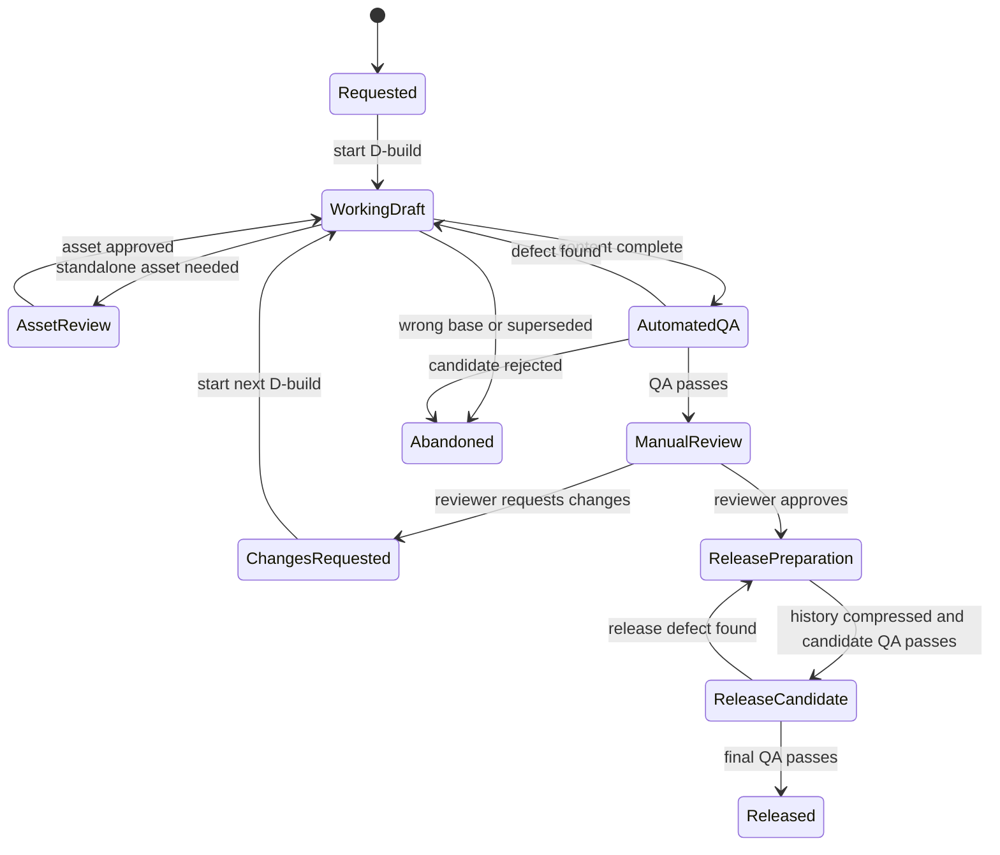

# Controlled Document Development Process

| Field | Value |
|---|---|
| Process owner | Repository maintainer |
| Applies to | Repository-backed Word documents and illustrated technical manuals |
| Process status | Approved reusable workflow |
| Process revision | 2.0 |
| Effective date | 2026-09-01 |

## 1. Purpose

This process governs documents refined through repeated authoring and review.
It separates internal development builds from public releases, keeps the Word
filename stable, records visible document status, compresses in-document history
at release, and preserves detailed evidence in the repository.

It also prevents common long-chain failures: working from the wrong base,
overwriting approved files, losing embedded figures, allowing pagination drift,
mixing approved and unapproved artwork, retaining stale status text, or declaring
a DOCX complete without inspecting every rendered page.

## 2. Control model

### 2.1 Stable document filename

The canonical DOCX uses one descriptive filename for its entire life, such as:

```text
Sideline_Screen_Duck_Blind_Build_Instructions.docx
```

Do not add `D24`, `v1`, a date, or another cache-busting token to the filename.
The same filename is used in the working, current, build, and release directories.
Byte-level identity comes from the SHA-256 digest, repository commit, and manifest.

Browser caching is a delivery concern. Use a content-addressed download URL,
Library version, ETag, commit link, or equivalent delivery mechanism instead of
renaming the document.

### 2.2 Internal builds and public releases

| Identifier | Meaning | Audience | Appears in released DOCX? |
|---|---|---|---|
| `D1`, `D2`, … | Unique internal development build | Authors and reviewers | No |
| `v0` | Unreleased product state | Authors and reviewers | No public distribution |
| `v1`, `v2`, … | Public release | Document users | Yes |

D-numbers never reset and are never reused. Release numbers advance only when a
document is formally published. A project may therefore reach `D24` while still
being `v0`.

### 2.3 Required in-document version history

Every controlled DOCX contains a visible table with this minimum schema:

| Version | Date | Status | One-line description |
|---|---|---|---|

During active development, the table may contain public release rows plus the
D-build rows needed for the current review sequence. Each description is one
line and should state the user-visible result, not implementation details.

At release, compress the working history:

- For the first public release, remove every D-row and create exactly one row:
  `v1 | <release date> | Released | Initial release`.
- For later releases, remove all D-rows since the prior release and add one new
  release row with a one-line summary.
- Keep previous release rows.

The repository `CHANGELOG.md`, change records, manifest history, Git commits, and
QA reports retain the detailed build-by-build record after compression.

### 2.4 Migration example: current v24 draft

An unreleased document colloquially called “v24” is normalized as follows:

| Before normalization | Controlled meaning |
|---|---|
| Filename ending `_v24.docx` | Stable filename without `_v24` |
| Visible `v24` draft label | `Release v0 (unreleased)` and `Development build D24` |
| Review-ready marking | `MANUAL REVIEW REQUIRED — NOT RELEASED` |
| First published version | `v1` |
| Compressed v1 history description | `Initial release` |

## 3. Repository model

```text
docs/
|-- <stable-name>.docx          <-- Current controlled document right at top of docs/
|-- AGENTS.md
|-- GEMINI.md / CLAUDE.md
|-- project.json
|-- CHANGELOG.md
|-- .gitignore
|-- documents/
|   |-- working/
|   |   `-- <stable-name>.docx  <-- Active build working copy
|   `-- releases/
|       `-- v1/<stable-name>.docx
|-- assets/
|   |-- incoming/
|   |-- working/
|   `-- approved/
|-- changes/
|   `-- D24.md
|-- qa/
|   |-- baselines/
|   |-- renders/
|   `-- reports/
`-- references/
    |-- TECHNICAL_SPEC.md
    |-- FIGURE_STYLE.md
    |-- FIGURE_REGISTER.csv
    `-- VERSION_HISTORY.md
```

### 3.1 Authoritative records

| Record | Purpose |
|---|---|
| `project.json` | Stable filename, current digest, current/next release, next D-number, active candidate, status, releases, and detailed history. |
| Project `AGENTS.md` | Document-specific facts, terminology, style, and exclusions. |
| `changes/D<number>.md` | Scope, preservation rules, acceptance criteria, evidence, and disposition for one internal build. |
| `CHANGELOG.md` | Human-readable detailed build and release history. |
| In-document version table | Compressed reader-facing release history and temporary active review rows. |
| `FIGURE_REGISTER.csv` | Figure provenance, approval state, caption, alt text, and integration build. |
| QA reports | Digest-bound structural, visual, accessibility, and regression evidence. |

### 3.2 Cross-agent integration and execution

The repository supports multiple AI coding assistants through unified rules and multi-path discovery:

| Assistant | Rule location | Skill / script location |
|---|---|---|
| **Google Gemini / Antigravity** | `AGENTS.md`, `GEMINI.md` | `.agents/skills/develop-versioned-documents/` |
| **OpenAI Codex** | `AGENTS.md` | `.codex/skills/develop-versioned-documents/` |
| **Anthropic Claude Code** | `CLAUDE.md` (references `AGENTS.md`) | `.agents/skills/develop-versioned-documents/scripts/` |
| **Cursor IDE** | `.cursorrules`, `.cursor/rules/*.mdc` | Helper scripts in `.agents/skills/...` |
| **GitHub Copilot** | `.github/copilot-instructions.md` | Helper scripts in `.agents/skills/...` |
| **Windsurf** | `.windsurfrules` | Helper scripts in `.agents/skills/...` |

All agents execute the same underlying Python helper scripts and adhere to identical quality gates.

## 4. Process flow and markings



### 4.1 State and marking matrix

| Process state | DOCX marking | May be distributed? | Exit evidence |
|---|---|---|---|
| Requested | None; no candidate exists | No | Scope and base identified |
| Working draft | `WORKING DRAFT — NOT FOR USE` | Authoring only | Content complete |
| Asset review | Standalone asset carries review status; master DOCX remains unchanged | Asset only | Explicit asset approval |
| Automated QA | Keep `WORKING DRAFT — NOT FOR USE` | No | Final render, audit, diff, and all-page review |
| Manual review required | `MANUAL REVIEW REQUIRED — NOT RELEASED` | Reviewer only | Human decision |
| Changes requested | Reviewed file retains its manual-review marking; next D-build becomes working draft | Reviewer record only | New D-build started |
| Release preparation | `WORKING DRAFT — NOT FOR USE` until candidate QA | Approvers only after transition | Compressed history and candidate QA |
| Release candidate | `RELEASE CANDIDATE — APPROVAL REQUIRED` | Approvers only | Released-state render, audit, diff, and approval |
| Released | `RELEASED — APPROVED FOR USE` | Yes | Release snapshot, manifest, history, and commit agree |
| Abandoned | No new marking required; preserved outside `working/` | No | Reason recorded; D-number retired |

The status marking belongs in a prominent cover status block and, when practical,
in the footer so a detached printed page cannot be mistaken for released content.

## 5. Standard procedure

### 5.1 Intake and base confirmation

1. Read repository and project instructions, `project.json`, and the relevant
   technical references.
2. Resolve `documents/current/<stable-name>.docx` from the manifest and recompute
   its SHA-256 digest. Stop if it differs.
3. Convert the request into a change record with exact targets, preservation
   rules, standalone approvals, expected pagination consequences, and pass criteria.
4. Confirm no active candidate exists.
5. Reserve the next D-number with `start_build.py`; never copy a convenient file
   or infer a base from a version-looking filename.

### 5.2 Baseline capture

Before mutation:

1. Test the current DOCX as a ZIP package.
2. Record pages, sections, headings, tables, figures, fields, links, bookmarks,
   relationships, external content, and accessibility findings.
3. Render and preserve the full baseline.
4. Inspect pages expected to change at print size and enlarged zoom.

Baseline defects remain visible in comparison. Do not silently expand the change
request to repair them.

### 5.3 Create and mark a working build

`start_build.py` copies the digest-verified current file to the stable working
path and creates `changes/D<number>.md`. It increments the D-number immediately,
so even an abandoned build is never reused.

In the working DOCX:

1. Change the visible status to `WORKING DRAFT — NOT FOR USE`.
2. Show `Release v0 (unreleased)` or the current public release.
3. Show the new D-number.
4. Add or update the D-row in the version-history table with the one-line build
   description.

For release preparation, use `start_build.py --prepare-release`. The target is
the next public release, and the history will be compressed before publication.

### 5.4 Develop uncertain figures separately

When the reviewer asks to see an image first or geometry is unsettled:

1. Preserve the upload in `assets/incoming/`.
2. Build derivatives in `assets/working/<figure-id>/`.
3. Return a standalone SVG or high-resolution PNG for review.
4. Do not update the master DOCX.
5. After approval, preserve the accepted source in `assets/approved/`, update the
   figure register, and create any framed document derivative separately.

### 5.5 Implement in short, controlled batches

1. Edit only `documents/working/<stable-name>.docx`.
2. Prefer semantic document operations. Use narrow OOXML patches only when needed.
3. Locate targets by stable context, relationship, caption, bookmark, or inspected
   XML; never assume visible text occupies one Word run.
4. Update coupled content together: artwork, framing, labels, captions, alt text,
   instructions, cross-references, page references, version table, status, dates,
   and properties.
5. Render after each layout-sensitive batch.

### 5.6 Automated QA

When content is complete, record the process state as `automated_qa`. Freeze the
candidate and run:

- full-page rendering;
- 100% review of every page and 200% review of changed figures;
- DOCX structural/accessibility/version/status audit;
- base-to-candidate text and package comparison.

If any byte changes, restart the final render, audit, comparison, and review.

### 5.7 Publish for manual review

After QA passes:

1. Change the DOCX marking to `MANUAL REVIEW REQUIRED — NOT RELEASED`.
2. Confirm the release, D-number, status, and one-line D-row agree.
3. Rerun the final render and audits on those exact bytes.
4. Transition the manifest to `manual_review_required` with digest-bound evidence.
5. Run `publish_review_build.py`.

The helper stores an immutable snapshot in `documents/builds/D<number>/` and
updates the stable current file. The reviewer receives the stable filename.

If changes are requested, record that decision and start the next D-build from
the reviewed current file. Do not alter the review snapshot.

### 5.8 Prepare and publish a release

After human approval:

1. Start a new build with `--prepare-release` using the intended one-line release
   summary. For the first release, it must be `Initial release`.
2. Compress all D-rows since the prior release into one target-release row.
3. Mark the document `RELEASE CANDIDATE — APPROVAL REQUIRED`; retain the internal
   D-number during candidate QA.
4. Complete full release-candidate QA and transition the candidate state.
5. Change the document to `RELEASED — APPROVED FOR USE` and remove every D-number from visible text,
   headers, footers, properties, and stored metadata.
6. Rerender and re-audit the released bytes, requiring the target release, release
   summary, stable filename, released marking, and zero D-number tokens.
7. Run `release_document.py` with the final audit, diff, and visual-review reports.

The helper creates `documents/releases/v<number>/<stable-name>.docx`, updates the
stable current file, records the release and digest, and advances the next release.

## 6. Quality controls

### Visual

- Expected page count and page size.
- No clipped, overlapping, stretched, or missing content.
- Figures remain with captions and are legible at print size.
- Section starts, headers, footers, dates, page numbers, version history, and
  status markings are correct.
- Technical geometry follows approved specifications.

### Structural and accessibility

- ZIP integrity and internal relationships pass.
- No linked picture, attached template, OLE link, or external-data field exists
  unless explicitly authorized.
- Intentional web hyperlinks are distinguished from external content dependencies.
- Update-fields-on-open is disabled unless required.
- Informative images have meaningful alt text.
- Headings, tables, fields, bookmarks, and page numbering meet expectations.

### Regression

Compare visual pages, extracted text, and package members. Every difference must
be explained by the change request or a documented application side effect.
Unexplained differences fail the gate.

### Version and status

- Filename is stable.
- Manifest digest matches the candidate.
- Current D-number and release marker are present at review stages.
- Visible status uses the exact approved marking.
- The version-history row contains the approved one-line summary.
- Released documents contain the target release and no D-number.

## 7. Recovery rules

- **Wrong base:** abandon the D-build, retire its number, and restart from the
  manifest current file. Do not merge uncertain document XML.
- **Unsafe broad mutation:** restore the working copy from its base and replace
  the editing method rather than repairing widespread damage.
- **Unexpected pagination:** treat it as a document-wide change and repeat all-page
  review.
- **External-link warning:** inspect relationship types, field instructions, and
  `w:updateFields` before removing useful web hyperlinks.
- **Post-release defect:** start a new D-build and publish a later release. Never
  replace bytes in an existing release directory.

## 8. Definition of done

A review build or release is done only when its base, digest, scope, assets,
render, package audit, accessibility review, regression evidence, internal
version/history, visible status, manifest, changelog, and repository commit agree.
