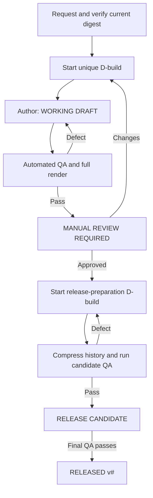

# Document Development Process Flow

This is the quick operational view of the full
[Controlled Document Development Process](DOCUMENT_DEVELOPMENT_PROCESS.md).

## Stage controls

| Stage | File location | Inside-document marking | Required evidence / action |
|---|---|---|---|
| Current base | `documents/current/<stable-name>.docx` | Last published review or release status | Manifest path and SHA-256 match |
| Working build | `documents/working/<stable-name>.docx` | `WORKING DRAFT — NOT FOR USE` | D-row with one-line description |
| Automated QA | Same working file | Keep working-draft marking | Full render, all-page review, audit, and diff |
| Manual review | Current file plus `documents/builds/D#/` snapshot | `MANUAL REVIEW REQUIRED — NOT RELEASED` | QA-bound promotion and human decision |
| Release candidate | Stable working file | `RELEASE CANDIDATE — APPROVAL REQUIRED` | Compressed history and full candidate QA |
| Release | Current file plus `documents/releases/v#/` snapshot | `RELEASED — APPROVED FOR USE` | Final released-state QA; no D-number remains |

## Version-history compression

| Moment | In-document history |
|---|---|
| Unreleased D24 review | D-build rows with one-line descriptions; release shown as v0 |
| First public release | One row: `v1 — Initial release`; remove all D-rows |
| Development after v1 | Keep v1 row; add temporary D-build rows |
| Public v2 | Keep v1; replace post-v1 D-rows with one v2 row |

Repository history remains detailed even when the reader-facing table is
compressed. The DOCX filename never changes for builds, review, or release.
